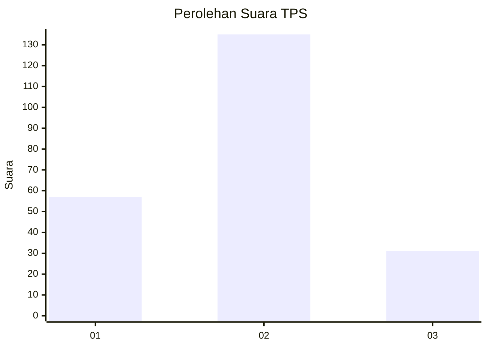
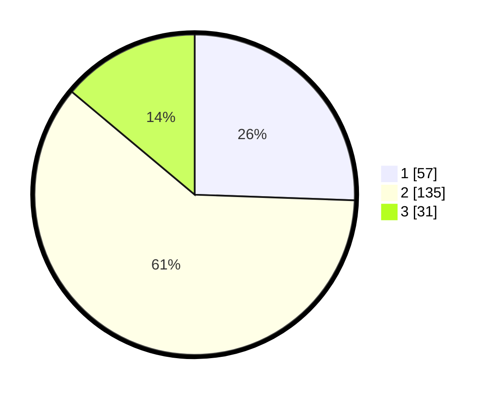

# Hasil

## Grafik

## Tabel

| No. | Nama Paslon    | Suara | Suara (raw) | Persentase |
|:--- |:-------------- | -----:| -----------:| ----------:|
| 1   | ANIES MUHAIMIN | 57    | [57][p-1]   | 25,56      |
| 2   | PRABOWO GIBRAN | 135   | [135][p-2]  | 60,54      |
| 3   | GANJAR MAHFUD  | 31    | [31][p-3]   | 13,90      |

[p-1]: https://github.com/gigit-pemilu/pemilu-2024-34-di-yogyakarta/blob/main/pilpres/hitung-suara/sub/34-di-yogyakarta/sub/02-bantul/sub/02-sanden/sub/2001-gadingsari/sub/025-tps/sub/paslon-1.txt
[p-2]: https://github.com/gigit-pemilu/pemilu-2024-34-di-yogyakarta/blob/main/pilpres/hitung-suara/sub/34-di-yogyakarta/sub/02-bantul/sub/02-sanden/sub/2001-gadingsari/sub/025-tps/sub/paslon-2.txt
[p-3]: https://github.com/gigit-pemilu/pemilu-2024-34-di-yogyakarta/blob/main/pilpres/hitung-suara/sub/34-di-yogyakarta/sub/02-bantul/sub/02-sanden/sub/2001-gadingsari/sub/025-tps/sub/paslon-3.txt

## Foto C Plano

https://sirekap-obj-formc.kpu.go.id/4828/pemilu/ppwp/34/02/02/20/01/3402022001025-20240215-023159--f1e57d22-9c06-42d7-a385-608336a8031a.jpg

https://sirekap-obj-formc.kpu.go.id/4828/pemilu/ppwp/34/02/02/20/01/3402022001025-20240215-023226--3c6d4efb-060c-487b-9357-8b14878c145b.jpg

https://sirekap-obj-formc.kpu.go.id/4828/pemilu/ppwp/34/02/02/20/01/3402022001025-20240215-023244--0beeab0e-de9b-4d43-95f5-c260d27f89e8.jpg

## Metadata

| Key        | Value               |
| ---------- | ------------------- |
| Time Stamp | 2024-02-16 08:00:28 |

