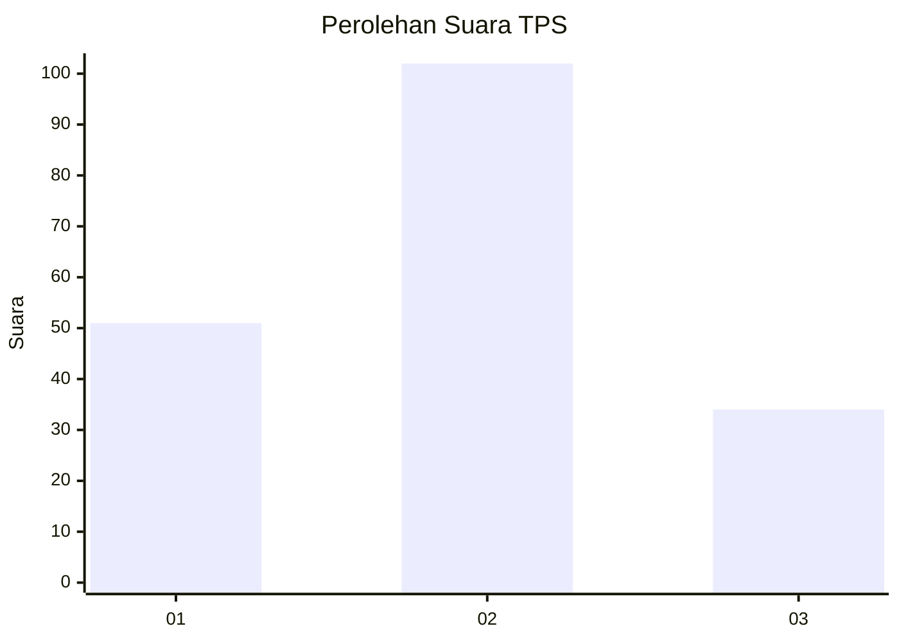
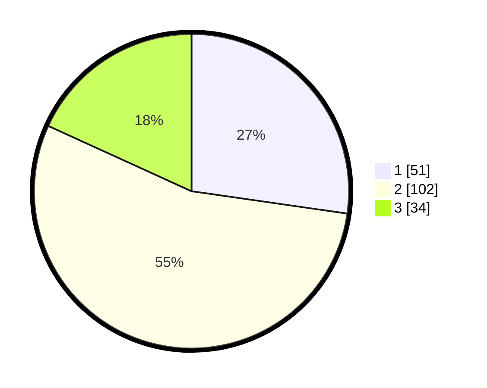

# Hasil

## Grafik

## Tabel

| No. | Nama Paslon    | Suara | Suara (raw) | Persentase |
|:--- |:-------------- | -----:| -----------:| ----------:|
| 1   | ANIES MUHAIMIN | 51    | [51][p-1]   | 27,27      |
| 2   | PRABOWO GIBRAN | 102   | [102][p-2]  | 54,55      |
| 3   | GANJAR MAHFUD  | 34    | [34][p-3]   | 18,18      |

[p-1]: https://github.com/gigit-pemilu/pemilu-2024-34-di-yogyakarta/blob/main/pilpres/hitung-suara/sub/34-di-yogyakarta/sub/02-bantul/sub/02-sanden/sub/2001-gadingsari/sub/026-tps/sub/paslon-1.txt
[p-2]: https://github.com/gigit-pemilu/pemilu-2024-34-di-yogyakarta/blob/main/pilpres/hitung-suara/sub/34-di-yogyakarta/sub/02-bantul/sub/02-sanden/sub/2001-gadingsari/sub/026-tps/sub/paslon-2.txt
[p-3]: https://github.com/gigit-pemilu/pemilu-2024-34-di-yogyakarta/blob/main/pilpres/hitung-suara/sub/34-di-yogyakarta/sub/02-bantul/sub/02-sanden/sub/2001-gadingsari/sub/026-tps/sub/paslon-3.txt

## Foto C Plano

https://sirekap-obj-formc.kpu.go.id/06d4/pemilu/ppwp/34/02/02/20/01/3402022001026-20240214-192128--63543293-a7f8-4ced-93de-379cdbccaa3d.jpg

https://sirekap-obj-formc.kpu.go.id/06d4/pemilu/ppwp/34/02/02/20/01/3402022001026-20240214-231328--8603ce5f-59f6-469b-9762-06fbf1dd32aa.jpg

https://sirekap-obj-formc.kpu.go.id/06d4/pemilu/ppwp/34/02/02/20/01/3402022001026-20240214-192203--91d0c315-fae7-4846-bcf4-05023bba7db8.jpg

## Metadata

| Key        | Value               |
| ---------- | ------------------- |
| Time Stamp | 2024-02-25 17:00:00 |

