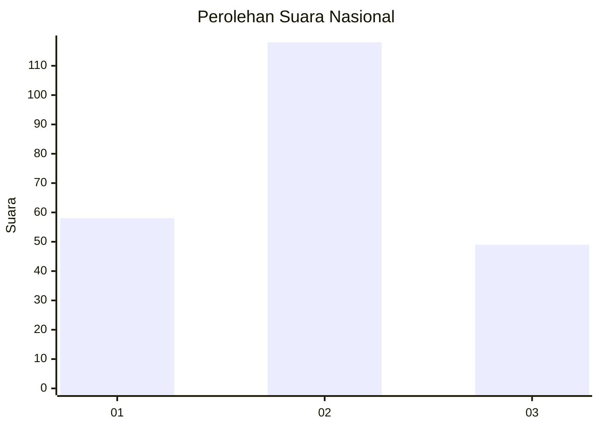
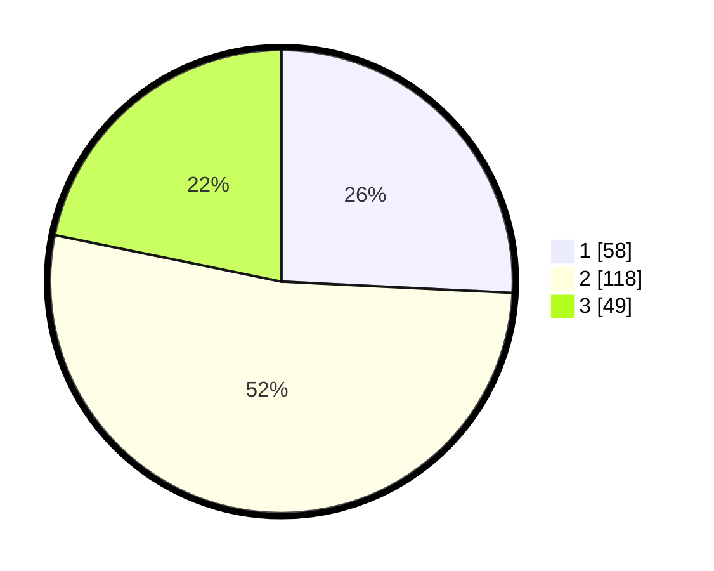

# Hasil

## Grafik

## Tabel

| No. | Nama Paslon    | Suara | Suara (raw) | Persentase |
|:--- |:-------------- | -----:| -----------:| ----------:|
| 1   | ANIES MUHAIMIN | 58    | [58][p-1]   | 25,78      |
| 2   | PRABOWO GIBRAN | 118   | [118][p-2]  | 52,44      |
| 3   | GANJAR MAHFUD  | 49    | [49][p-3]   | 21,78      |

[p-1]: https://github.com/gigit-pemilu/pemilu-2024/blob/main/pilpres/hitung-suara/sub/34-di-yogyakarta/sub/02-bantul/sub/02-sanden/sub/2001-gadingsari/sub/029-tps/sub/paslon-1.txt
[p-2]: https://github.com/gigit-pemilu/pemilu-2024/blob/main/pilpres/hitung-suara/sub/34-di-yogyakarta/sub/02-bantul/sub/02-sanden/sub/2001-gadingsari/sub/029-tps/sub/paslon-2.txt
[p-3]: https://github.com/gigit-pemilu/pemilu-2024/blob/main/pilpres/hitung-suara/sub/34-di-yogyakarta/sub/02-bantul/sub/02-sanden/sub/2001-gadingsari/sub/029-tps/sub/paslon-3.txt

## Foto C Plano

https://sirekap-obj-formc.kpu.go.id/73b8/pemilu/ppwp/34/02/02/20/01/3402022001029-20240215-033939--218c8918-5d51-4cde-b027-984adbc13bb1.jpg

https://sirekap-obj-formc.kpu.go.id/73b8/pemilu/ppwp/34/02/02/20/01/3402022001029-20240215-034101--761abdbe-2dd5-4185-9f54-31adcb4862c5.jpg

https://sirekap-obj-formc.kpu.go.id/73b8/pemilu/ppwp/34/02/02/20/01/3402022001029-20240215-034428--fb9ea34f-4f94-4b5a-9482-cf2c361fd2ef.jpg

## Metadata

| Key        | Value               |
| ---------- | ------------------- |
| Time Stamp | 2024-02-15 22:40:13 |

