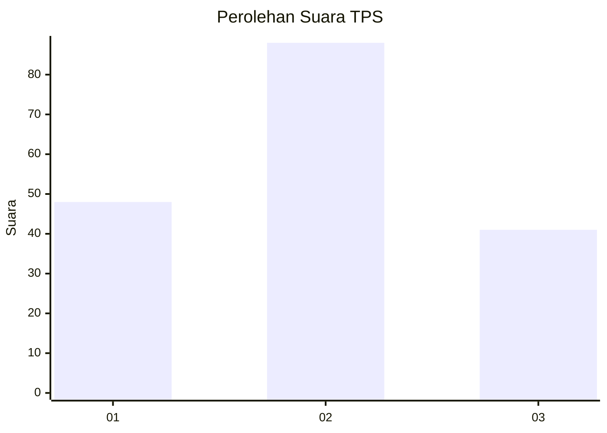
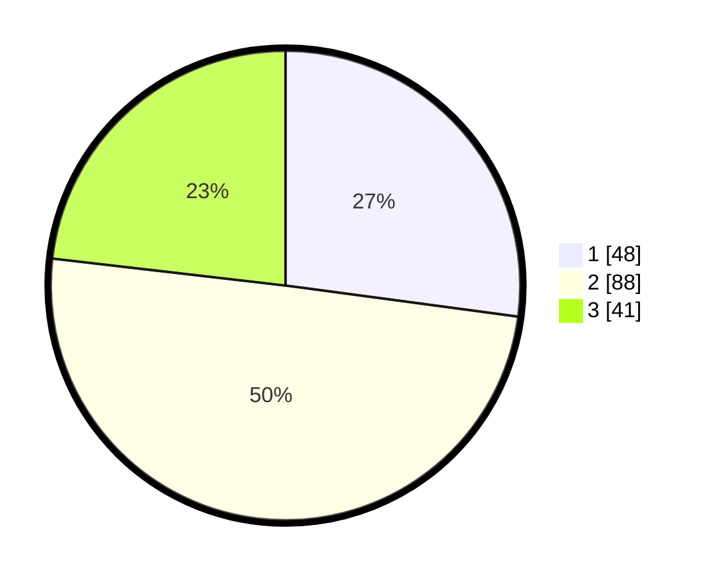

# Hasil

## Grafik

## Tabel

| No. | Nama Paslon    | Suara | Suara (raw) | Persentase |
|:--- |:-------------- | -----:| -----------:| ----------:|
| 1   | ANIES MUHAIMIN | 48    | [48][p-1]   | 27,12      |
| 2   | PRABOWO GIBRAN | 88    | [88][p-2]   | 49,72      |
| 3   | GANJAR MAHFUD  | 41    | [41][p-3]   | 23,16      |

[p-1]: https://github.com/gigit-pemilu/pemilu-2024-34-di-yogyakarta/blob/main/pilpres/hitung-suara/sub/34-di-yogyakarta/sub/02-bantul/sub/02-sanden/sub/2001-gadingsari/sub/031-tps/sub/paslon-1.txt
[p-2]: https://github.com/gigit-pemilu/pemilu-2024-34-di-yogyakarta/blob/main/pilpres/hitung-suara/sub/34-di-yogyakarta/sub/02-bantul/sub/02-sanden/sub/2001-gadingsari/sub/031-tps/sub/paslon-2.txt
[p-3]: https://github.com/gigit-pemilu/pemilu-2024-34-di-yogyakarta/blob/main/pilpres/hitung-suara/sub/34-di-yogyakarta/sub/02-bantul/sub/02-sanden/sub/2001-gadingsari/sub/031-tps/sub/paslon-3.txt

## Foto C Plano

https://sirekap-obj-formc.kpu.go.id/0184/pemilu/ppwp/34/02/02/20/01/3402022001031-20240215-225434--706e98ea-9139-42b3-b6e8-bc296d1c867b.jpg

https://sirekap-obj-formc.kpu.go.id/0184/pemilu/ppwp/34/02/02/20/01/3402022001031-20240216-091058--08629c17-8573-40cf-b93c-c9b8a89ad9ed.jpg

https://sirekap-obj-formc.kpu.go.id/0184/pemilu/ppwp/34/02/02/20/01/3402022001031-20240216-091240--ae370494-6757-414e-abbf-6b432fc2d3f7.jpg

## Metadata

| Key        | Value               |
| ---------- | ------------------- |
| Time Stamp | 2024-02-24 22:31:28 |

