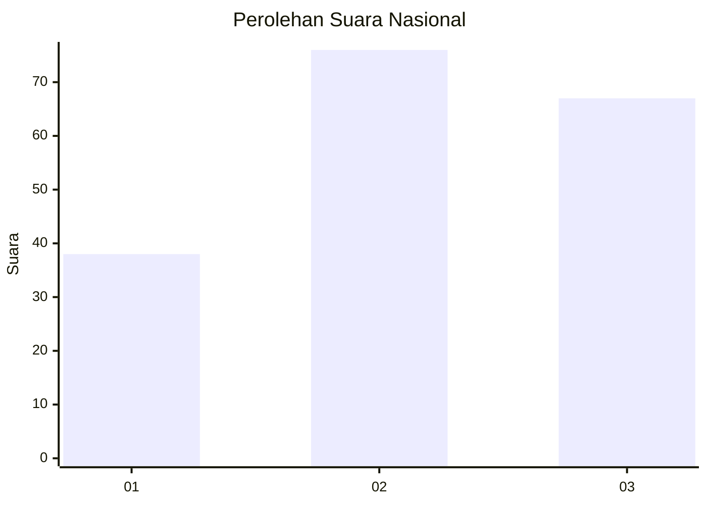
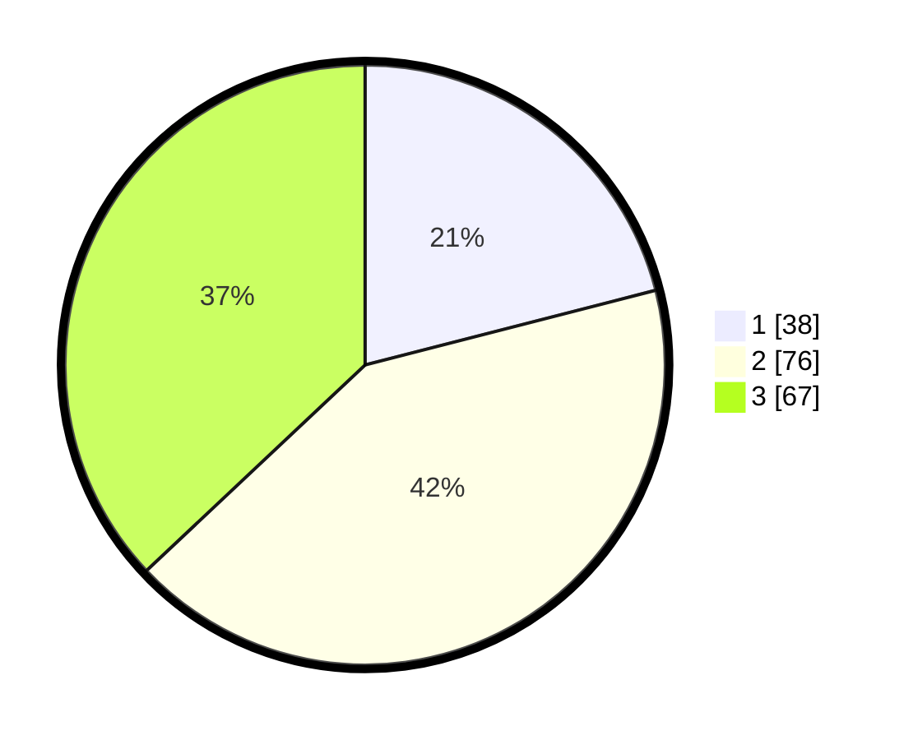

# Hasil

## Grafik

## Tabel

| No. | Nama Paslon    | Suara | Suara (raw) | Persentase |
|:--- |:-------------- | -----:| -----------:| ----------:|
| 1   | ANIES MUHAIMIN | 38    | [38][p-1]   | 20,99      |
| 2   | PRABOWO GIBRAN | 76    | [76][p-2]   | 41,99      |
| 3   | GANJAR MAHFUD  | 67    | [67][p-3]   | 37,02      |

[p-1]: https://github.com/gigit-pemilu/pemilu-2024/blob/main/pilpres/hitung-suara/sub/34-di-yogyakarta/sub/02-bantul/sub/02-sanden/sub/2001-gadingsari/sub/033-tps/sub/paslon-1.txt
[p-2]: https://github.com/gigit-pemilu/pemilu-2024/blob/main/pilpres/hitung-suara/sub/34-di-yogyakarta/sub/02-bantul/sub/02-sanden/sub/2001-gadingsari/sub/033-tps/sub/paslon-2.txt
[p-3]: https://github.com/gigit-pemilu/pemilu-2024/blob/main/pilpres/hitung-suara/sub/34-di-yogyakarta/sub/02-bantul/sub/02-sanden/sub/2001-gadingsari/sub/033-tps/sub/paslon-3.txt

## Foto C Plano

https://sirekap-obj-formc.kpu.go.id/e681/pemilu/ppwp/34/02/02/20/01/3402022001033-20240215-213107--6d54df25-dc28-4b65-9978-35fda7f377dd.jpg

https://sirekap-obj-formc.kpu.go.id/e681/pemilu/ppwp/34/02/02/20/01/3402022001033-20240215-213125--f6df3042-4170-49c1-af4d-f3bb89e12b99.jpg

https://sirekap-obj-formc.kpu.go.id/e681/pemilu/ppwp/34/02/02/20/01/3402022001033-20240215-213128--46107cf5-283a-48a3-ab87-334ea1b47b46.jpg

## Metadata

| Key        | Value               |
| ---------- | ------------------- |
| Time Stamp | 2024-02-15 22:30:27 |

