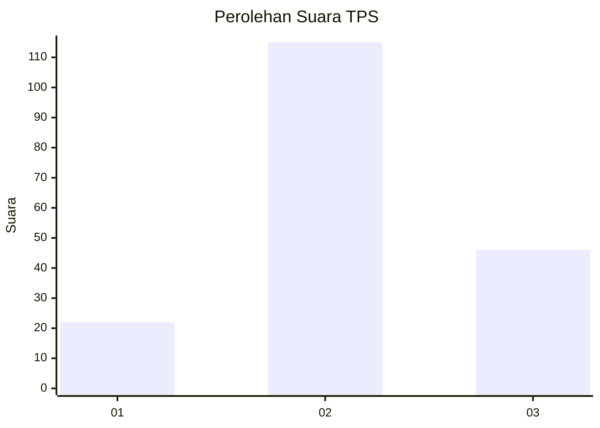
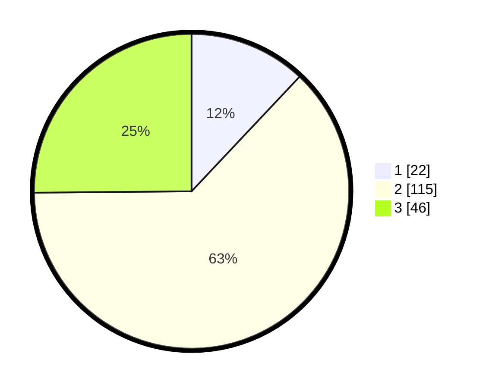

# Hasil

## Grafik

## Tabel

| No. | Nama Paslon    | Suara | Suara (raw) | Persentase |
|:--- |:-------------- | -----:| -----------:| ----------:|
| 1   | ANIES MUHAIMIN | 22    | [22][p-1]   | 12,02      |
| 2   | PRABOWO GIBRAN | 115   | [115][p-2]  | 62,84      |
| 3   | GANJAR MAHFUD  | 46    | [46][p-3]   | 25,14      |

[p-1]: https://github.com/gigit-pemilu/pemilu-2024-34-di-yogyakarta/blob/main/pilpres/hitung-suara/sub/34-di-yogyakarta/sub/02-bantul/sub/02-sanden/sub/2001-gadingsari/sub/036-tps/sub/paslon-1.txt
[p-2]: https://github.com/gigit-pemilu/pemilu-2024-34-di-yogyakarta/blob/main/pilpres/hitung-suara/sub/34-di-yogyakarta/sub/02-bantul/sub/02-sanden/sub/2001-gadingsari/sub/036-tps/sub/paslon-2.txt
[p-3]: https://github.com/gigit-pemilu/pemilu-2024-34-di-yogyakarta/blob/main/pilpres/hitung-suara/sub/34-di-yogyakarta/sub/02-bantul/sub/02-sanden/sub/2001-gadingsari/sub/036-tps/sub/paslon-3.txt

## Foto C Plano

https://sirekap-obj-formc.kpu.go.id/9753/pemilu/ppwp/34/02/02/20/01/3402022001036-20240214-231122--73855b7c-9b5b-4676-ae4a-c11f0bffa145.jpg

https://sirekap-obj-formc.kpu.go.id/9753/pemilu/ppwp/34/02/02/20/01/3402022001036-20240214-195209--74f8ec57-c55e-4185-9195-2c603a2fb7b5.jpg

https://sirekap-obj-formc.kpu.go.id/9753/pemilu/ppwp/34/02/02/20/01/3402022001036-20240214-231418--be2e6eab-f2c2-4751-8645-a413ee8100dd.jpg

## Metadata

| Key        | Value               |
| ---------- | ------------------- |
| Time Stamp | 2024-02-15 02:10:27 |

