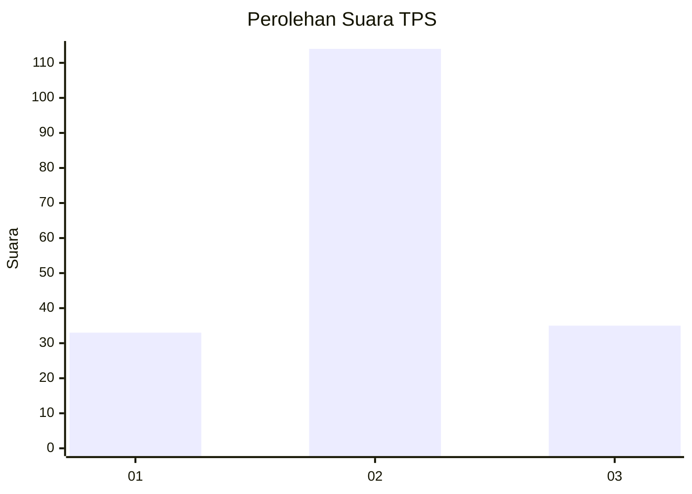
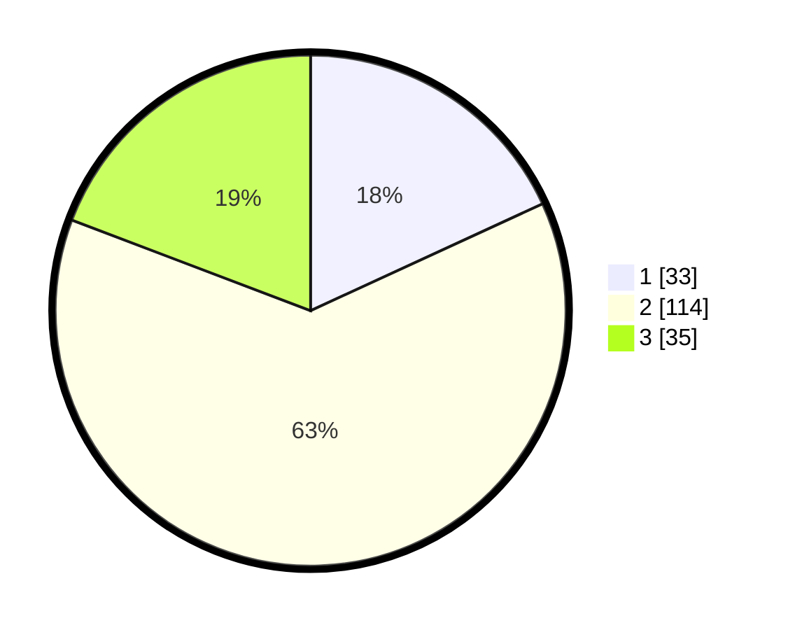

# Hasil

## Grafik

## Tabel

| No. | Nama Paslon    | Suara | Suara (raw) | Persentase |
|:--- |:-------------- | -----:| -----------:| ----------:|
| 1   | ANIES MUHAIMIN | 33    | [33][p-1]   | 18,13      |
| 2   | PRABOWO GIBRAN | 114   | [114][p-2]  | 62,64      |
| 3   | GANJAR MAHFUD  | 35    | [35][p-3]   | 19,23      |

[p-1]: https://github.com/gigit-pemilu/pemilu-2024-34-di-yogyakarta/blob/main/pilpres/hitung-suara/sub/34-di-yogyakarta/sub/02-bantul/sub/02-sanden/sub/2001-gadingsari/sub/037-tps/sub/paslon-1.txt
[p-2]: https://github.com/gigit-pemilu/pemilu-2024-34-di-yogyakarta/blob/main/pilpres/hitung-suara/sub/34-di-yogyakarta/sub/02-bantul/sub/02-sanden/sub/2001-gadingsari/sub/037-tps/sub/paslon-2.txt
[p-3]: https://github.com/gigit-pemilu/pemilu-2024-34-di-yogyakarta/blob/main/pilpres/hitung-suara/sub/34-di-yogyakarta/sub/02-bantul/sub/02-sanden/sub/2001-gadingsari/sub/037-tps/sub/paslon-3.txt

## Foto C Plano

https://sirekap-obj-formc.kpu.go.id/5ec3/pemilu/ppwp/34/02/02/20/01/3402022001037-20240214-214123--257f0929-a7ae-4a55-b7de-d2539c7fa3bb.jpg

https://sirekap-obj-formc.kpu.go.id/5ec3/pemilu/ppwp/34/02/02/20/01/3402022001037-20240214-212819--921fe550-fea7-4a15-97b9-282c4bab2fd8.jpg

https://sirekap-obj-formc.kpu.go.id/5ec3/pemilu/ppwp/34/02/02/20/01/3402022001037-20240214-235957--64e02557-4113-4ade-a094-e07bed49bd4d.jpg

## Metadata

| Key        | Value               |
| ---------- | ------------------- |
| Time Stamp | 2024-02-15 12:00:28 |

