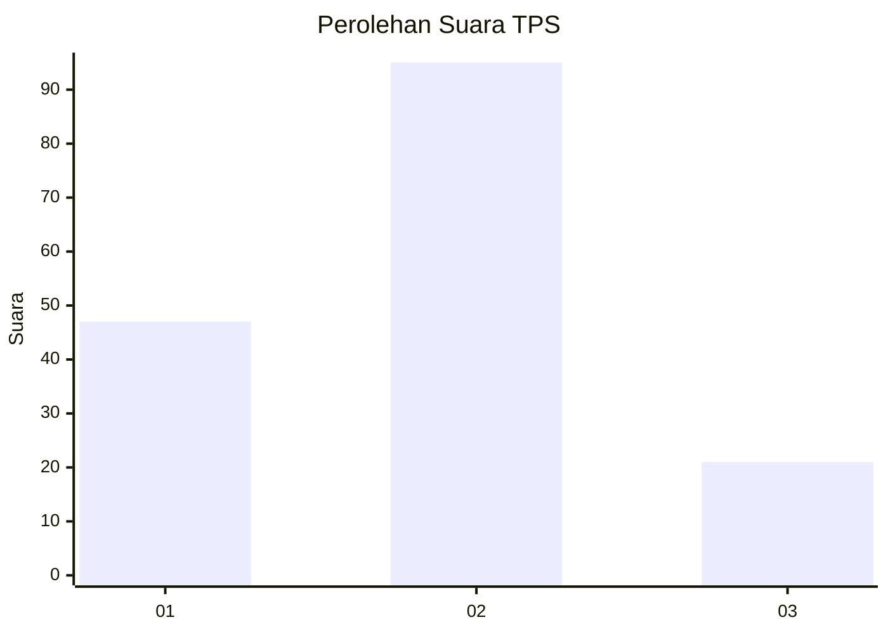
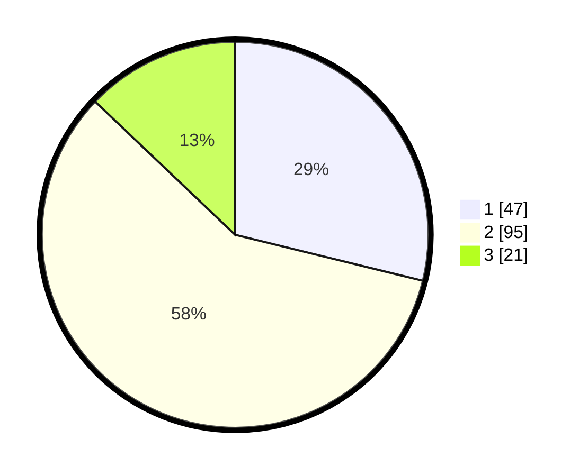

# Hasil

## Grafik

## Tabel

| No. | Nama Paslon    | Suara | Suara (raw) | Persentase |
|:--- |:-------------- | -----:| -----------:| ----------:|
| 1   | ANIES MUHAIMIN | 47    | [47][p-1]   | 28,83      |
| 2   | PRABOWO GIBRAN | 95    | [95][p-2]   | 58,28      |
| 3   | GANJAR MAHFUD  | 21    | [21][p-3]   | 12,88      |

[p-1]: https://github.com/gigit-pemilu/pemilu-2024-34-di-yogyakarta/blob/main/pilpres/hitung-suara/sub/34-di-yogyakarta/sub/02-bantul/sub/02-sanden/sub/2001-gadingsari/sub/039-tps/sub/paslon-1.txt
[p-2]: https://github.com/gigit-pemilu/pemilu-2024-34-di-yogyakarta/blob/main/pilpres/hitung-suara/sub/34-di-yogyakarta/sub/02-bantul/sub/02-sanden/sub/2001-gadingsari/sub/039-tps/sub/paslon-2.txt
[p-3]: https://github.com/gigit-pemilu/pemilu-2024-34-di-yogyakarta/blob/main/pilpres/hitung-suara/sub/34-di-yogyakarta/sub/02-bantul/sub/02-sanden/sub/2001-gadingsari/sub/039-tps/sub/paslon-3.txt

## Foto C Plano

https://sirekap-obj-formc.kpu.go.id/215e/pemilu/ppwp/34/02/02/20/01/3402022001039-20240214-141120--423f2a7d-392a-46ad-9fad-298497a09ce0.jpg

https://sirekap-obj-formc.kpu.go.id/215e/pemilu/ppwp/34/02/02/20/01/3402022001039-20240216-135921--7f7f16a6-bfa7-4d33-8084-4199085306ac.jpg

https://sirekap-obj-formc.kpu.go.id/215e/pemilu/ppwp/34/02/02/20/01/3402022001039-20240216-135920--f67f2c01-f6ff-4ce9-b916-b95929aa509c.jpg

## Metadata

| Key        | Value               |
| ---------- | ------------------- |
| Time Stamp | 2024-02-20 08:00:00 |

## DATA PEMILIH TETAP

Jumlah pemilih dalam DPT: **188**.
 * L: **90**.
 * P: **98**.

## DATA PENGGUNA HAK PILIH

Jumlah pengguna hak pilih dalam DPT: **163**.
 * L: **77**.
 * P: **86**.

Jumlah pengguna hak pilih dalam DPTb: **3**.
 * L: **3**.
 * P: **0**.

Jumlah pengguna hak pilih dalam DPK: **0**.
 * L: **0**.
 * P: **0**.

Jumlah pengguna hak pilih: **166**.
 * L: **80**.
 * P: **86**.

## JUMLAH SUARA SAH DAN TIDAK SAH

JUMLAH SELURUH SUARA SAH: **163**.

JUMLAH SUARA TIDAK SAH: **3**.

JUMLAH SELURUH SUARA SAH DAN SUARA TIDAK SAH: **166**.

