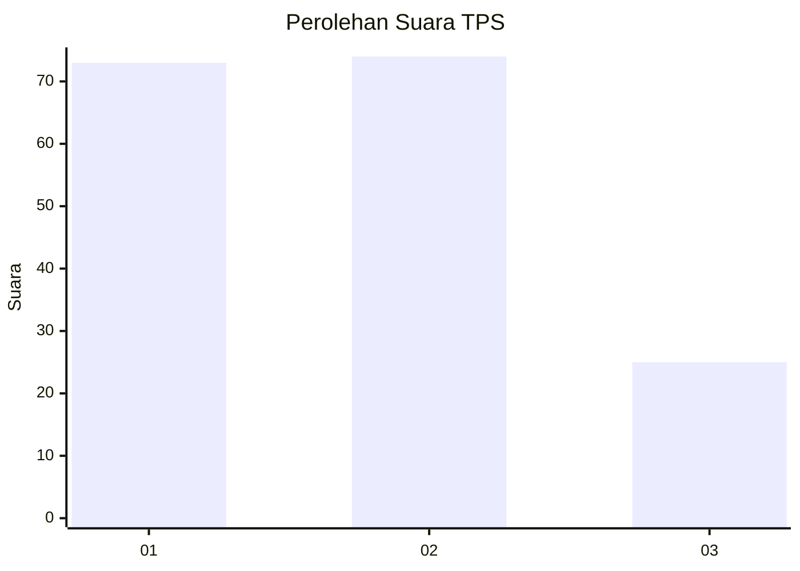
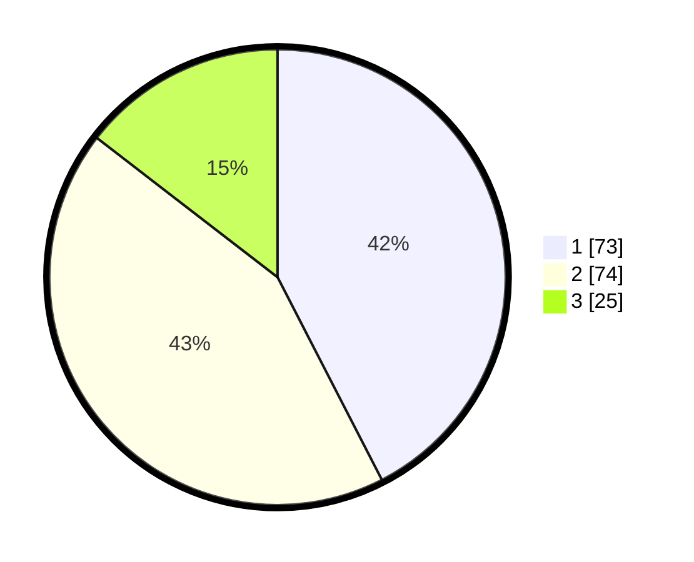

# Hasil

## Grafik

## Tabel

| No. | Nama Paslon    | Suara | Suara (raw) | Persentase |
|:--- |:-------------- | -----:| -----------:| ----------:|
| 1   | ANIES MUHAIMIN | 73    | [73][p-1]   | 42,44      |
| 2   | PRABOWO GIBRAN | 74    | [74][p-2]   | 43,02      |
| 3   | GANJAR MAHFUD  | 25    | [25][p-3]   | 14,53      |

[p-1]: https://github.com/gigit-pemilu/pemilu-2024-34-di-yogyakarta/blob/main/pilpres/hitung-suara/sub/34-di-yogyakarta/sub/02-bantul/sub/02-sanden/sub/2002-gadingharjo/sub/001-tps/sub/paslon-1.txt
[p-2]: https://github.com/gigit-pemilu/pemilu-2024-34-di-yogyakarta/blob/main/pilpres/hitung-suara/sub/34-di-yogyakarta/sub/02-bantul/sub/02-sanden/sub/2002-gadingharjo/sub/001-tps/sub/paslon-2.txt
[p-3]: https://github.com/gigit-pemilu/pemilu-2024-34-di-yogyakarta/blob/main/pilpres/hitung-suara/sub/34-di-yogyakarta/sub/02-bantul/sub/02-sanden/sub/2002-gadingharjo/sub/001-tps/sub/paslon-3.txt

## Foto C Plano

https://sirekap-obj-formc.kpu.go.id/1c6f/pemilu/ppwp/34/02/02/20/02/3402022002001-20240215-035333--e91c2f5c-5929-4eb8-8f99-75ef9d29b1cb.jpg

https://sirekap-obj-formc.kpu.go.id/1c6f/pemilu/ppwp/34/02/02/20/02/3402022002001-20240215-034022--9fbb4912-ddd1-4d63-9d14-4a1eec14a365.jpg

https://sirekap-obj-formc.kpu.go.id/1c6f/pemilu/ppwp/34/02/02/20/02/3402022002001-20240215-034111--b288e59d-6d89-4310-a31a-4048931a6427.jpg

## Metadata

| Key        | Value               |
| ---------- | ------------------- |
| Time Stamp | 2024-02-24 22:31:28 |

