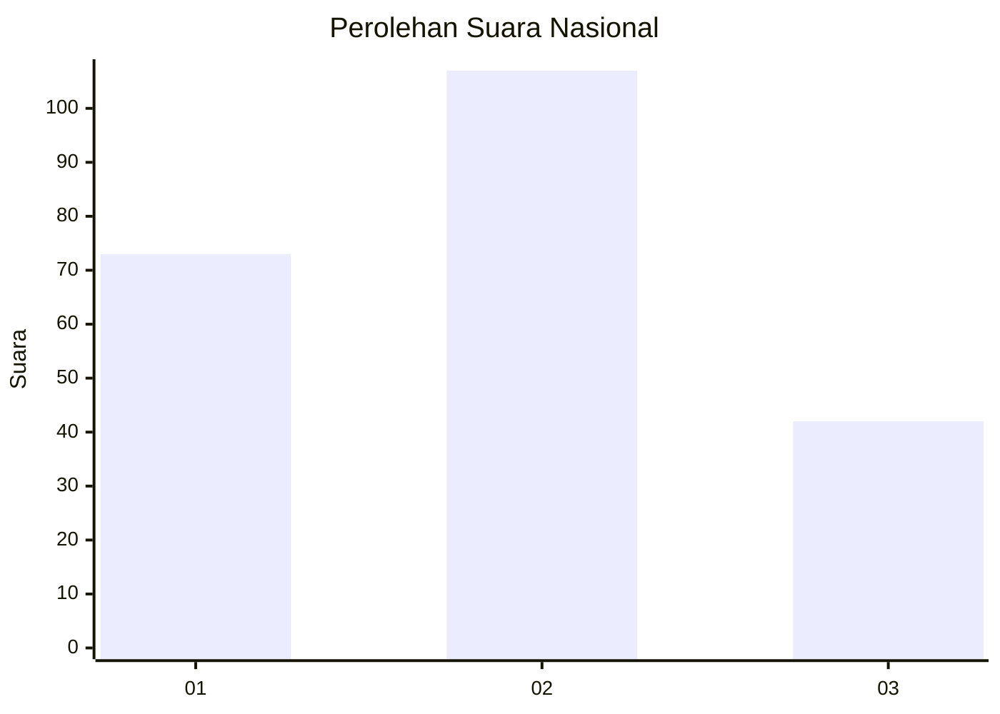
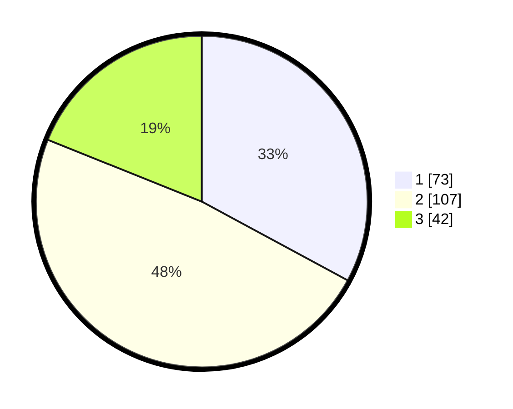

# Hasil

## Grafik

## Tabel

| No. | Nama Paslon    | Suara | Suara (raw) | Persentase |
|:--- |:-------------- | -----:| -----------:| ----------:|
| 1   | ANIES MUHAIMIN | 73    | [73][p-1]   | 32,88      |
| 2   | PRABOWO GIBRAN | 107   | [107][p-2]  | 48,20      |
| 3   | GANJAR MAHFUD  | 42    | [42][p-3]   | 18,92      |

[p-1]: https://github.com/gigit-pemilu/pemilu-2024/blob/main/pilpres/hitung-suara/sub/34-di-yogyakarta/sub/02-bantul/sub/02-sanden/sub/2002-gadingharjo/sub/002-tps/sub/paslon-1.txt
[p-2]: https://github.com/gigit-pemilu/pemilu-2024/blob/main/pilpres/hitung-suara/sub/34-di-yogyakarta/sub/02-bantul/sub/02-sanden/sub/2002-gadingharjo/sub/002-tps/sub/paslon-2.txt
[p-3]: https://github.com/gigit-pemilu/pemilu-2024/blob/main/pilpres/hitung-suara/sub/34-di-yogyakarta/sub/02-bantul/sub/02-sanden/sub/2002-gadingharjo/sub/002-tps/sub/paslon-3.txt

## Foto C Plano

https://sirekap-obj-formc.kpu.go.id/9a42/pemilu/ppwp/34/02/02/20/02/3402022002002-20240218-132026--4d06ea3c-8acf-4197-a058-b4d063f52616.jpg

https://sirekap-obj-formc.kpu.go.id/9a42/pemilu/ppwp/34/02/02/20/02/3402022002002-20240218-132027--452d93ad-184b-4e73-a50f-19bc6c75d8ef.jpg

https://sirekap-obj-formc.kpu.go.id/9a42/pemilu/ppwp/34/02/02/20/02/3402022002002-20240218-132026--333d386a-e89e-4b95-bb8c-6f799e49cb80.jpg

## Metadata

| Key        | Value               |
| ---------- | ------------------- |
| Time Stamp | 2024-02-20 09:00:00 |

## DATA PEMILIH TETAP

Jumlah pemilih dalam DPT: **254**.
 * L: **126**.
 * P: **128**.

## DATA PENGGUNA HAK PILIH

Jumlah pengguna hak pilih dalam DPT: **227**.
 * L: **113**.
 * P: **114**.

Jumlah pengguna hak pilih dalam DPTb: **0**.
 * L: **4**.
 * P: **0**.

Jumlah pengguna hak pilih dalam DPK: **0**.
 * L: **0**.
 * P: **0**.

Jumlah pengguna hak pilih: **231**.
 * L: **117**.
 * P: **114**.

## JUMLAH SUARA SAH DAN TIDAK SAH

JUMLAH SELURUH SUARA SAH: **222**.

JUMLAH SUARA TIDAK SAH: **9**.

JUMLAH SELURUH SUARA SAH DAN SUARA TIDAK SAH: **231**.

