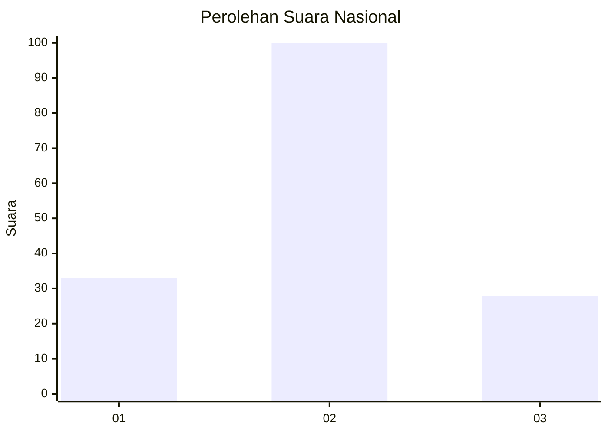

# Hasil

## Grafik

## Tabel

| No. | Nama Paslon    | Suara | Suara (raw) | Persentase |
|:--- |:-------------- | -----:| -----------:| ----------:|
| 1   | ANIES MUHAIMIN | 33    | [33][p-1]   | 20,50      |
| 2   | PRABOWO GIBRAN | 100   | [100][p-2]  | 62,11      |
| 3   | GANJAR MAHFUD  | 28    | [28][p-3]   | 17,39      |

[p-1]: https://github.com/gigit-pemilu/pemilu-2024/blob/main/pilpres/hitung-suara/sub/34-di-yogyakarta/sub/02-bantul/sub/02-sanden/sub/2002-gadingharjo/sub/004-tps/sub/paslon-1.txt
[p-2]: https://github.com/gigit-pemilu/pemilu-2024/blob/main/pilpres/hitung-suara/sub/34-di-yogyakarta/sub/02-bantul/sub/02-sanden/sub/2002-gadingharjo/sub/004-tps/sub/paslon-2.txt
[p-3]: https://github.com/gigit-pemilu/pemilu-2024/blob/main/pilpres/hitung-suara/sub/34-di-yogyakarta/sub/02-bantul/sub/02-sanden/sub/2002-gadingharjo/sub/004-tps/sub/paslon-3.txt

## Foto C Plano

https://sirekap-obj-formc.kpu.go.id/d323/pemilu/ppwp/34/02/02/20/02/3402022002004-20240215-003315--ef7b2da3-a664-463a-84e9-847356e9c170.jpg

https://sirekap-obj-formc.kpu.go.id/d323/pemilu/ppwp/34/02/02/20/02/3402022002004-20240215-003337--128bfc4b-79a2-4f2d-84f9-364fc0e0c85d.jpg

https://sirekap-obj-formc.kpu.go.id/d323/pemilu/ppwp/34/02/02/20/02/3402022002004-20240215-002849--fdfccb70-7456-446a-a56a-d586b3cd1afb.jpg

## Metadata

| Key        | Value               |
| ---------- | ------------------- |
| Time Stamp | 2024-02-25 17:00:00 |

