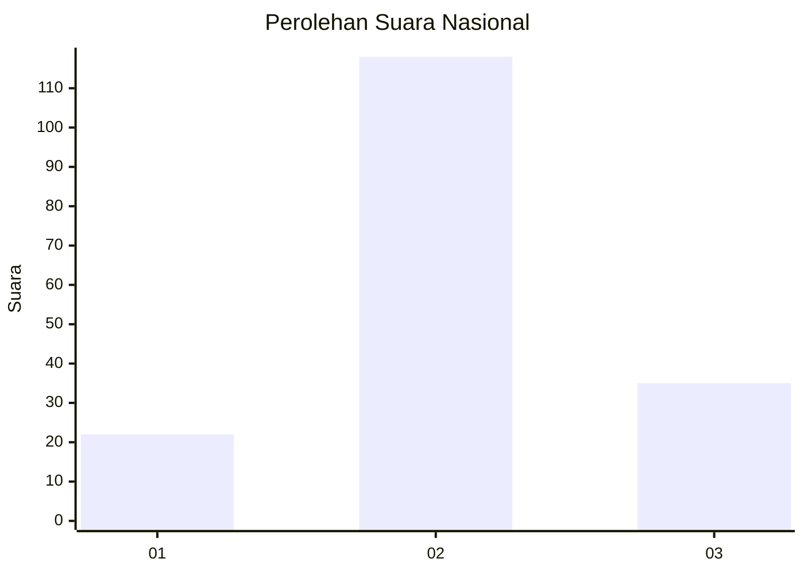
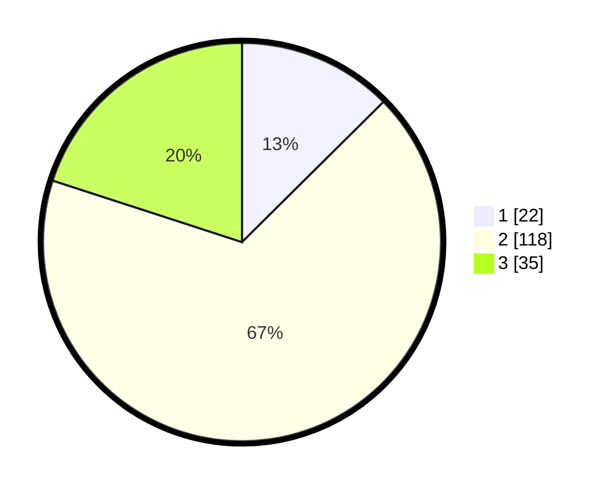

# Hasil

## Grafik

## Tabel

| No. | Nama Paslon    | Suara | Suara (raw) | Persentase |
|:--- |:-------------- | -----:| -----------:| ----------:|
| 1   | ANIES MUHAIMIN | 22    | [22][p-1]   | 12,57      |
| 2   | PRABOWO GIBRAN | 118   | [118][p-2]  | 67,43      |
| 3   | GANJAR MAHFUD  | 35    | [35][p-3]   | 20,00      |

[p-1]: https://github.com/gigit-pemilu/pemilu-2024/blob/main/pilpres/hitung-suara/sub/34-di-yogyakarta/sub/02-bantul/sub/02-sanden/sub/2002-gadingharjo/sub/005-tps/sub/paslon-1.txt
[p-2]: https://github.com/gigit-pemilu/pemilu-2024/blob/main/pilpres/hitung-suara/sub/34-di-yogyakarta/sub/02-bantul/sub/02-sanden/sub/2002-gadingharjo/sub/005-tps/sub/paslon-2.txt
[p-3]: https://github.com/gigit-pemilu/pemilu-2024/blob/main/pilpres/hitung-suara/sub/34-di-yogyakarta/sub/02-bantul/sub/02-sanden/sub/2002-gadingharjo/sub/005-tps/sub/paslon-3.txt

## Foto C Plano

https://sirekap-obj-formc.kpu.go.id/a959/pemilu/ppwp/34/02/02/20/02/3402022002005-20240215-050008--9ac89f73-a831-453f-b0ae-7c84a9ca3889.jpg

https://sirekap-obj-formc.kpu.go.id/a959/pemilu/ppwp/34/02/02/20/02/3402022002005-20240215-050052--aaf9ce93-78c5-4732-bdab-cb6c88336d82.jpg

https://sirekap-obj-formc.kpu.go.id/a959/pemilu/ppwp/34/02/02/20/02/3402022002005-20240215-050224--467af176-9434-43f3-be4a-c396ba3822d9.jpg

## Metadata

| Key        | Value               |
| ---------- | ------------------- |
| Time Stamp | 2024-02-24 22:31:28 |

