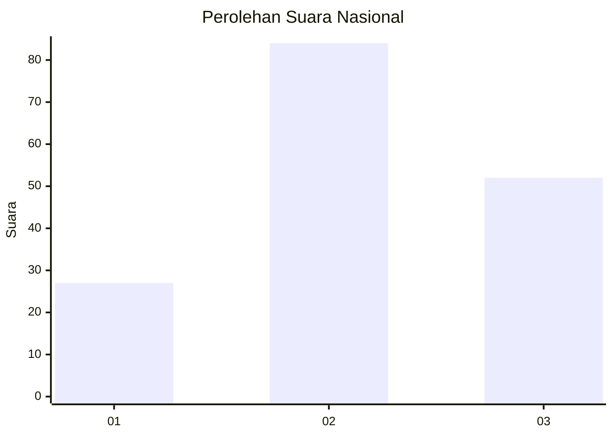
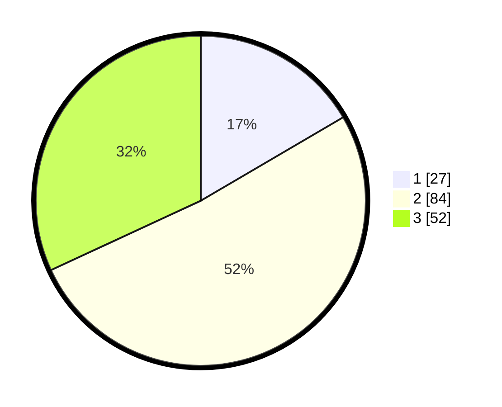

# Hasil

## Grafik

## Tabel

| No. | Nama Paslon    | Suara | Suara (raw) | Persentase |
|:--- |:-------------- | -----:| -----------:| ----------:|
| 1   | ANIES MUHAIMIN | 27    | [27][p-1]   | 16,56      |
| 2   | PRABOWO GIBRAN | 84    | [84][p-2]   | 51,53      |
| 3   | GANJAR MAHFUD  | 52    | [52][p-3]   | 31,90      |

[p-1]: https://github.com/gigit-pemilu/pemilu-2024/blob/main/pilpres/hitung-suara/sub/34-di-yogyakarta/sub/02-bantul/sub/02-sanden/sub/2003-srigading/sub/003-tps/sub/paslon-1.txt
[p-2]: https://github.com/gigit-pemilu/pemilu-2024/blob/main/pilpres/hitung-suara/sub/34-di-yogyakarta/sub/02-bantul/sub/02-sanden/sub/2003-srigading/sub/003-tps/sub/paslon-2.txt
[p-3]: https://github.com/gigit-pemilu/pemilu-2024/blob/main/pilpres/hitung-suara/sub/34-di-yogyakarta/sub/02-bantul/sub/02-sanden/sub/2003-srigading/sub/003-tps/sub/paslon-3.txt

## Foto C Plano

https://sirekap-obj-formc.kpu.go.id/1760/pemilu/ppwp/34/02/02/20/03/3402022003003-20240215-003644--7c9c737f-f60f-4f59-bfe3-70917d436c6f.jpg

https://sirekap-obj-formc.kpu.go.id/1760/pemilu/ppwp/34/02/02/20/03/3402022003003-20240215-003134--e4c45a6f-149a-49dc-b66a-b3dbb0b7b2c9.jpg

https://sirekap-obj-formc.kpu.go.id/1760/pemilu/ppwp/34/02/02/20/03/3402022003003-20240215-003632--14660522-b6a4-425d-be83-87896d28c982.jpg

## Metadata

| Key        | Value               |
| ---------- | ------------------- |
| Time Stamp | 2024-02-25 18:00:00 |

