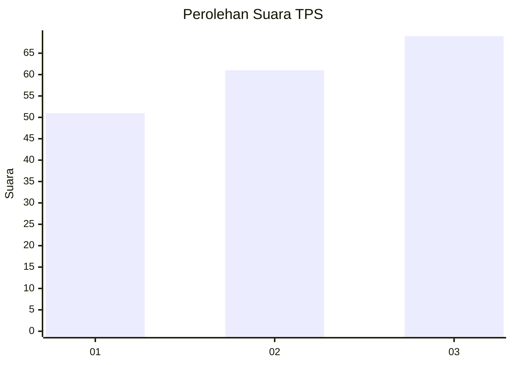
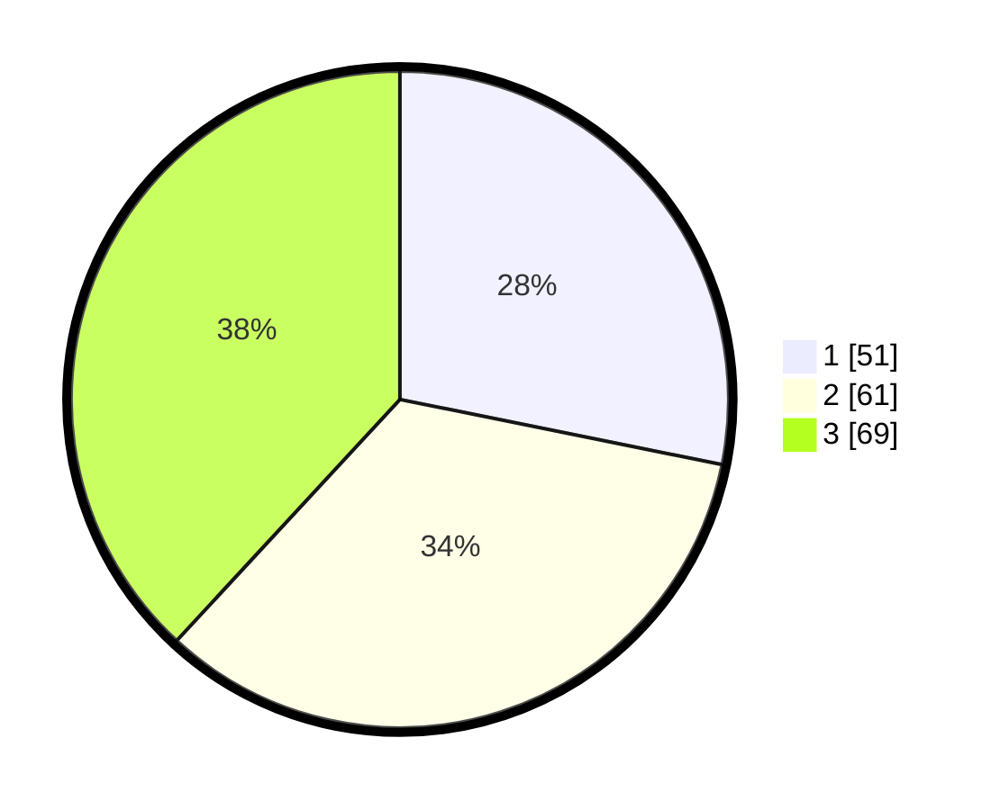

# Hasil

## Grafik

## Tabel

| No. | Nama Paslon    | Suara | Suara (raw) | Persentase |
|:--- |:-------------- | -----:| -----------:| ----------:|
| 1   | ANIES MUHAIMIN | 51    | [51][p-1]   | 28,18      |
| 2   | PRABOWO GIBRAN | 61    | [61][p-2]   | 33,70      |
| 3   | GANJAR MAHFUD  | 69    | [69][p-3]   | 38,12      |

[p-1]: https://github.com/gigit-pemilu/pemilu-2024-34-di-yogyakarta/blob/main/pilpres/hitung-suara/sub/34-di-yogyakarta/sub/02-bantul/sub/02-sanden/sub/2003-srigading/sub/005-tps/sub/paslon-1.txt
[p-2]: https://github.com/gigit-pemilu/pemilu-2024-34-di-yogyakarta/blob/main/pilpres/hitung-suara/sub/34-di-yogyakarta/sub/02-bantul/sub/02-sanden/sub/2003-srigading/sub/005-tps/sub/paslon-2.txt
[p-3]: https://github.com/gigit-pemilu/pemilu-2024-34-di-yogyakarta/blob/main/pilpres/hitung-suara/sub/34-di-yogyakarta/sub/02-bantul/sub/02-sanden/sub/2003-srigading/sub/005-tps/sub/paslon-3.txt

## Foto C Plano

https://sirekap-obj-formc.kpu.go.id/34a0/pemilu/ppwp/34/02/02/20/03/3402022003005-20240215-033801--6537b380-0a7c-48c7-b9bf-8613ad81fa0b.jpg

https://sirekap-obj-formc.kpu.go.id/34a0/pemilu/ppwp/34/02/02/20/03/3402022003005-20240215-202943--7c41d1b0-fc98-43d6-b682-e1daa01a1d50.jpg

https://sirekap-obj-formc.kpu.go.id/34a0/pemilu/ppwp/34/02/02/20/03/3402022003005-20240215-185851--ee725c9b-00a6-4a06-b08f-2e592e9d198c.jpg

## Metadata

| Key        | Value               |
| ---------- | ------------------- |
| Time Stamp | 2024-02-24 22:31:28 |

