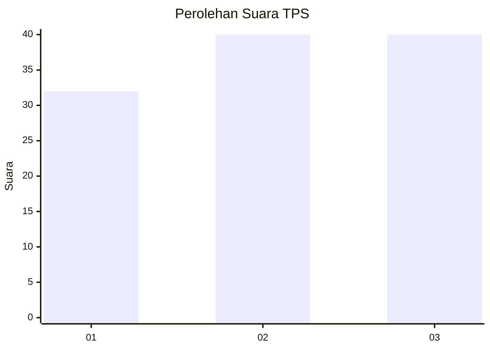
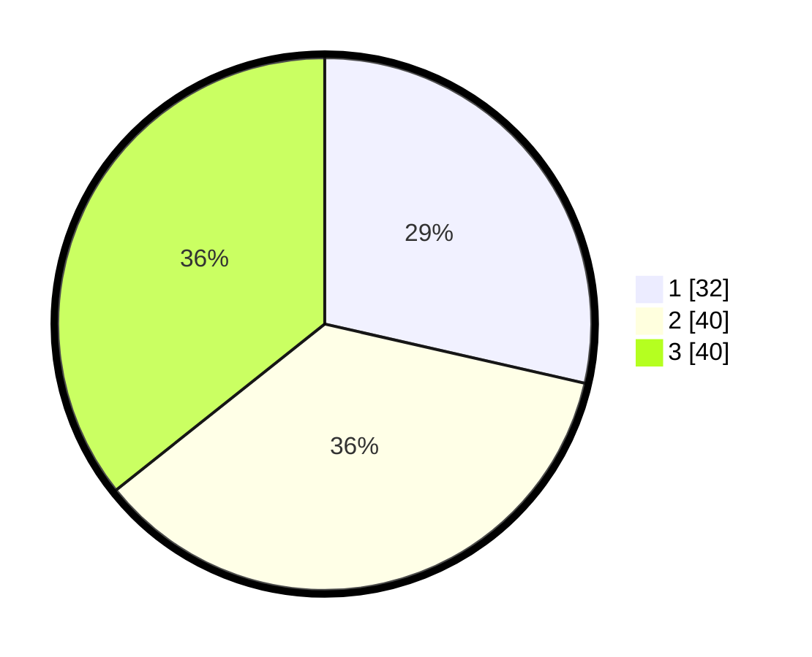

# Hasil

## Grafik

## Tabel

| No. | Nama Paslon    | Suara | Suara (raw) | Persentase |
|:--- |:-------------- | -----:| -----------:| ----------:|
| 1   | ANIES MUHAIMIN | 32    | [32][p-1]   | 28,57      |
| 2   | PRABOWO GIBRAN | 40    | [40][p-2]   | 35,71      |
| 3   | GANJAR MAHFUD  | 40    | [40][p-3]   | 35,71      |

[p-1]: https://github.com/gigit-pemilu/pemilu-2024-34-di-yogyakarta/blob/main/pilpres/hitung-suara/sub/34-di-yogyakarta/sub/02-bantul/sub/02-sanden/sub/2003-srigading/sub/006-tps/sub/paslon-1.txt
[p-2]: https://github.com/gigit-pemilu/pemilu-2024-34-di-yogyakarta/blob/main/pilpres/hitung-suara/sub/34-di-yogyakarta/sub/02-bantul/sub/02-sanden/sub/2003-srigading/sub/006-tps/sub/paslon-2.txt
[p-3]: https://github.com/gigit-pemilu/pemilu-2024-34-di-yogyakarta/blob/main/pilpres/hitung-suara/sub/34-di-yogyakarta/sub/02-bantul/sub/02-sanden/sub/2003-srigading/sub/006-tps/sub/paslon-3.txt

## Foto C Plano

https://sirekap-obj-formc.kpu.go.id/a830/pemilu/ppwp/34/02/02/20/03/3402022003006-20240215-025702--0b9bed3d-c49c-4b88-bc00-8c1784705838.jpg

https://sirekap-obj-formc.kpu.go.id/a830/pemilu/ppwp/34/02/02/20/03/3402022003006-20240214-203114--b3a733bb-7ccf-4d18-9f80-fff3990b4748.jpg

https://sirekap-obj-formc.kpu.go.id/a830/pemilu/ppwp/34/02/02/20/03/3402022003006-20240214-203119--bdcb2650-0d00-46bd-9773-fd3e7e5fce2e.jpg

## Metadata

| Key        | Value               |
| ---------- | ------------------- |
| Time Stamp | 2024-02-15 12:00:28 |

