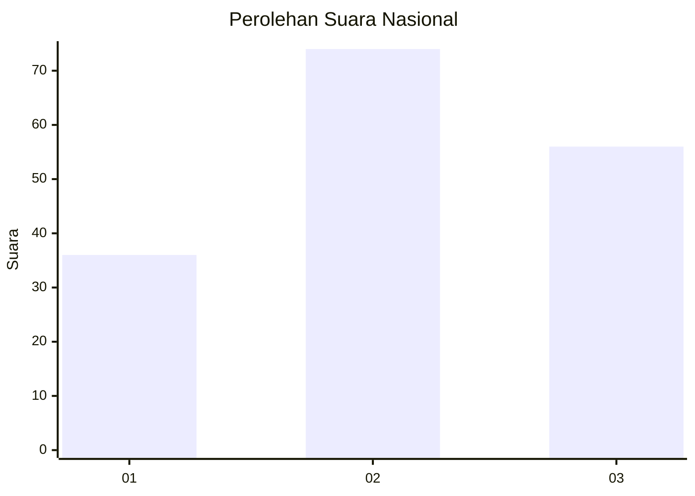
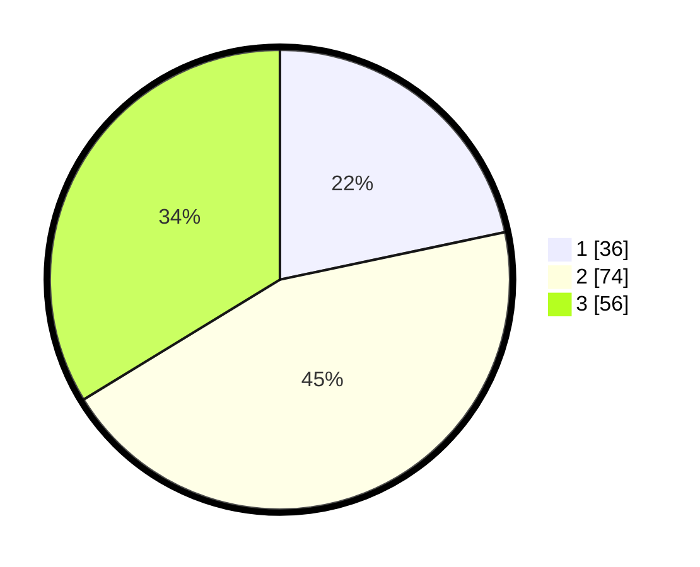

# Hasil

## Grafik

## Tabel

| No. | Nama Paslon    | Suara | Suara (raw) | Persentase |
|:--- |:-------------- | -----:| -----------:| ----------:|
| 1   | ANIES MUHAIMIN | 36    | [36][p-1]   | 21,69      |
| 2   | PRABOWO GIBRAN | 74    | [74][p-2]   | 44,58      |
| 3   | GANJAR MAHFUD  | 56    | [56][p-3]   | 33,73      |

[p-1]: https://github.com/gigit-pemilu/pemilu-2024/blob/main/pilpres/hitung-suara/sub/34-di-yogyakarta/sub/02-bantul/sub/02-sanden/sub/2003-srigading/sub/012-tps/sub/paslon-1.txt
[p-2]: https://github.com/gigit-pemilu/pemilu-2024/blob/main/pilpres/hitung-suara/sub/34-di-yogyakarta/sub/02-bantul/sub/02-sanden/sub/2003-srigading/sub/012-tps/sub/paslon-2.txt
[p-3]: https://github.com/gigit-pemilu/pemilu-2024/blob/main/pilpres/hitung-suara/sub/34-di-yogyakarta/sub/02-bantul/sub/02-sanden/sub/2003-srigading/sub/012-tps/sub/paslon-3.txt

## Foto C Plano

https://sirekap-obj-formc.kpu.go.id/d318/pemilu/ppwp/34/02/02/20/03/3402022003012-20240214-224340--9be82949-e73a-42e1-ac9b-97c9ea2025f3.jpg

https://sirekap-obj-formc.kpu.go.id/d318/pemilu/ppwp/34/02/02/20/03/3402022003012-20240214-224515--e71ffe11-cd52-458e-8667-a3d5239377c3.jpg

https://sirekap-obj-formc.kpu.go.id/d318/pemilu/ppwp/34/02/02/20/03/3402022003012-20240214-224658--1067d698-4258-428a-9f6f-fe7890a39c23.jpg

## Metadata

| Key        | Value               |
| ---------- | ------------------- |
| Time Stamp | 2024-02-24 22:31:28 |

