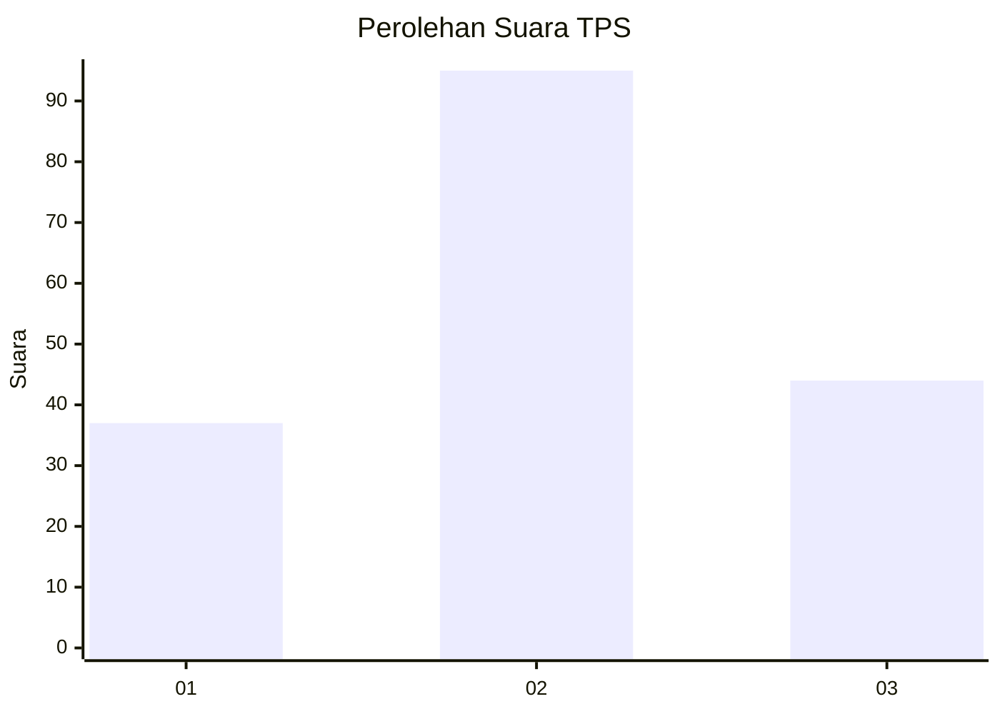
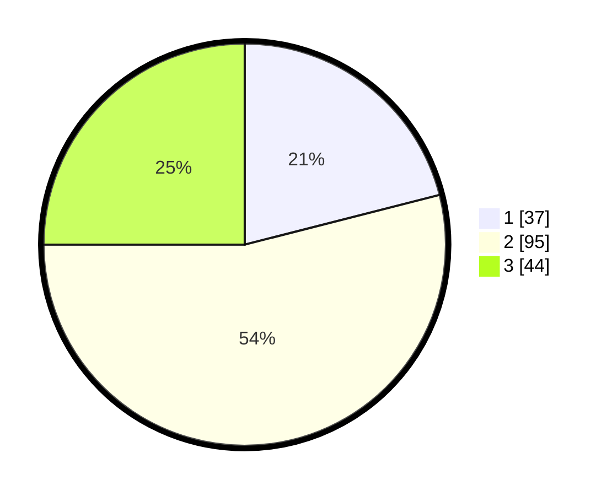

# Hasil

## Grafik

## Tabel

| No. | Nama Paslon    | Suara | Suara (raw) | Persentase |
|:--- |:-------------- | -----:| -----------:| ----------:|
| 1   | ANIES MUHAIMIN | 37    | [37][p-1]   | 21,02      |
| 2   | PRABOWO GIBRAN | 95    | [95][p-2]   | 53,98      |
| 3   | GANJAR MAHFUD  | 44    | [44][p-3]   | 25,00      |

[p-1]: https://github.com/gigit-pemilu/pemilu-2024-34-di-yogyakarta/blob/main/pilpres/hitung-suara/sub/34-di-yogyakarta/sub/02-bantul/sub/02-sanden/sub/2003-srigading/sub/014-tps/sub/paslon-1.txt
[p-2]: https://github.com/gigit-pemilu/pemilu-2024-34-di-yogyakarta/blob/main/pilpres/hitung-suara/sub/34-di-yogyakarta/sub/02-bantul/sub/02-sanden/sub/2003-srigading/sub/014-tps/sub/paslon-2.txt
[p-3]: https://github.com/gigit-pemilu/pemilu-2024-34-di-yogyakarta/blob/main/pilpres/hitung-suara/sub/34-di-yogyakarta/sub/02-bantul/sub/02-sanden/sub/2003-srigading/sub/014-tps/sub/paslon-3.txt

## Foto C Plano

https://sirekap-obj-formc.kpu.go.id/3a1f/pemilu/ppwp/34/02/02/20/03/3402022003014-20240218-152632--66676e25-6c98-4f14-8074-cceaa9f5f49f.jpg

https://sirekap-obj-formc.kpu.go.id/3a1f/pemilu/ppwp/34/02/02/20/03/3402022003014-20240218-152700--16a3c86c-abf1-4e04-addf-b17a8c6f1016.jpg

https://sirekap-obj-formc.kpu.go.id/3a1f/pemilu/ppwp/34/02/02/20/03/3402022003014-20240218-152744--9ec47074-5f7e-41a4-9c54-373b81237842.jpg

## Metadata

| Key        | Value               |
| ---------- | ------------------- |
| Time Stamp | 2024-02-24 22:31:28 |

