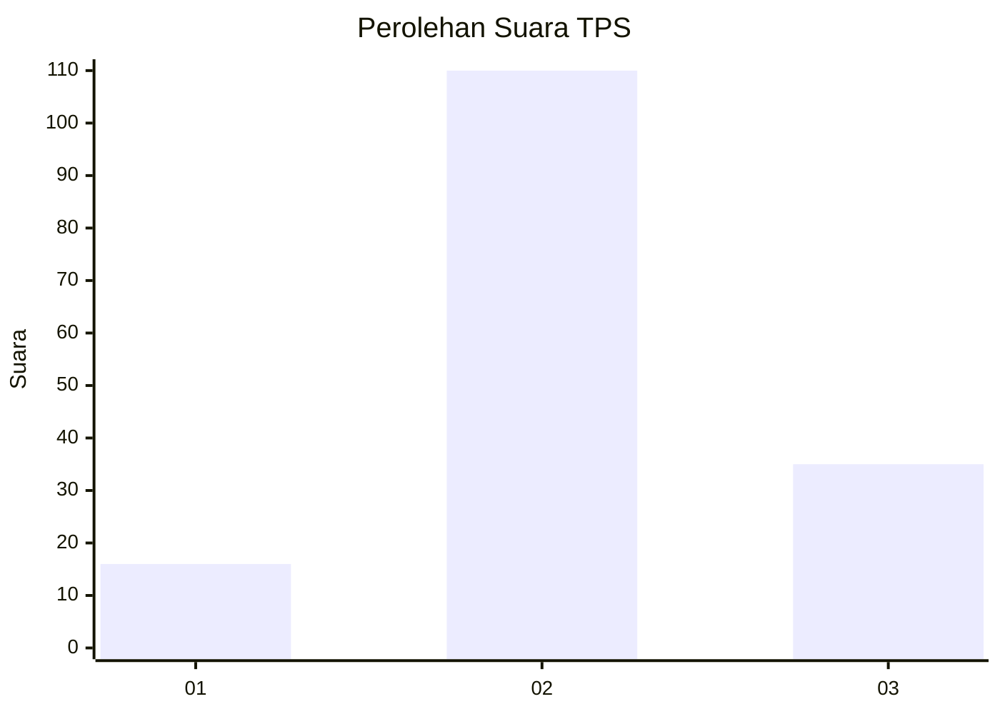
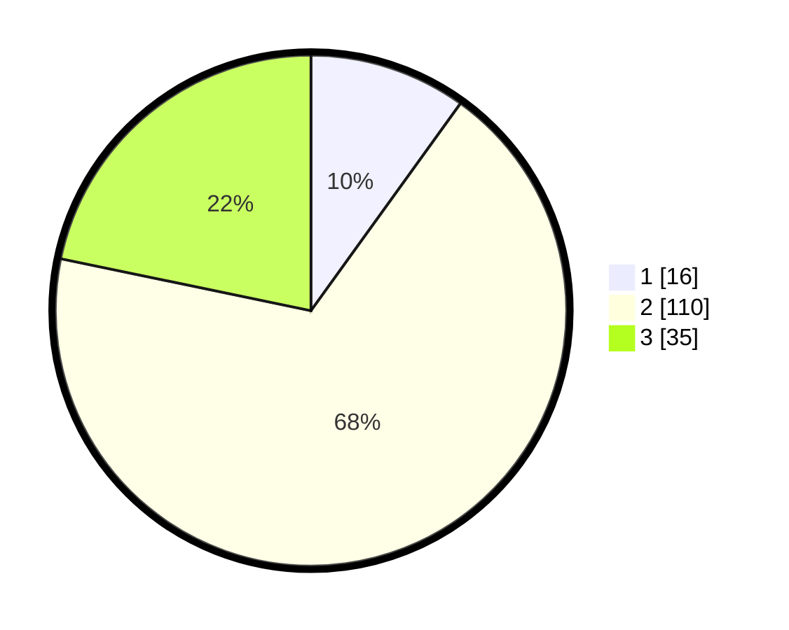

# Hasil

## Grafik

## Tabel

| No. | Nama Paslon    | Suara | Suara (raw) | Persentase |
|:--- |:-------------- | -----:| -----------:| ----------:|
| 1   | ANIES MUHAIMIN | 16    | [16][p-1]   | 9,94       |
| 2   | PRABOWO GIBRAN | 110   | [110][p-2]  | 68,32      |
| 3   | GANJAR MAHFUD  | 35    | [35][p-3]   | 21,74      |

[p-1]: https://github.com/gigit-pemilu/pemilu-2024-34-di-yogyakarta/blob/main/pilpres/hitung-suara/sub/34-di-yogyakarta/sub/02-bantul/sub/02-sanden/sub/2003-srigading/sub/016-tps/sub/paslon-1.txt
[p-2]: https://github.com/gigit-pemilu/pemilu-2024-34-di-yogyakarta/blob/main/pilpres/hitung-suara/sub/34-di-yogyakarta/sub/02-bantul/sub/02-sanden/sub/2003-srigading/sub/016-tps/sub/paslon-2.txt
[p-3]: https://github.com/gigit-pemilu/pemilu-2024-34-di-yogyakarta/blob/main/pilpres/hitung-suara/sub/34-di-yogyakarta/sub/02-bantul/sub/02-sanden/sub/2003-srigading/sub/016-tps/sub/paslon-3.txt

## Foto C Plano

https://sirekap-obj-formc.kpu.go.id/b2ac/pemilu/ppwp/34/02/02/20/03/3402022003016-20240214-222943--739d1b9e-fee1-46b2-b1e4-587aa06fcd3a.jpg

https://sirekap-obj-formc.kpu.go.id/b2ac/pemilu/ppwp/34/02/02/20/03/3402022003016-20240214-223124--fa6252d5-066b-4114-b5cc-0c702ffed5c0.jpg

https://sirekap-obj-formc.kpu.go.id/b2ac/pemilu/ppwp/34/02/02/20/03/3402022003016-20240214-223354--b25d98dc-ab44-4db9-9cee-4c905c57de0c.jpg

## Metadata

| Key        | Value               |
| ---------- | ------------------- |
| Time Stamp | 2024-02-24 22:31:28 |

