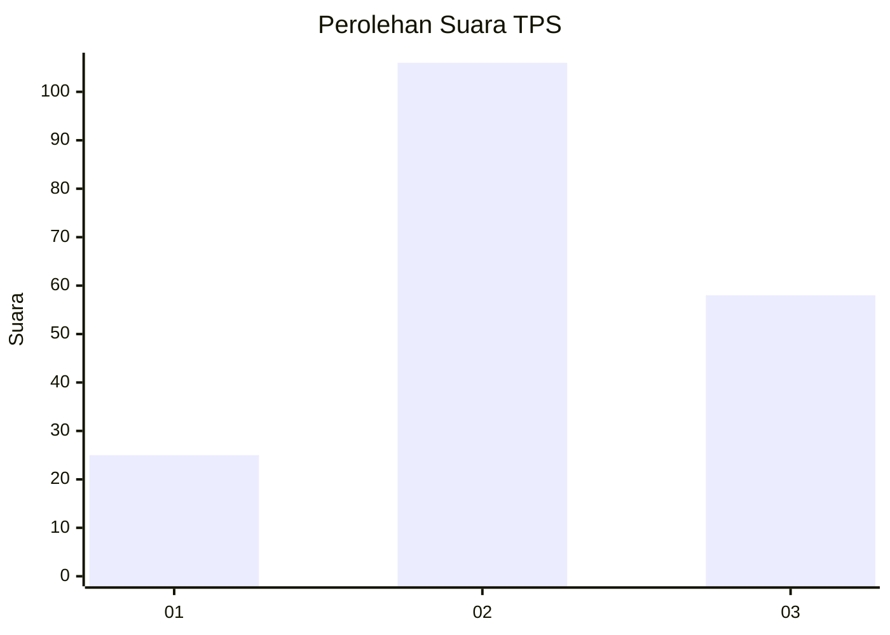
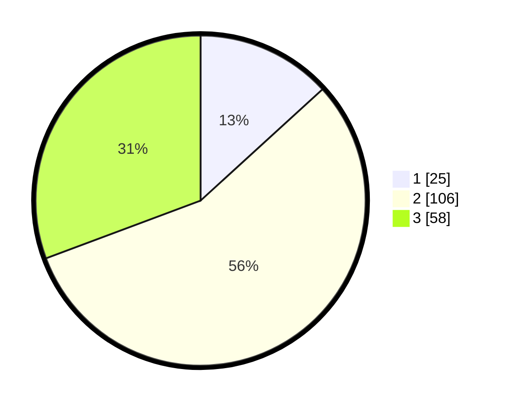

# Hasil

## Grafik

## Tabel

| No. | Nama Paslon    | Suara | Suara (raw) | Persentase |
|:--- |:-------------- | -----:| -----------:| ----------:|
| 1   | ANIES MUHAIMIN | 25    | [25][p-1]   | 13,23      |
| 2   | PRABOWO GIBRAN | 106   | [106][p-2]  | 56,08      |
| 3   | GANJAR MAHFUD  | 58    | [58][p-3]   | 30,69      |

[p-1]: https://github.com/gigit-pemilu/pemilu-2024-34-di-yogyakarta/blob/main/pilpres/hitung-suara/sub/34-di-yogyakarta/sub/02-bantul/sub/02-sanden/sub/2003-srigading/sub/021-tps/sub/paslon-1.txt
[p-2]: https://github.com/gigit-pemilu/pemilu-2024-34-di-yogyakarta/blob/main/pilpres/hitung-suara/sub/34-di-yogyakarta/sub/02-bantul/sub/02-sanden/sub/2003-srigading/sub/021-tps/sub/paslon-2.txt
[p-3]: https://github.com/gigit-pemilu/pemilu-2024-34-di-yogyakarta/blob/main/pilpres/hitung-suara/sub/34-di-yogyakarta/sub/02-bantul/sub/02-sanden/sub/2003-srigading/sub/021-tps/sub/paslon-3.txt

## Foto C Plano

https://sirekap-obj-formc.kpu.go.id/86f5/pemilu/ppwp/34/02/02/20/03/3402022003021-20240214-232437--2537f6db-ddfc-41fa-9c08-635468c72f5d.jpg

https://sirekap-obj-formc.kpu.go.id/86f5/pemilu/ppwp/34/02/02/20/03/3402022003021-20240214-222048--29a27643-4837-4e33-ae8a-36971da63c83.jpg

https://sirekap-obj-formc.kpu.go.id/86f5/pemilu/ppwp/34/02/02/20/03/3402022003021-20240214-222121--8a4d7aae-e2c3-4503-adac-18baa4239e4f.jpg

## Metadata

| Key        | Value               |
| ---------- | ------------------- |
| Time Stamp | 2024-02-24 22:31:28 |

