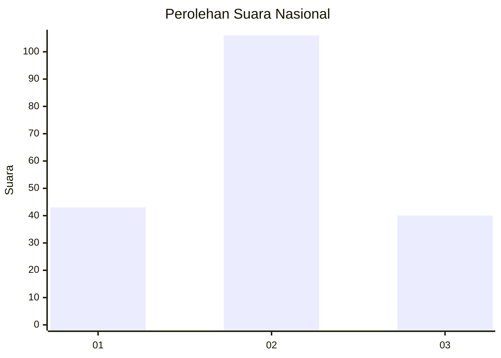
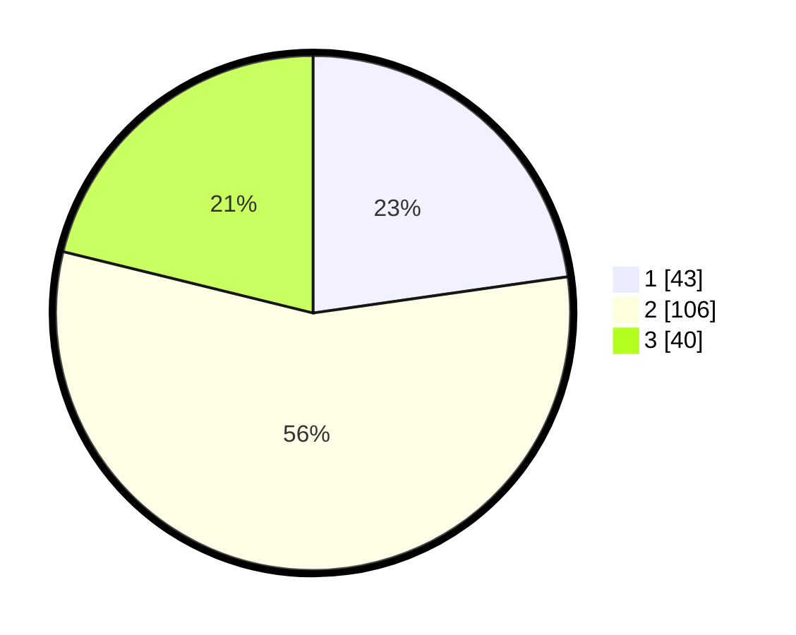

# Hasil

## Grafik

## Tabel

| No. | Nama Paslon    | Suara | Suara (raw) | Persentase |
|:--- |:-------------- | -----:| -----------:| ----------:|
| 1   | ANIES MUHAIMIN | 43    | [43][p-1]   | 22,75      |
| 2   | PRABOWO GIBRAN | 106   | [106][p-2]  | 56,08      |
| 3   | GANJAR MAHFUD  | 40    | [40][p-3]   | 21,16      |

[p-1]: https://github.com/gigit-pemilu/pemilu-2024/blob/main/pilpres/hitung-suara/sub/34-di-yogyakarta/sub/02-bantul/sub/02-sanden/sub/2003-srigading/sub/022-tps/sub/paslon-1.txt
[p-2]: https://github.com/gigit-pemilu/pemilu-2024/blob/main/pilpres/hitung-suara/sub/34-di-yogyakarta/sub/02-bantul/sub/02-sanden/sub/2003-srigading/sub/022-tps/sub/paslon-2.txt
[p-3]: https://github.com/gigit-pemilu/pemilu-2024/blob/main/pilpres/hitung-suara/sub/34-di-yogyakarta/sub/02-bantul/sub/02-sanden/sub/2003-srigading/sub/022-tps/sub/paslon-3.txt

## Foto C Plano

https://sirekap-obj-formc.kpu.go.id/17c2/pemilu/ppwp/34/02/02/20/03/3402022003022-20240215-014848--2883ac95-b7ab-445c-807a-80198be419e5.jpg

https://sirekap-obj-formc.kpu.go.id/17c2/pemilu/ppwp/34/02/02/20/03/3402022003022-20240215-014944--0c1c18fc-3ed6-4977-9ed9-8fc562897ad8.jpg

https://sirekap-obj-formc.kpu.go.id/17c2/pemilu/ppwp/34/02/02/20/03/3402022003022-20240215-015242--b4b3bea4-5482-4022-b1d9-bb547a8a2ab0.jpg

## Metadata

| Key        | Value               |
| ---------- | ------------------- |
| Time Stamp | 2024-02-24 22:31:28 |

