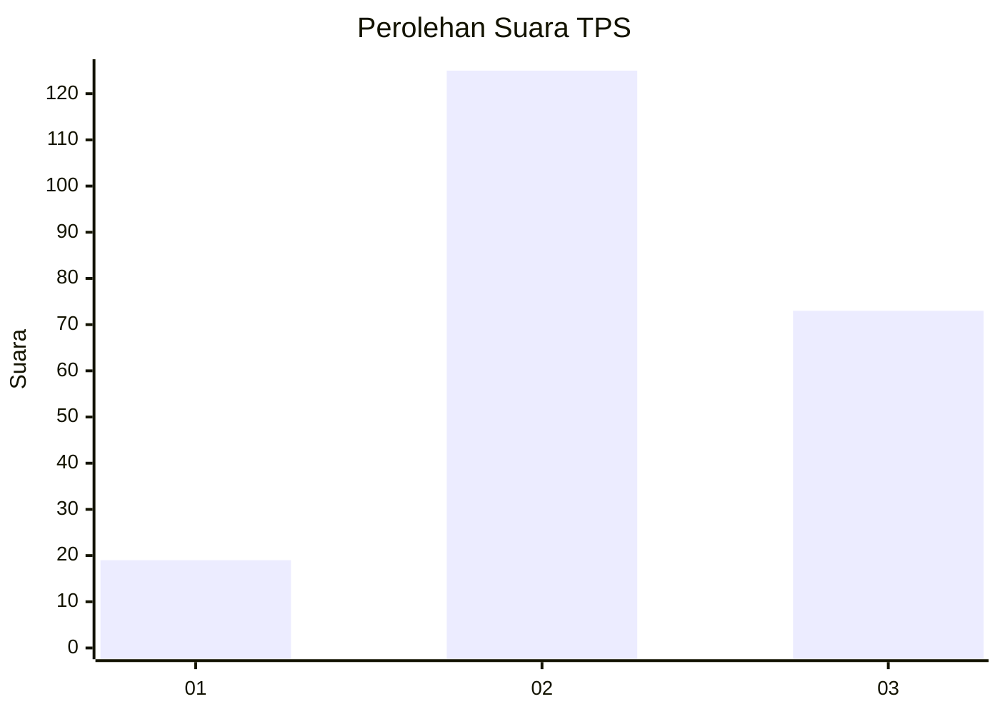
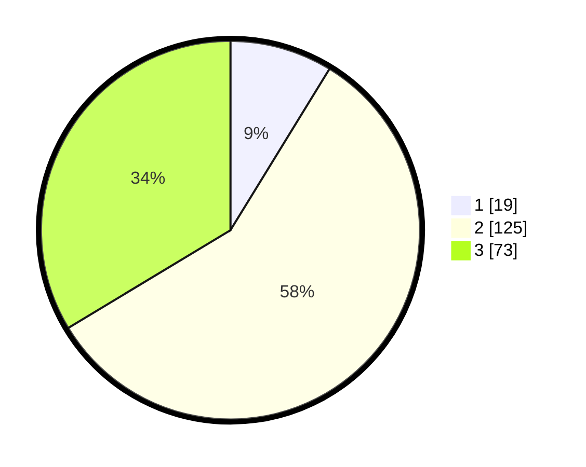

# Hasil

## Grafik

## Tabel

| No. | Nama Paslon    | Suara | Suara (raw) | Persentase |
|:--- |:-------------- | -----:| -----------:| ----------:|
| 1   | ANIES MUHAIMIN | 19    | [19][p-1]   | 8,76       |
| 2   | PRABOWO GIBRAN | 125   | [125][p-2]  | 57,60      |
| 3   | GANJAR MAHFUD  | 73    | [73][p-3]   | 33,64      |

[p-1]: https://github.com/gigit-pemilu/pemilu-2024-34-di-yogyakarta/blob/main/pilpres/hitung-suara/sub/34-di-yogyakarta/sub/02-bantul/sub/02-sanden/sub/2003-srigading/sub/027-tps/sub/paslon-1.txt
[p-2]: https://github.com/gigit-pemilu/pemilu-2024-34-di-yogyakarta/blob/main/pilpres/hitung-suara/sub/34-di-yogyakarta/sub/02-bantul/sub/02-sanden/sub/2003-srigading/sub/027-tps/sub/paslon-2.txt
[p-3]: https://github.com/gigit-pemilu/pemilu-2024-34-di-yogyakarta/blob/main/pilpres/hitung-suara/sub/34-di-yogyakarta/sub/02-bantul/sub/02-sanden/sub/2003-srigading/sub/027-tps/sub/paslon-3.txt

## Foto C Plano

https://sirekap-obj-formc.kpu.go.id/6c8a/pemilu/ppwp/34/02/02/20/03/3402022003027-20240216-042911--612cf778-af85-4c4b-b6a9-4586cb9a073b.jpg

https://sirekap-obj-formc.kpu.go.id/6c8a/pemilu/ppwp/34/02/02/20/03/3402022003027-20240216-043637--b8f47cf6-349c-4b41-bbd8-cd570a7f673c.jpg

https://sirekap-obj-formc.kpu.go.id/6c8a/pemilu/ppwp/34/02/02/20/03/3402022003027-20240216-042919--c03e8281-0c25-4ed2-a5f3-ddcc4ab5ad4e.jpg

## Metadata

| Key        | Value               |
| ---------- | ------------------- |
| Time Stamp | 2024-02-16 12:51:22 |

## DATA PEMILIH TETAP

Jumlah pemilih dalam DPT: **231**.
 * L: **123**.
 * P: **108**.

## DATA PENGGUNA HAK PILIH

Jumlah pengguna hak pilih dalam DPT: **210**.
 * L: **111**.
 * P: **99**.

Jumlah pengguna hak pilih dalam DPTb: **0**.
 * L: **0**.
 * P: **0**.

Jumlah pengguna hak pilih dalam DPK: **12**.
 * L: **3**.
 * P: **9**.

Jumlah pengguna hak pilih: **222**.
 * L: **114**.
 * P: **108**.

## JUMLAH SUARA SAH DAN TIDAK SAH

JUMLAH SELURUH SUARA SAH: **217**.

JUMLAH SUARA TIDAK SAH: **5**.

JUMLAH SELURUH SUARA SAH DAN SUARA TIDAK SAH: **222**.

