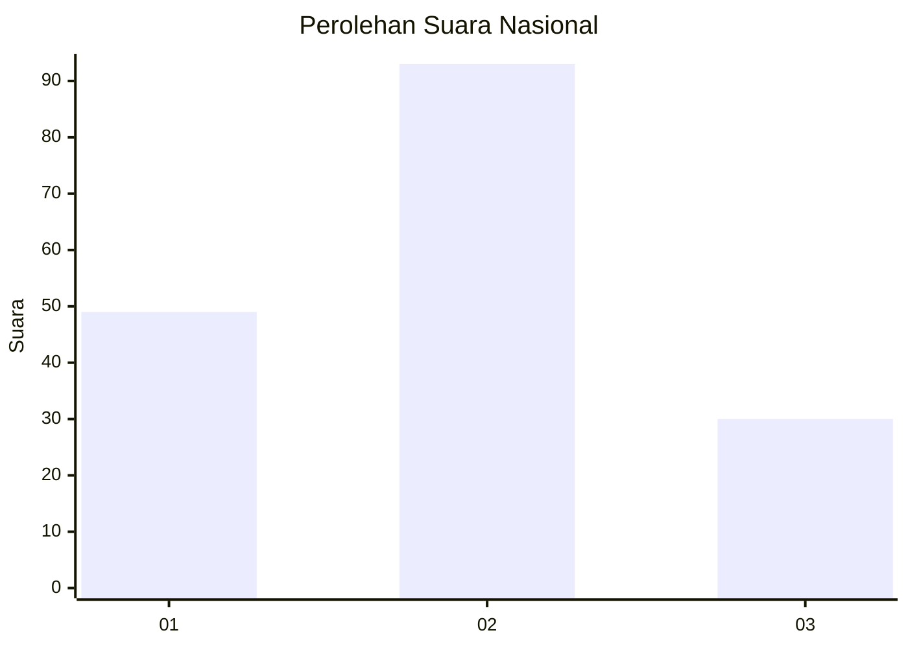
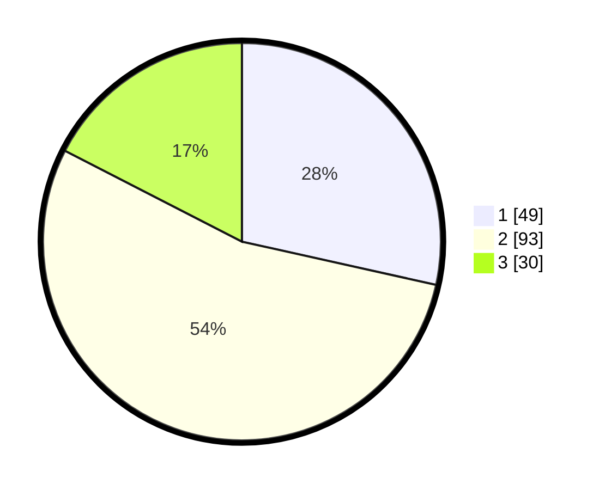

# Hasil

## Grafik

## Tabel

| No. | Nama Paslon    | Suara | Suara (raw) | Persentase |
|:--- |:-------------- | -----:| -----------:| ----------:|
| 1   | ANIES MUHAIMIN | 49    | [49][p-1]   | 28,49      |
| 2   | PRABOWO GIBRAN | 93    | [93][p-2]   | 54,07      |
| 3   | GANJAR MAHFUD  | 30    | [30][p-3]   | 17,44      |

[p-1]: https://github.com/gigit-pemilu/pemilu-2024/blob/main/pilpres/hitung-suara/sub/34-di-yogyakarta/sub/02-bantul/sub/02-sanden/sub/2004-murtigading/sub/001-tps/sub/paslon-1.txt
[p-2]: https://github.com/gigit-pemilu/pemilu-2024/blob/main/pilpres/hitung-suara/sub/34-di-yogyakarta/sub/02-bantul/sub/02-sanden/sub/2004-murtigading/sub/001-tps/sub/paslon-2.txt
[p-3]: https://github.com/gigit-pemilu/pemilu-2024/blob/main/pilpres/hitung-suara/sub/34-di-yogyakarta/sub/02-bantul/sub/02-sanden/sub/2004-murtigading/sub/001-tps/sub/paslon-3.txt

## Foto C Plano

https://sirekap-obj-formc.kpu.go.id/b6b8/pemilu/ppwp/34/02/02/20/04/3402022004001-20240214-232608--fca8429c-e0cf-4588-9c3f-5f3cf56ff722.jpg

https://sirekap-obj-formc.kpu.go.id/b6b8/pemilu/ppwp/34/02/02/20/04/3402022004001-20240215-004508--7d6d83c8-ddb4-4a18-969a-da1c00dc26eb.jpg

https://sirekap-obj-formc.kpu.go.id/b6b8/pemilu/ppwp/34/02/02/20/04/3402022004001-20240215-004543--50c10b21-bf42-46a1-8f5a-bc3dd7aee2e9.jpg

## Metadata

| Key        | Value               |
| ---------- | ------------------- |
| Time Stamp | 2024-02-24 22:31:28 |

