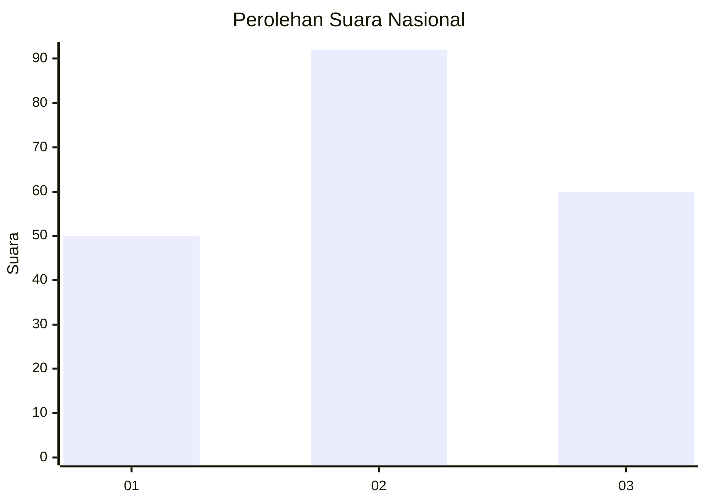
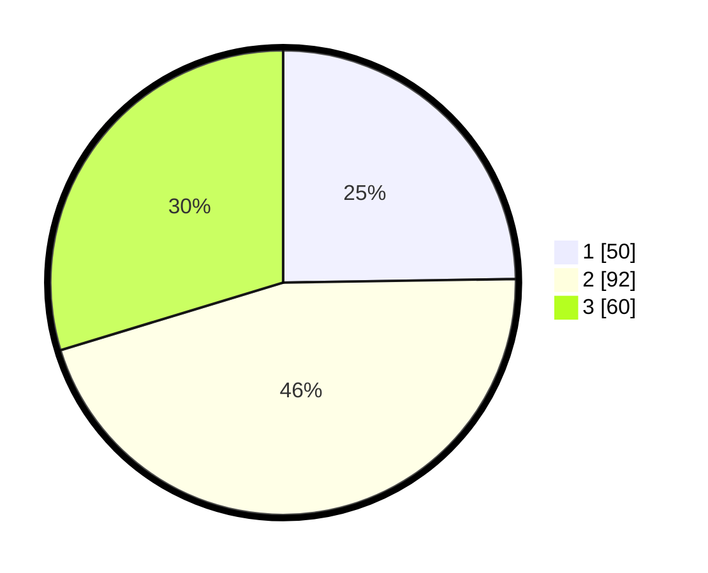

# Hasil

## Grafik

## Tabel

| No. | Nama Paslon    | Suara | Suara (raw) | Persentase |
|:--- |:-------------- | -----:| -----------:| ----------:|
| 1   | ANIES MUHAIMIN | 50    | [50][p-1]   | 24,75      |
| 2   | PRABOWO GIBRAN | 92    | [92][p-2]   | 45,54      |
| 3   | GANJAR MAHFUD  | 60    | [60][p-3]   | 29,70      |

[p-1]: https://github.com/gigit-pemilu/pemilu-2024/blob/main/pilpres/hitung-suara/sub/34-di-yogyakarta/sub/02-bantul/sub/02-sanden/sub/2004-murtigading/sub/002-tps/sub/paslon-1.txt
[p-2]: https://github.com/gigit-pemilu/pemilu-2024/blob/main/pilpres/hitung-suara/sub/34-di-yogyakarta/sub/02-bantul/sub/02-sanden/sub/2004-murtigading/sub/002-tps/sub/paslon-2.txt
[p-3]: https://github.com/gigit-pemilu/pemilu-2024/blob/main/pilpres/hitung-suara/sub/34-di-yogyakarta/sub/02-bantul/sub/02-sanden/sub/2004-murtigading/sub/002-tps/sub/paslon-3.txt

## Foto C Plano

https://sirekap-obj-formc.kpu.go.id/ec81/pemilu/ppwp/34/02/02/20/04/3402022004002-20240214-215857--5147f9fd-39e0-46ac-add5-c4b37b37850c.jpg

https://sirekap-obj-formc.kpu.go.id/ec81/pemilu/ppwp/34/02/02/20/04/3402022004002-20240214-220156--9a7efcad-eda4-4210-b9d2-65716be9daca.jpg

https://sirekap-obj-formc.kpu.go.id/ec81/pemilu/ppwp/34/02/02/20/04/3402022004002-20240214-233825--1c2d1b36-eadb-41a6-a62b-061ff9b266c2.jpg

## Metadata

| Key        | Value               |
| ---------- | ------------------- |
| Time Stamp | 2024-02-24 22:31:28 |

