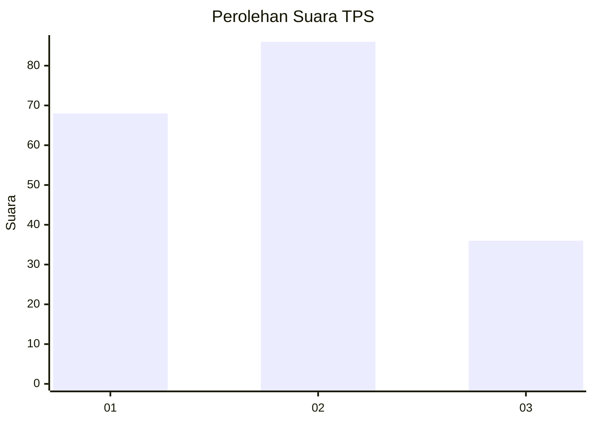
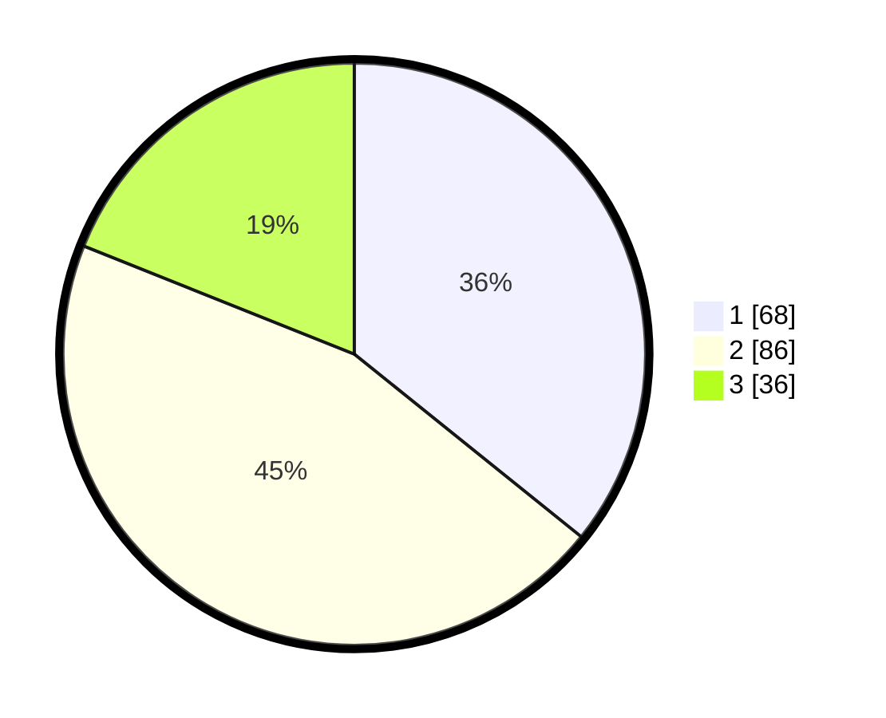

# Hasil

## Grafik

## Tabel

| No. | Nama Paslon    | Suara | Suara (raw) | Persentase |
|:--- |:-------------- | -----:| -----------:| ----------:|
| 1   | ANIES MUHAIMIN | 68    | [68][p-1]   | 35,79      |
| 2   | PRABOWO GIBRAN | 86    | [86][p-2]   | 45,26      |
| 3   | GANJAR MAHFUD  | 36    | [36][p-3]   | 18,95      |

[p-1]: https://github.com/gigit-pemilu/pemilu-2024-34-di-yogyakarta/blob/main/pilpres/hitung-suara/sub/34-di-yogyakarta/sub/02-bantul/sub/02-sanden/sub/2004-murtigading/sub/005-tps/sub/paslon-1.txt
[p-2]: https://github.com/gigit-pemilu/pemilu-2024-34-di-yogyakarta/blob/main/pilpres/hitung-suara/sub/34-di-yogyakarta/sub/02-bantul/sub/02-sanden/sub/2004-murtigading/sub/005-tps/sub/paslon-2.txt
[p-3]: https://github.com/gigit-pemilu/pemilu-2024-34-di-yogyakarta/blob/main/pilpres/hitung-suara/sub/34-di-yogyakarta/sub/02-bantul/sub/02-sanden/sub/2004-murtigading/sub/005-tps/sub/paslon-3.txt

## Foto C Plano

https://sirekap-obj-formc.kpu.go.id/21a7/pemilu/ppwp/34/02/02/20/04/3402022004005-20240214-224136--08e30551-3def-45f9-b837-72501fc23e85.jpg

https://sirekap-obj-formc.kpu.go.id/21a7/pemilu/ppwp/34/02/02/20/04/3402022004005-20240214-155357--0aa885c6-b72c-4c41-b77d-0efae77fd31e.jpg

https://sirekap-obj-formc.kpu.go.id/21a7/pemilu/ppwp/34/02/02/20/04/3402022004005-20240214-225837--d04dabd7-107f-4b02-92b1-f9a864ab81a3.jpg

## Metadata

| Key        | Value               |
| ---------- | ------------------- |
| Time Stamp | 2024-02-15 19:30:26 |

