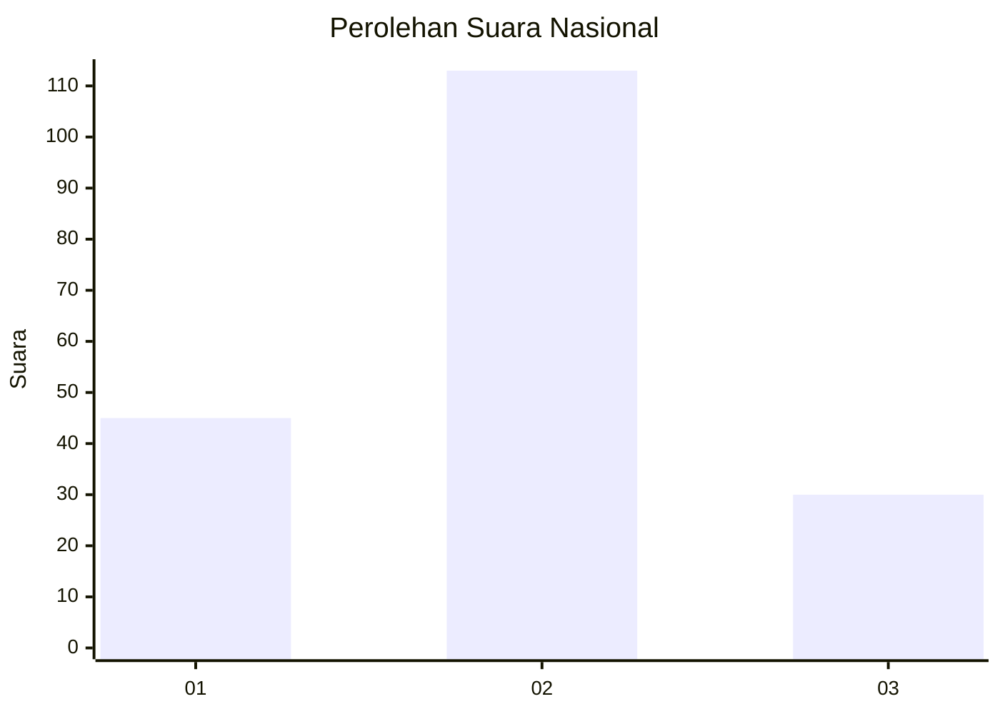

# Hasil

## Grafik

## Tabel

| No. | Nama Paslon    | Suara | Suara (raw) | Persentase |
|:--- |:-------------- | -----:| -----------:| ----------:|
| 1   | ANIES MUHAIMIN | 45    | [45][p-1]   | 23,94      |
| 2   | PRABOWO GIBRAN | 113   | [113][p-2]  | 60,11      |
| 3   | GANJAR MAHFUD  | 30    | [30][p-3]   | 15,96      |

[p-1]: https://github.com/gigit-pemilu/pemilu-2024/blob/main/pilpres/hitung-suara/sub/34-di-yogyakarta/sub/02-bantul/sub/02-sanden/sub/2004-murtigading/sub/006-tps/sub/paslon-1.txt
[p-2]: https://github.com/gigit-pemilu/pemilu-2024/blob/main/pilpres/hitung-suara/sub/34-di-yogyakarta/sub/02-bantul/sub/02-sanden/sub/2004-murtigading/sub/006-tps/sub/paslon-2.txt
[p-3]: https://github.com/gigit-pemilu/pemilu-2024/blob/main/pilpres/hitung-suara/sub/34-di-yogyakarta/sub/02-bantul/sub/02-sanden/sub/2004-murtigading/sub/006-tps/sub/paslon-3.txt

## Foto C Plano

https://sirekap-obj-formc.kpu.go.id/cda6/pemilu/ppwp/34/02/02/20/04/3402022004006-20240214-235823--6fe1a98e-0d18-4a21-bc45-cab53d42473c.jpg

https://sirekap-obj-formc.kpu.go.id/cda6/pemilu/ppwp/34/02/02/20/04/3402022004006-20240214-234821--fb772a0c-a085-41c0-912b-7c910b1a282f.jpg

https://sirekap-obj-formc.kpu.go.id/cda6/pemilu/ppwp/34/02/02/20/04/3402022004006-20240215-000610--680f9e49-1134-46cf-b18d-9d5dfbe3968c.jpg

## Metadata

| Key        | Value               |
| ---------- | ------------------- |
| Time Stamp | 2024-02-24 22:31:28 |

