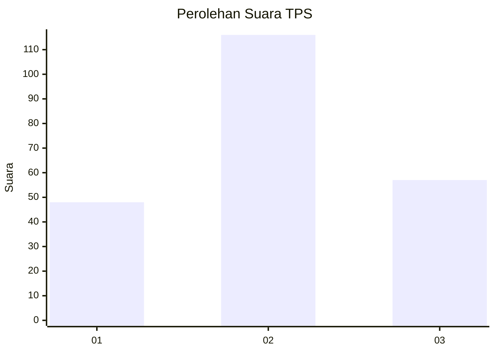
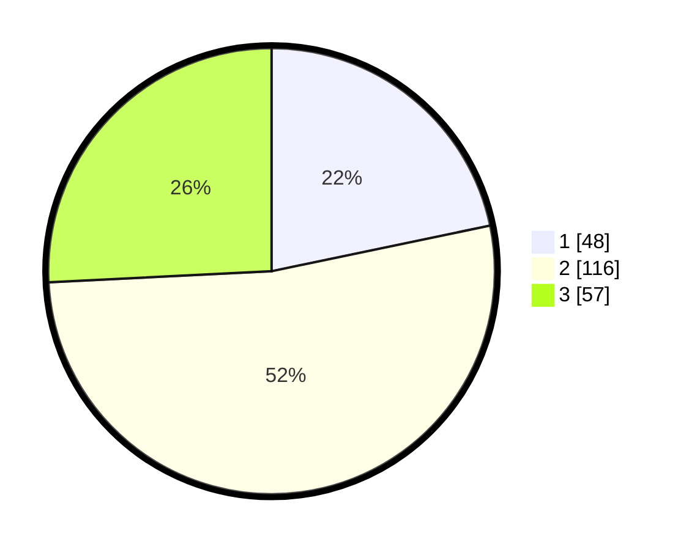

# Hasil

## Grafik

## Tabel

| No. | Nama Paslon    | Suara | Suara (raw) | Persentase |
|:--- |:-------------- | -----:| -----------:| ----------:|
| 1   | ANIES MUHAIMIN | 48    | [48][p-1]   | 21,72      |
| 2   | PRABOWO GIBRAN | 116   | [116][p-2]  | 52,49      |
| 3   | GANJAR MAHFUD  | 57    | [57][p-3]   | 25,79      |

[p-1]: https://github.com/gigit-pemilu/pemilu-2024-34-di-yogyakarta/blob/main/pilpres/hitung-suara/sub/34-di-yogyakarta/sub/02-bantul/sub/02-sanden/sub/2004-murtigading/sub/008-tps/sub/paslon-1.txt
[p-2]: https://github.com/gigit-pemilu/pemilu-2024-34-di-yogyakarta/blob/main/pilpres/hitung-suara/sub/34-di-yogyakarta/sub/02-bantul/sub/02-sanden/sub/2004-murtigading/sub/008-tps/sub/paslon-2.txt
[p-3]: https://github.com/gigit-pemilu/pemilu-2024-34-di-yogyakarta/blob/main/pilpres/hitung-suara/sub/34-di-yogyakarta/sub/02-bantul/sub/02-sanden/sub/2004-murtigading/sub/008-tps/sub/paslon-3.txt

## Foto C Plano

https://sirekap-obj-formc.kpu.go.id/8b3f/pemilu/ppwp/34/02/02/20/04/3402022004008-20240214-234759--f6b3d2f5-ec66-4d52-9955-1dc9c725f019.jpg

https://sirekap-obj-formc.kpu.go.id/8b3f/pemilu/ppwp/34/02/02/20/04/3402022004008-20240215-012038--3e928e9d-007b-4abd-bd97-7f49630f9b77.jpg

https://sirekap-obj-formc.kpu.go.id/8b3f/pemilu/ppwp/34/02/02/20/04/3402022004008-20240215-012434--0e2874a8-a4a7-43a1-ae6f-d978d67704e3.jpg

## Metadata

| Key        | Value               |
| ---------- | ------------------- |
| Time Stamp | 2024-02-25 14:00:00 |

