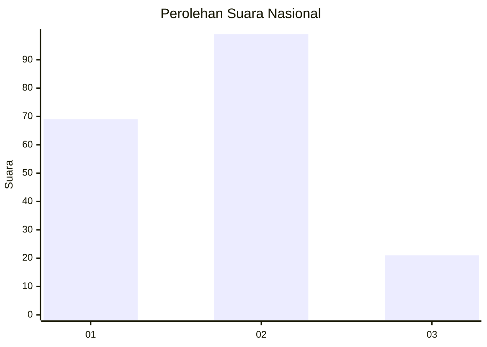
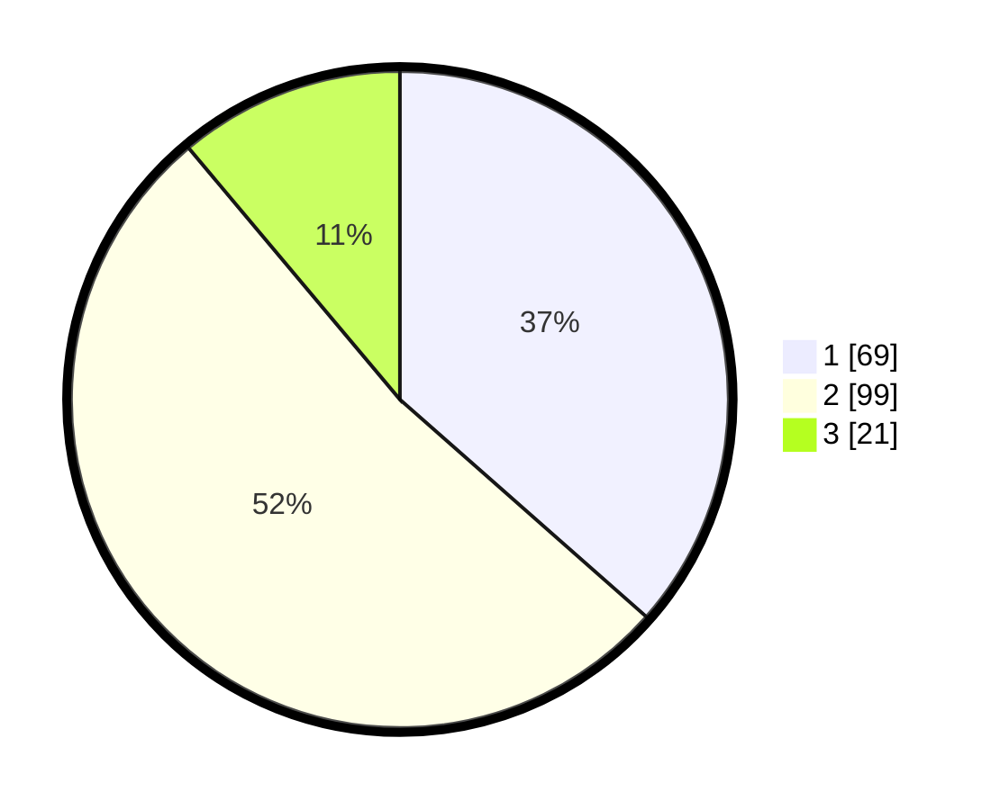

# Hasil

## Grafik

## Tabel

| No. | Nama Paslon    | Suara | Suara (raw) | Persentase |
|:--- |:-------------- | -----:| -----------:| ----------:|
| 1   | ANIES MUHAIMIN | 69    | [69][p-1]   | 36,51      |
| 2   | PRABOWO GIBRAN | 99    | [99][p-2]   | 52,38      |
| 3   | GANJAR MAHFUD  | 21    | [21][p-3]   | 11,11      |

[p-1]: https://github.com/gigit-pemilu/pemilu-2024/blob/main/pilpres/hitung-suara/sub/34-di-yogyakarta/sub/02-bantul/sub/02-sanden/sub/2004-murtigading/sub/009-tps/sub/paslon-1.txt
[p-2]: https://github.com/gigit-pemilu/pemilu-2024/blob/main/pilpres/hitung-suara/sub/34-di-yogyakarta/sub/02-bantul/sub/02-sanden/sub/2004-murtigading/sub/009-tps/sub/paslon-2.txt
[p-3]: https://github.com/gigit-pemilu/pemilu-2024/blob/main/pilpres/hitung-suara/sub/34-di-yogyakarta/sub/02-bantul/sub/02-sanden/sub/2004-murtigading/sub/009-tps/sub/paslon-3.txt

## Foto C Plano

https://sirekap-obj-formc.kpu.go.id/084e/pemilu/ppwp/34/02/02/20/04/3402022004009-20240215-085120--fb3f0c0c-a6a1-4a95-b312-54dc008293fb.jpg

https://sirekap-obj-formc.kpu.go.id/084e/pemilu/ppwp/34/02/02/20/04/3402022004009-20240215-085127--46a7a99d-d47f-440a-9df6-b526cdf348cc.jpg

https://sirekap-obj-formc.kpu.go.id/084e/pemilu/ppwp/34/02/02/20/04/3402022004009-20240215-085134--5f397228-3d6f-45c4-b8b7-b7d8762ee374.jpg

## Metadata

| Key        | Value               |
| ---------- | ------------------- |
| Time Stamp | 2024-02-24 22:31:28 |

