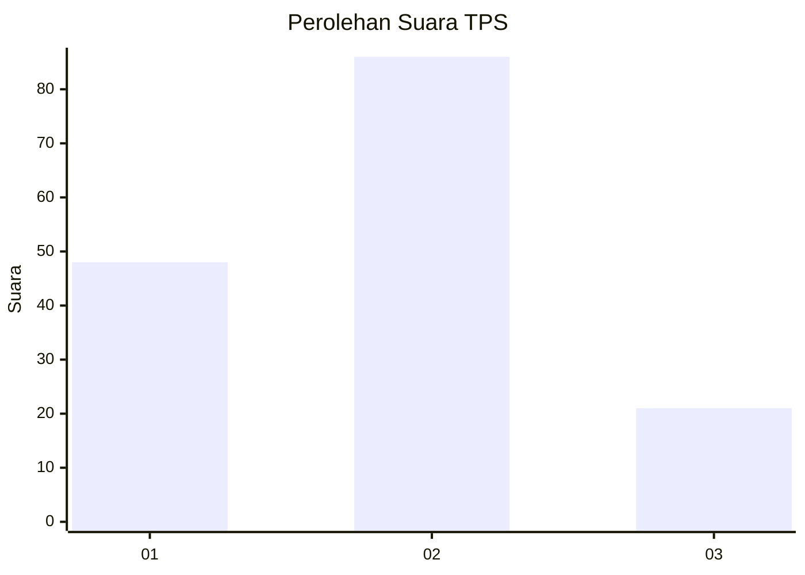
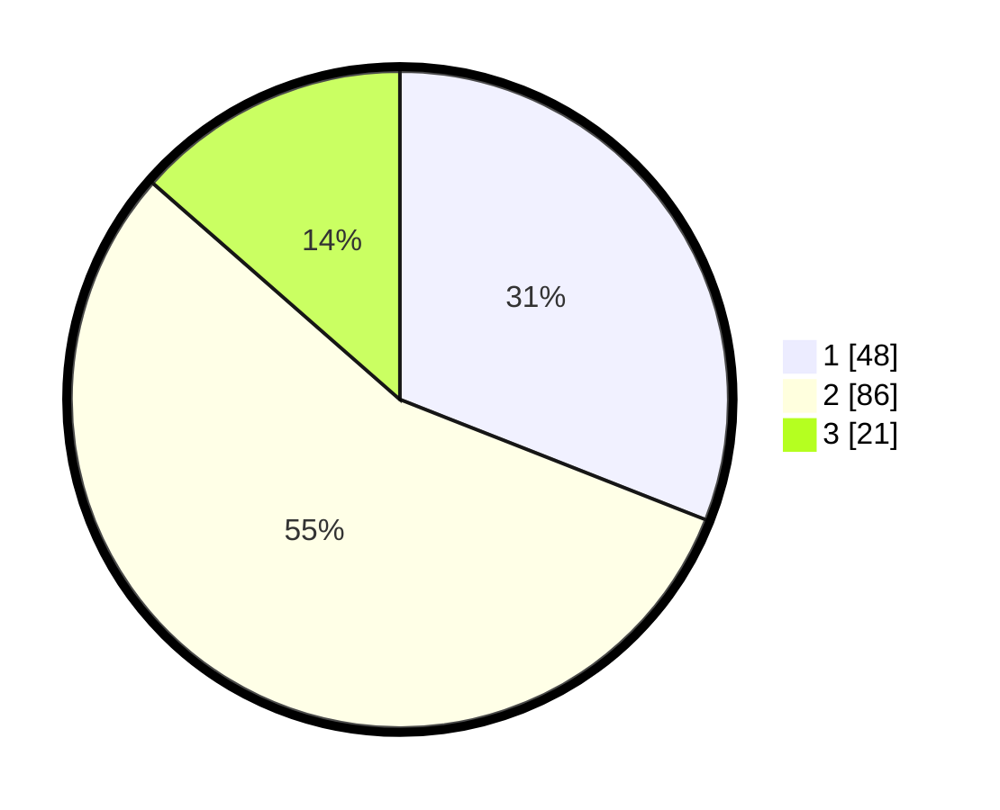

# Hasil

## Grafik

## Tabel

| No. | Nama Paslon    | Suara | Suara (raw) | Persentase |
|:--- |:-------------- | -----:| -----------:| ----------:|
| 1   | ANIES MUHAIMIN | 48    | [48][p-1]   | 30,97      |
| 2   | PRABOWO GIBRAN | 86    | [86][p-2]   | 55,48      |
| 3   | GANJAR MAHFUD  | 21    | [21][p-3]   | 13,55      |

[p-1]: https://github.com/gigit-pemilu/pemilu-2024-34-di-yogyakarta/blob/main/pilpres/hitung-suara/sub/34-di-yogyakarta/sub/02-bantul/sub/02-sanden/sub/2004-murtigading/sub/010-tps/sub/paslon-1.txt
[p-2]: https://github.com/gigit-pemilu/pemilu-2024-34-di-yogyakarta/blob/main/pilpres/hitung-suara/sub/34-di-yogyakarta/sub/02-bantul/sub/02-sanden/sub/2004-murtigading/sub/010-tps/sub/paslon-2.txt
[p-3]: https://github.com/gigit-pemilu/pemilu-2024-34-di-yogyakarta/blob/main/pilpres/hitung-suara/sub/34-di-yogyakarta/sub/02-bantul/sub/02-sanden/sub/2004-murtigading/sub/010-tps/sub/paslon-3.txt

## Foto C Plano

https://sirekap-obj-formc.kpu.go.id/d368/pemilu/ppwp/34/02/02/20/04/3402022004010-20240215-003857--e1d3e840-d103-45ee-8929-02d64727fb34.jpg

https://sirekap-obj-formc.kpu.go.id/d368/pemilu/ppwp/34/02/02/20/04/3402022004010-20240215-003939--6a1f81bf-424a-4e71-a45c-2f4bf12293c1.jpg

https://sirekap-obj-formc.kpu.go.id/d368/pemilu/ppwp/34/02/02/20/04/3402022004010-20240215-004146--e6963908-6062-4876-b64f-e692aafed7e2.jpg

## Metadata

| Key        | Value               |
| ---------- | ------------------- |
| Time Stamp | 2024-02-17 09:30:03 |

