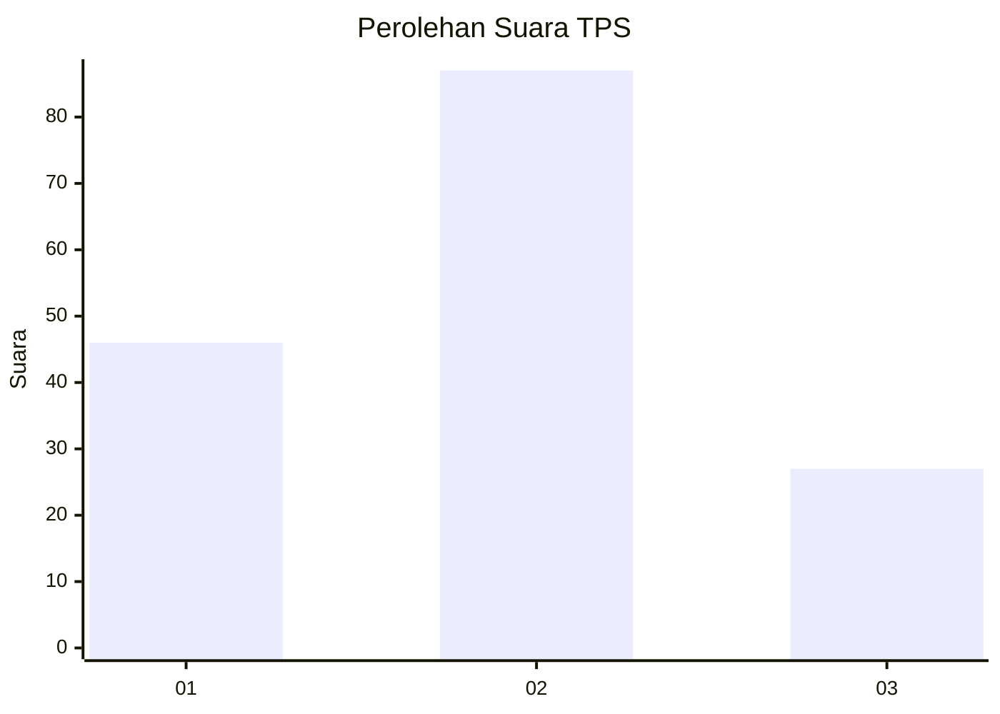
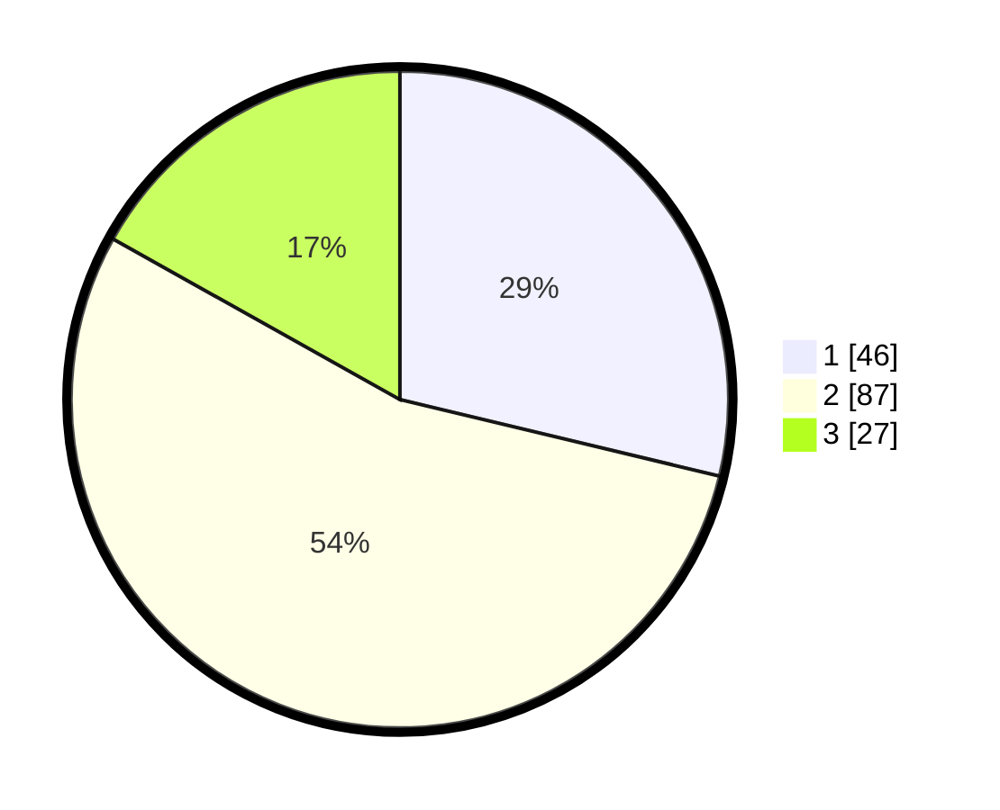

# Hasil

## Grafik

## Tabel

| No. | Nama Paslon    | Suara | Suara (raw) | Persentase |
|:--- |:-------------- | -----:| -----------:| ----------:|
| 1   | ANIES MUHAIMIN | 46    | [46][p-1]   | 28,75      |
| 2   | PRABOWO GIBRAN | 87    | [87][p-2]   | 54,38      |
| 3   | GANJAR MAHFUD  | 27    | [27][p-3]   | 16,88      |

[p-1]: https://github.com/gigit-pemilu/pemilu-2024-34-di-yogyakarta/blob/main/pilpres/hitung-suara/sub/34-di-yogyakarta/sub/02-bantul/sub/02-sanden/sub/2004-murtigading/sub/011-tps/sub/paslon-1.txt
[p-2]: https://github.com/gigit-pemilu/pemilu-2024-34-di-yogyakarta/blob/main/pilpres/hitung-suara/sub/34-di-yogyakarta/sub/02-bantul/sub/02-sanden/sub/2004-murtigading/sub/011-tps/sub/paslon-2.txt
[p-3]: https://github.com/gigit-pemilu/pemilu-2024-34-di-yogyakarta/blob/main/pilpres/hitung-suara/sub/34-di-yogyakarta/sub/02-bantul/sub/02-sanden/sub/2004-murtigading/sub/011-tps/sub/paslon-3.txt

## Foto C Plano

https://sirekap-obj-formc.kpu.go.id/9806/pemilu/ppwp/34/02/02/20/04/3402022004011-20240214-232855--4db0a59d-45a4-45a8-89ae-201064b67955.jpg

https://sirekap-obj-formc.kpu.go.id/9806/pemilu/ppwp/34/02/02/20/04/3402022004011-20240214-194943--a78a4993-ab7c-4249-878d-1671a9571fde.jpg

https://sirekap-obj-formc.kpu.go.id/9806/pemilu/ppwp/34/02/02/20/04/3402022004011-20240214-233030--ad7623c7-242b-41d8-a8b0-2654161b9bb9.jpg

## Metadata

| Key        | Value               |
| ---------- | ------------------- |
| Time Stamp | 2024-02-26 11:00:00 |

