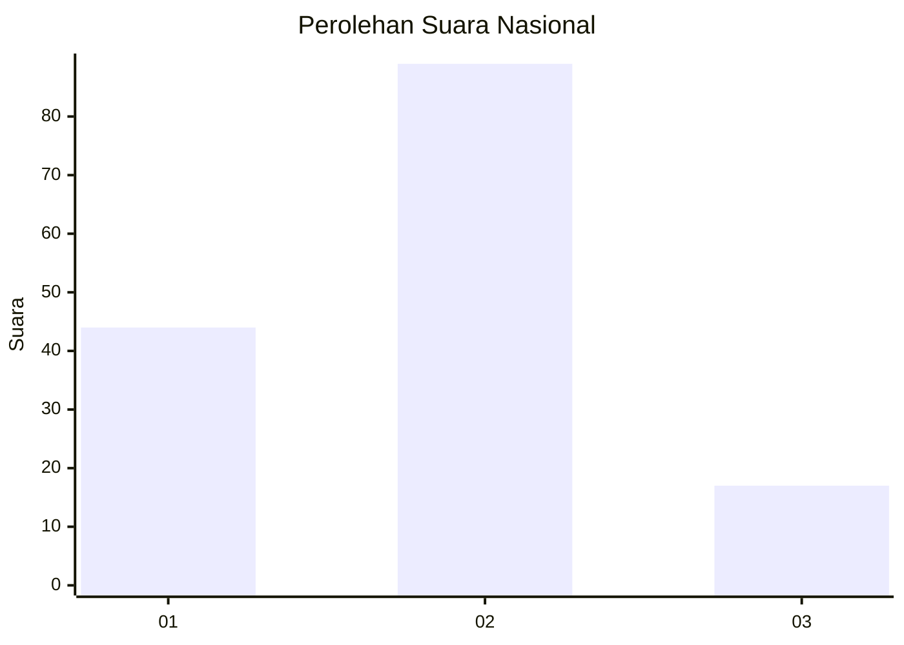
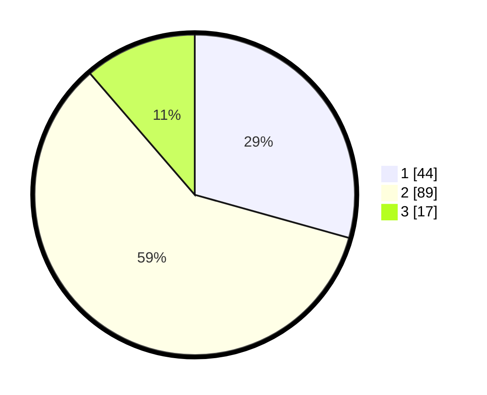

# Hasil

## Grafik

## Tabel

| No. | Nama Paslon    | Suara | Suara (raw) | Persentase |
|:--- |:-------------- | -----:| -----------:| ----------:|
| 1   | ANIES MUHAIMIN | 44    | [44][p-1]   | 29,33      |
| 2   | PRABOWO GIBRAN | 89    | [89][p-2]   | 59,33      |
| 3   | GANJAR MAHFUD  | 17    | [17][p-3]   | 11,33      |

[p-1]: https://github.com/gigit-pemilu/pemilu-2024/blob/main/pilpres/hitung-suara/sub/34-di-yogyakarta/sub/02-bantul/sub/02-sanden/sub/2004-murtigading/sub/012-tps/sub/paslon-1.txt
[p-2]: https://github.com/gigit-pemilu/pemilu-2024/blob/main/pilpres/hitung-suara/sub/34-di-yogyakarta/sub/02-bantul/sub/02-sanden/sub/2004-murtigading/sub/012-tps/sub/paslon-2.txt
[p-3]: https://github.com/gigit-pemilu/pemilu-2024/blob/main/pilpres/hitung-suara/sub/34-di-yogyakarta/sub/02-bantul/sub/02-sanden/sub/2004-murtigading/sub/012-tps/sub/paslon-3.txt

## Foto C Plano

https://sirekap-obj-formc.kpu.go.id/6741/pemilu/ppwp/34/02/02/20/04/3402022004012-20240214-210044--ac4f9978-06a3-46aa-aac8-7ba1078cd214.jpg

https://sirekap-obj-formc.kpu.go.id/6741/pemilu/ppwp/34/02/02/20/04/3402022004012-20240214-210134--daecbfba-1573-447d-92a1-b07268026955.jpg

https://sirekap-obj-formc.kpu.go.id/6741/pemilu/ppwp/34/02/02/20/04/3402022004012-20240214-221006--78ef4d92-5a7f-4725-814c-764bed2fd6df.jpg

## Metadata

| Key        | Value               |
| ---------- | ------------------- |
| Time Stamp | 2024-02-16 10:00:28 |

