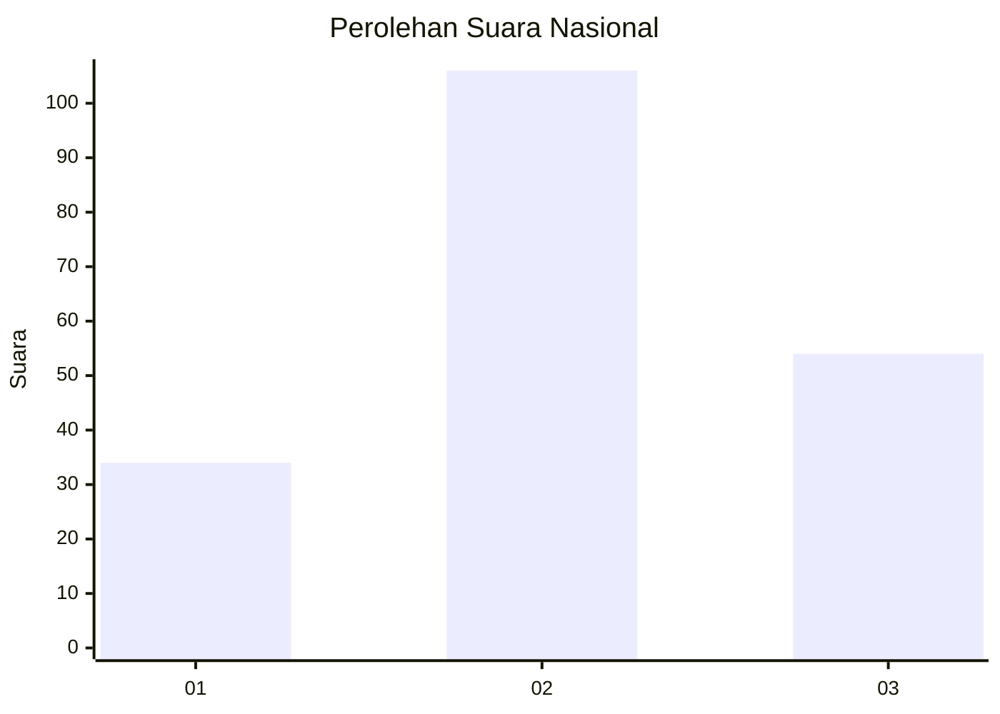
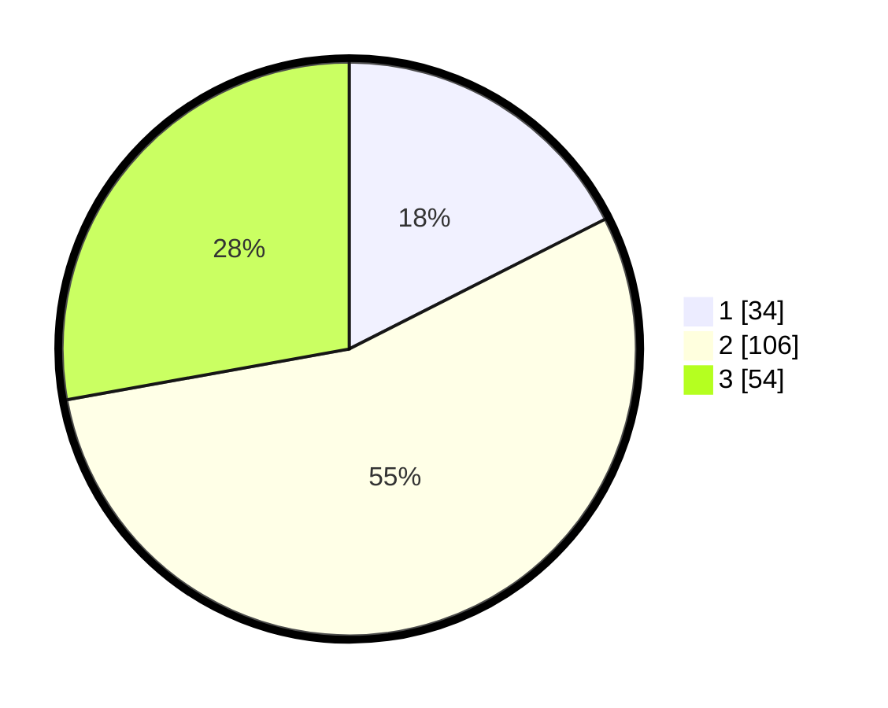

# Hasil

## Grafik

## Tabel

| No. | Nama Paslon    | Suara | Suara (raw) | Persentase |
|:--- |:-------------- | -----:| -----------:| ----------:|
| 1   | ANIES MUHAIMIN | 34    | [34][p-1]   | 17,53      |
| 2   | PRABOWO GIBRAN | 106   | [106][p-2]  | 54,64      |
| 3   | GANJAR MAHFUD  | 54    | [54][p-3]   | 27,84      |

[p-1]: https://github.com/gigit-pemilu/pemilu-2024/blob/main/pilpres/hitung-suara/sub/34-di-yogyakarta/sub/02-bantul/sub/02-sanden/sub/2004-murtigading/sub/017-tps/sub/paslon-1.txt
[p-2]: https://github.com/gigit-pemilu/pemilu-2024/blob/main/pilpres/hitung-suara/sub/34-di-yogyakarta/sub/02-bantul/sub/02-sanden/sub/2004-murtigading/sub/017-tps/sub/paslon-2.txt
[p-3]: https://github.com/gigit-pemilu/pemilu-2024/blob/main/pilpres/hitung-suara/sub/34-di-yogyakarta/sub/02-bantul/sub/02-sanden/sub/2004-murtigading/sub/017-tps/sub/paslon-3.txt

## Foto C Plano

https://sirekap-obj-formc.kpu.go.id/9372/pemilu/ppwp/34/02/02/20/04/3402022004017-20240215-004137--f208073f-16ae-417b-81da-1385f44ed92f.jpg

https://sirekap-obj-formc.kpu.go.id/9372/pemilu/ppwp/34/02/02/20/04/3402022004017-20240215-004355--55df98f1-8aa6-4060-8aa4-820d554b2e86.jpg

https://sirekap-obj-formc.kpu.go.id/9372/pemilu/ppwp/34/02/02/20/04/3402022004017-20240215-004536--a9d795e2-3495-42c0-9e96-8d95497ceb0a.jpg

## Metadata

| Key        | Value               |
| ---------- | ------------------- |
| Time Stamp | 2024-02-17 09:30:03 |

