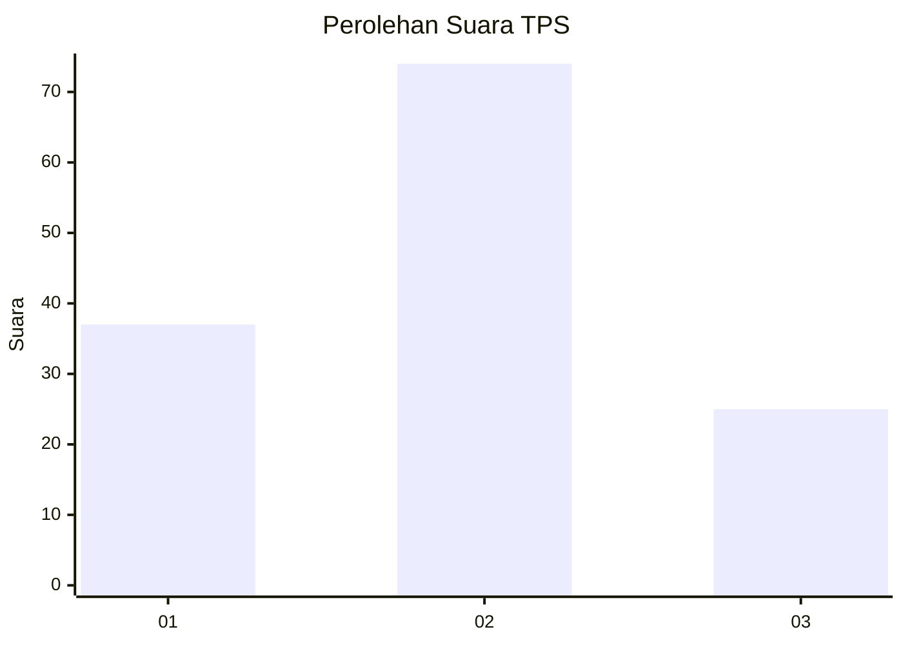
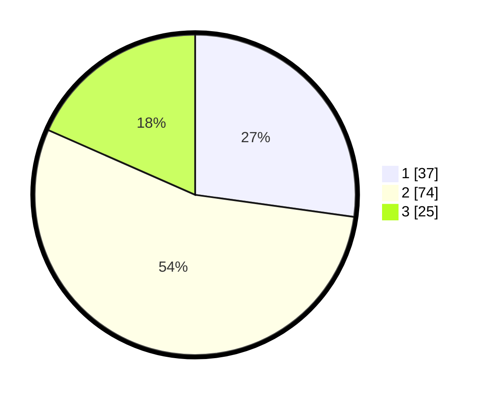

# Hasil

## Grafik

## Tabel

| No. | Nama Paslon    | Suara | Suara (raw) | Persentase |
|:--- |:-------------- | -----:| -----------:| ----------:|
| 1   | ANIES MUHAIMIN | 37    | [37][p-1]   | 27,21      |
| 2   | PRABOWO GIBRAN | 74    | [74][p-2]   | 54,41      |
| 3   | GANJAR MAHFUD  | 25    | [25][p-3]   | 18,38      |

[p-1]: https://github.com/gigit-pemilu/pemilu-2024-34-di-yogyakarta/blob/main/pilpres/hitung-suara/sub/34-di-yogyakarta/sub/02-bantul/sub/02-sanden/sub/2004-murtigading/sub/018-tps/sub/paslon-1.txt
[p-2]: https://github.com/gigit-pemilu/pemilu-2024-34-di-yogyakarta/blob/main/pilpres/hitung-suara/sub/34-di-yogyakarta/sub/02-bantul/sub/02-sanden/sub/2004-murtigading/sub/018-tps/sub/paslon-2.txt
[p-3]: https://github.com/gigit-pemilu/pemilu-2024-34-di-yogyakarta/blob/main/pilpres/hitung-suara/sub/34-di-yogyakarta/sub/02-bantul/sub/02-sanden/sub/2004-murtigading/sub/018-tps/sub/paslon-3.txt

## Foto C Plano

https://sirekap-obj-formc.kpu.go.id/e111/pemilu/ppwp/34/02/02/20/04/3402022004018-20240214-210818--bc19bd37-9301-4bd8-90c9-add54a8fea68.jpg

https://sirekap-obj-formc.kpu.go.id/e111/pemilu/ppwp/34/02/02/20/04/3402022004018-20240214-162242--0842b228-9cd8-4d70-9af1-a3e23bfb2d3d.jpg

https://sirekap-obj-formc.kpu.go.id/e111/pemilu/ppwp/34/02/02/20/04/3402022004018-20240215-000608--f49bf960-37d2-468a-854b-8dd26ec4f60f.jpg

## Metadata

| Key        | Value               |
| ---------- | ------------------- |
| Time Stamp | 2024-02-15 00:41:44 |

