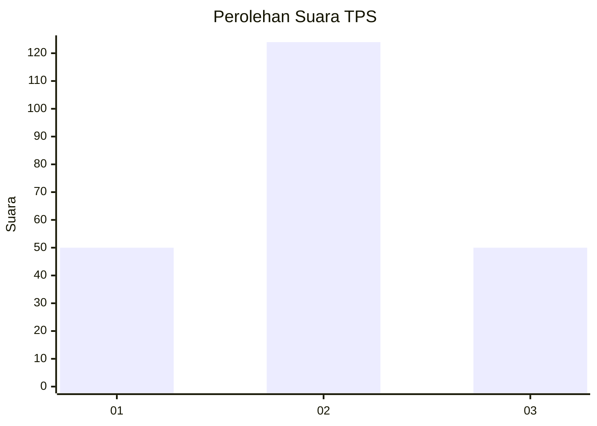
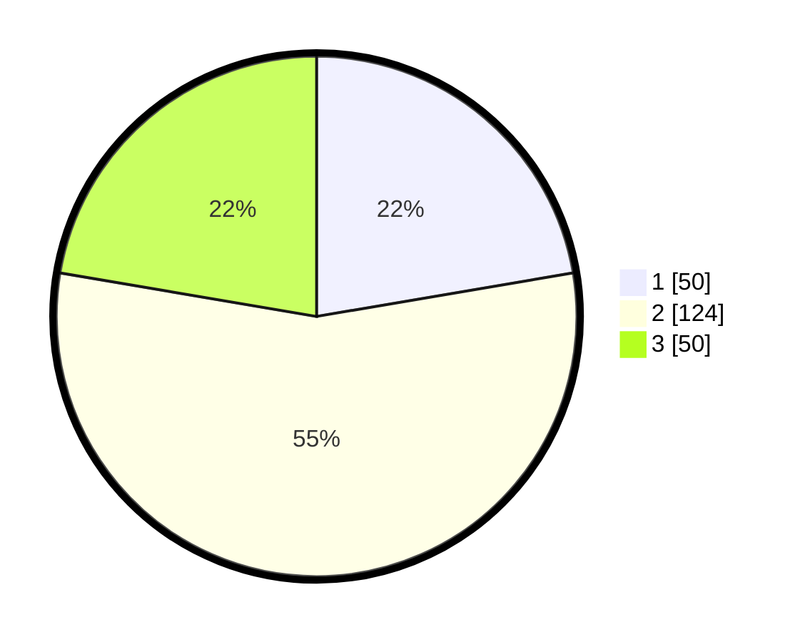

# Hasil

## Grafik

## Tabel

| No. | Nama Paslon    | Suara | Suara (raw) | Persentase |
|:--- |:-------------- | -----:| -----------:| ----------:|
| 1   | ANIES MUHAIMIN | 50    | [50][p-1]   | 22,32      |
| 2   | PRABOWO GIBRAN | 124   | [124][p-2]  | 55,36      |
| 3   | GANJAR MAHFUD  | 50    | [50][p-3]   | 22,32      |

[p-1]: https://github.com/gigit-pemilu/pemilu-2024-34-di-yogyakarta/blob/main/pilpres/hitung-suara/sub/34-di-yogyakarta/sub/02-bantul/sub/02-sanden/sub/2004-murtigading/sub/020-tps/sub/paslon-1.txt
[p-2]: https://github.com/gigit-pemilu/pemilu-2024-34-di-yogyakarta/blob/main/pilpres/hitung-suara/sub/34-di-yogyakarta/sub/02-bantul/sub/02-sanden/sub/2004-murtigading/sub/020-tps/sub/paslon-2.txt
[p-3]: https://github.com/gigit-pemilu/pemilu-2024-34-di-yogyakarta/blob/main/pilpres/hitung-suara/sub/34-di-yogyakarta/sub/02-bantul/sub/02-sanden/sub/2004-murtigading/sub/020-tps/sub/paslon-3.txt

## Foto C Plano

https://sirekap-obj-formc.kpu.go.id/48e9/pemilu/ppwp/34/02/02/20/04/3402022004020-20240215-003130--5ff64c4b-e44d-43e2-a9b3-c1da91d6c117.jpg

https://sirekap-obj-formc.kpu.go.id/48e9/pemilu/ppwp/34/02/02/20/04/3402022004020-20240215-002754--cd5b58eb-7092-47c8-a0e8-c24c70bd8dcf.jpg

https://sirekap-obj-formc.kpu.go.id/48e9/pemilu/ppwp/34/02/02/20/04/3402022004020-20240215-002726--5439b928-8a19-4201-8e74-8499319e217b.jpg

## Metadata

| Key        | Value               |
| ---------- | ------------------- |
| Time Stamp | 2024-02-16 10:00:28 |

