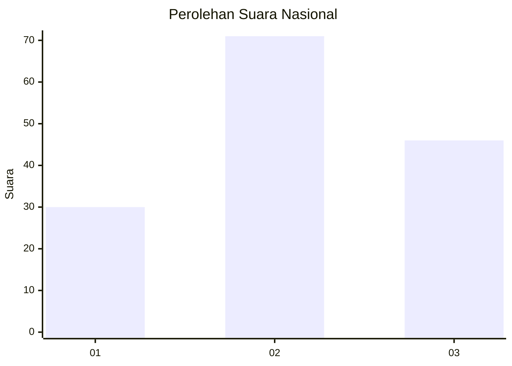
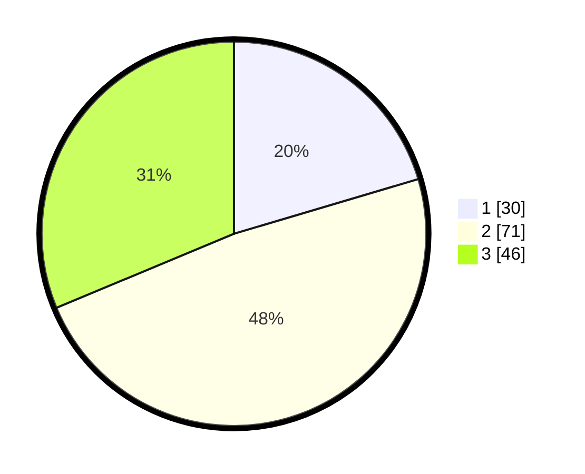

# Hasil

## Grafik

## Tabel

| No. | Nama Paslon    | Suara | Suara (raw) | Persentase |
|:--- |:-------------- | -----:| -----------:| ----------:|
| 1   | ANIES MUHAIMIN | 30    | [30][p-1]   | 20,41      |
| 2   | PRABOWO GIBRAN | 71    | [71][p-2]   | 48,30      |
| 3   | GANJAR MAHFUD  | 46    | [46][p-3]   | 31,29      |

[p-1]: https://github.com/gigit-pemilu/pemilu-2024/blob/main/pilpres/hitung-suara/sub/34-di-yogyakarta/sub/02-bantul/sub/02-sanden/sub/2004-murtigading/sub/021-tps/sub/paslon-1.txt
[p-2]: https://github.com/gigit-pemilu/pemilu-2024/blob/main/pilpres/hitung-suara/sub/34-di-yogyakarta/sub/02-bantul/sub/02-sanden/sub/2004-murtigading/sub/021-tps/sub/paslon-2.txt
[p-3]: https://github.com/gigit-pemilu/pemilu-2024/blob/main/pilpres/hitung-suara/sub/34-di-yogyakarta/sub/02-bantul/sub/02-sanden/sub/2004-murtigading/sub/021-tps/sub/paslon-3.txt

## Foto C Plano

https://sirekap-obj-formc.kpu.go.id/1c50/pemilu/ppwp/34/02/02/20/04/3402022004021-20240214-213529--51ca9e7a-3e16-4027-a24b-70edbff0188d.jpg

https://sirekap-obj-formc.kpu.go.id/1c50/pemilu/ppwp/34/02/02/20/04/3402022004021-20240214-214028--84af4b5f-24cd-4528-b036-0bf633eeb689.jpg

https://sirekap-obj-formc.kpu.go.id/1c50/pemilu/ppwp/34/02/02/20/04/3402022004021-20240214-214532--10f90fc5-403f-4f25-b39c-3fbbd056db4a.jpg

## Metadata

| Key        | Value               |
| ---------- | ------------------- |
| Time Stamp | 2024-02-15 15:00:29 |

