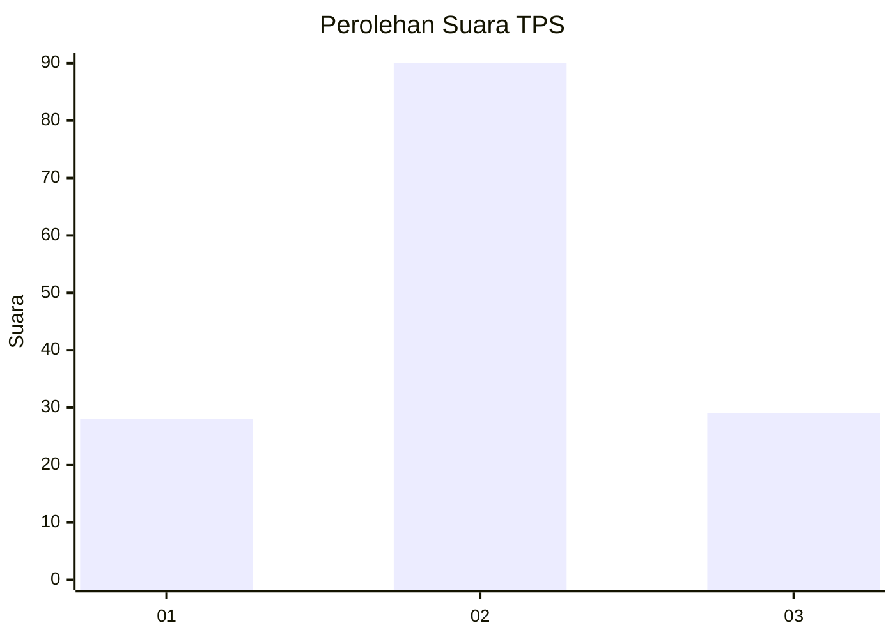
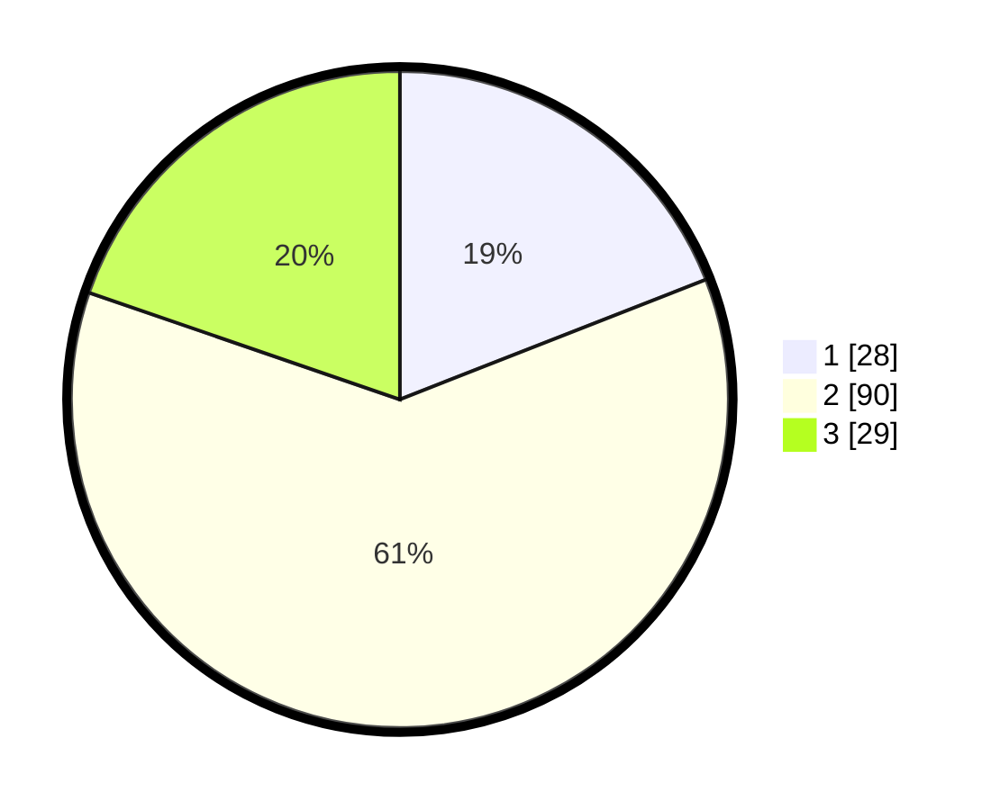

# Hasil

## Grafik

## Tabel

| No. | Nama Paslon    | Suara | Suara (raw) | Persentase |
|:--- |:-------------- | -----:| -----------:| ----------:|
| 1   | ANIES MUHAIMIN | 28    | [28][p-1]   | 19,05      |
| 2   | PRABOWO GIBRAN | 90    | [90][p-2]   | 61,22      |
| 3   | GANJAR MAHFUD  | 29    | [29][p-3]   | 19,73      |

[p-1]: https://github.com/gigit-pemilu/pemilu-2024-34-di-yogyakarta/blob/main/pilpres/hitung-suara/sub/34-di-yogyakarta/sub/02-bantul/sub/02-sanden/sub/2004-murtigading/sub/022-tps/sub/paslon-1.txt
[p-2]: https://github.com/gigit-pemilu/pemilu-2024-34-di-yogyakarta/blob/main/pilpres/hitung-suara/sub/34-di-yogyakarta/sub/02-bantul/sub/02-sanden/sub/2004-murtigading/sub/022-tps/sub/paslon-2.txt
[p-3]: https://github.com/gigit-pemilu/pemilu-2024-34-di-yogyakarta/blob/main/pilpres/hitung-suara/sub/34-di-yogyakarta/sub/02-bantul/sub/02-sanden/sub/2004-murtigading/sub/022-tps/sub/paslon-3.txt

## Foto C Plano

https://sirekap-obj-formc.kpu.go.id/fd7a/pemilu/ppwp/34/02/02/20/04/3402022004022-20240214-141259--557b0c89-f957-47a6-a1dd-8d84c2732062.jpg

https://sirekap-obj-formc.kpu.go.id/fd7a/pemilu/ppwp/34/02/02/20/04/3402022004022-20240214-141618--8adbfa4d-ac66-4d10-a3ef-b13b6d630939.jpg

https://sirekap-obj-formc.kpu.go.id/fd7a/pemilu/ppwp/34/02/02/20/04/3402022004022-20240214-225931--83a83e1a-9a27-4889-94a3-26732d80f5e7.jpg

## Metadata

| Key        | Value               |
| ---------- | ------------------- |
| Time Stamp | 2024-02-15 00:41:44 |

