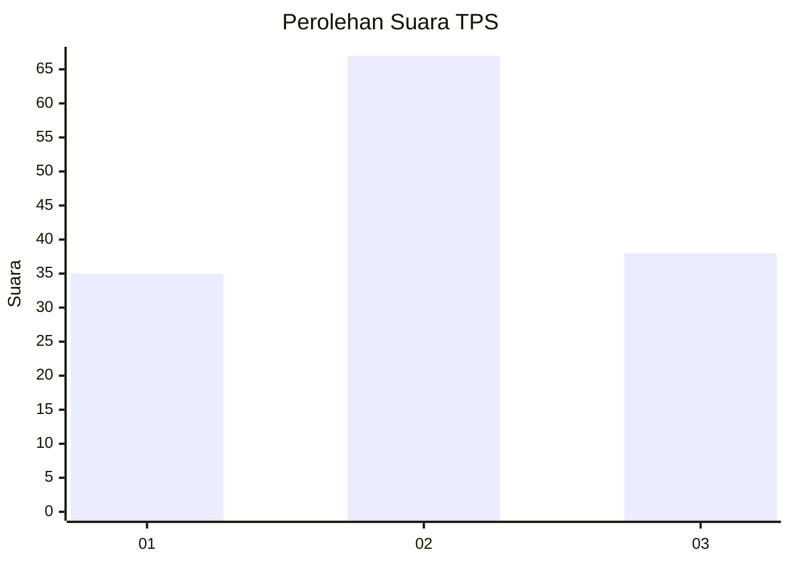
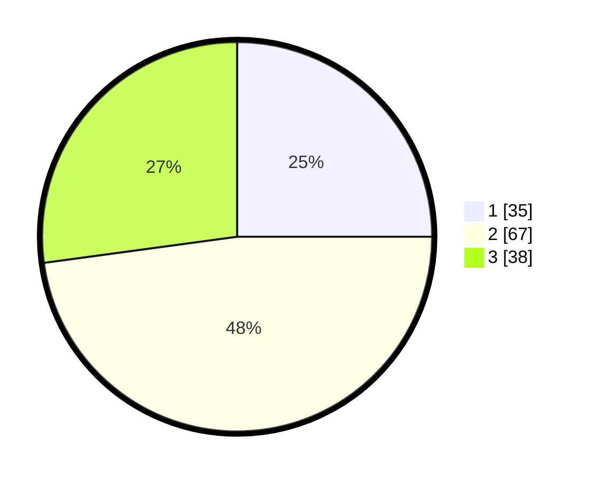

# Hasil

## Grafik

## Tabel

| No. | Nama Paslon    | Suara | Suara (raw) | Persentase |
|:--- |:-------------- | -----:| -----------:| ----------:|
| 1   | ANIES MUHAIMIN | 35    | [35][p-1]   | 25,00      |
| 2   | PRABOWO GIBRAN | 67    | [67][p-2]   | 47,86      |
| 3   | GANJAR MAHFUD  | 38    | [38][p-3]   | 27,14      |

[p-1]: https://github.com/gigit-pemilu/pemilu-2024-34-di-yogyakarta/blob/main/pilpres/hitung-suara/sub/34-di-yogyakarta/sub/02-bantul/sub/02-sanden/sub/2004-murtigading/sub/023-tps/sub/paslon-1.txt
[p-2]: https://github.com/gigit-pemilu/pemilu-2024-34-di-yogyakarta/blob/main/pilpres/hitung-suara/sub/34-di-yogyakarta/sub/02-bantul/sub/02-sanden/sub/2004-murtigading/sub/023-tps/sub/paslon-2.txt
[p-3]: https://github.com/gigit-pemilu/pemilu-2024-34-di-yogyakarta/blob/main/pilpres/hitung-suara/sub/34-di-yogyakarta/sub/02-bantul/sub/02-sanden/sub/2004-murtigading/sub/023-tps/sub/paslon-3.txt

## Foto C Plano

https://sirekap-obj-formc.kpu.go.id/7fa4/pemilu/ppwp/34/02/02/20/04/3402022004023-20240215-000520--069df56a-42ff-471c-96f5-4869f22449c1.jpg

https://sirekap-obj-formc.kpu.go.id/7fa4/pemilu/ppwp/34/02/02/20/04/3402022004023-20240214-234839--88a8b8b6-62f4-4eed-9217-c76da6721b25.jpg

https://sirekap-obj-formc.kpu.go.id/7fa4/pemilu/ppwp/34/02/02/20/04/3402022004023-20240214-235103--e07c5251-9122-41e1-a1ff-ab76fe2079d3.jpg

## Metadata

| Key        | Value               |
| ---------- | ------------------- |
| Time Stamp | 2024-02-25 12:00:00 |

