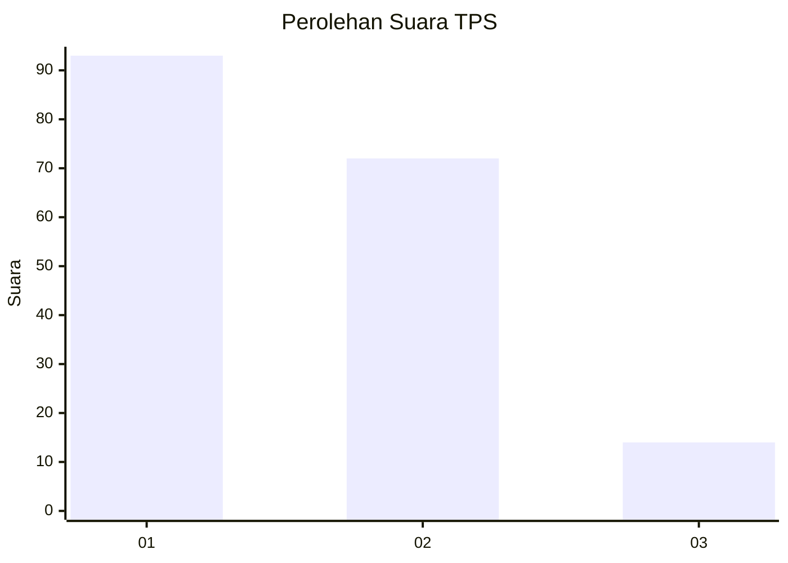
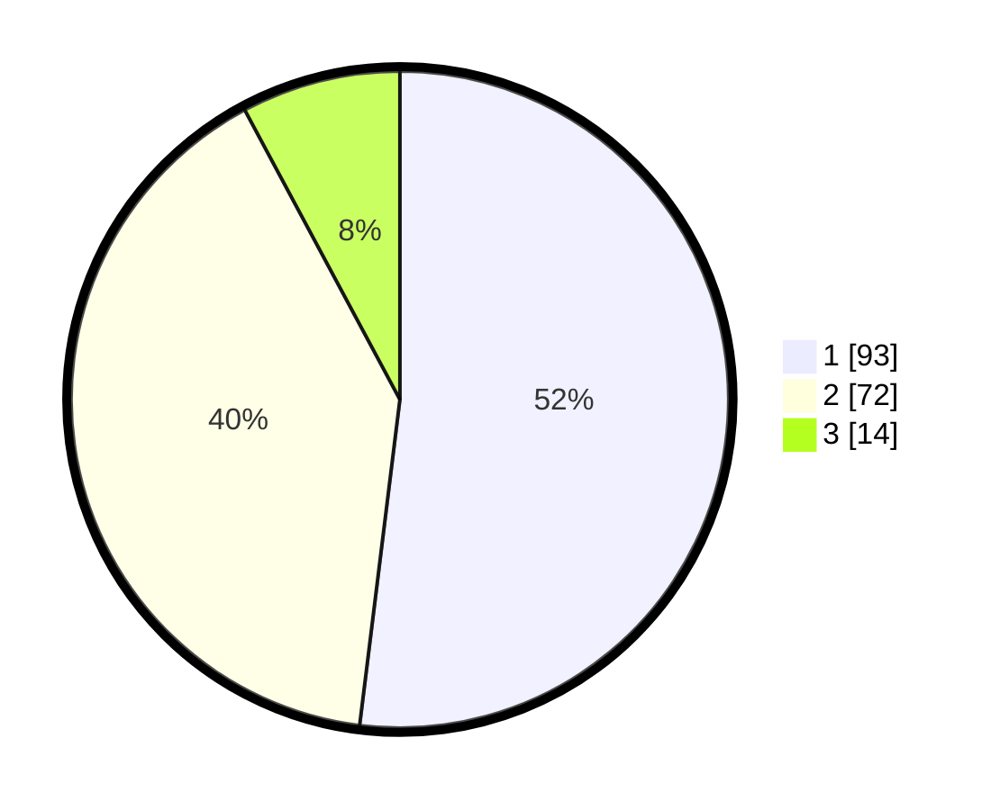

# Hasil

## Grafik

## Tabel

| No. | Nama Paslon    | Suara | Suara (raw) | Persentase |
|:--- |:-------------- | -----:| -----------:| ----------:|
| 1   | ANIES MUHAIMIN | 93    | [93][p-1]   | 51,96      |
| 2   | PRABOWO GIBRAN | 72    | [72][p-2]   | 40,22      |
| 3   | GANJAR MAHFUD  | 14    | [14][p-3]   | 7,82       |

[p-1]: https://github.com/gigit-pemilu/pemilu-2024-34-di-yogyakarta/blob/main/pilpres/hitung-suara/sub/34-di-yogyakarta/sub/02-bantul/sub/02-sanden/sub/2004-murtigading/sub/026-tps/sub/paslon-1.txt
[p-2]: https://github.com/gigit-pemilu/pemilu-2024-34-di-yogyakarta/blob/main/pilpres/hitung-suara/sub/34-di-yogyakarta/sub/02-bantul/sub/02-sanden/sub/2004-murtigading/sub/026-tps/sub/paslon-2.txt
[p-3]: https://github.com/gigit-pemilu/pemilu-2024-34-di-yogyakarta/blob/main/pilpres/hitung-suara/sub/34-di-yogyakarta/sub/02-bantul/sub/02-sanden/sub/2004-murtigading/sub/026-tps/sub/paslon-3.txt

## Foto C Plano

https://sirekap-obj-formc.kpu.go.id/5d97/pemilu/ppwp/34/02/02/20/04/3402022004026-20240214-211346--a34081c5-3671-45ae-9847-a65482a61d58.jpg

https://sirekap-obj-formc.kpu.go.id/5d97/pemilu/ppwp/34/02/02/20/04/3402022004026-20240214-211415--be72e36e-cec9-47fd-a9b4-6f2b759bdd1d.jpg

https://sirekap-obj-formc.kpu.go.id/5d97/pemilu/ppwp/34/02/02/20/04/3402022004026-20240214-211512--94e2ee4b-826f-474c-8805-86daf48f164d.jpg

## Metadata

| Key        | Value               |
| ---------- | ------------------- |
| Time Stamp | 2024-02-15 00:41:44 |

