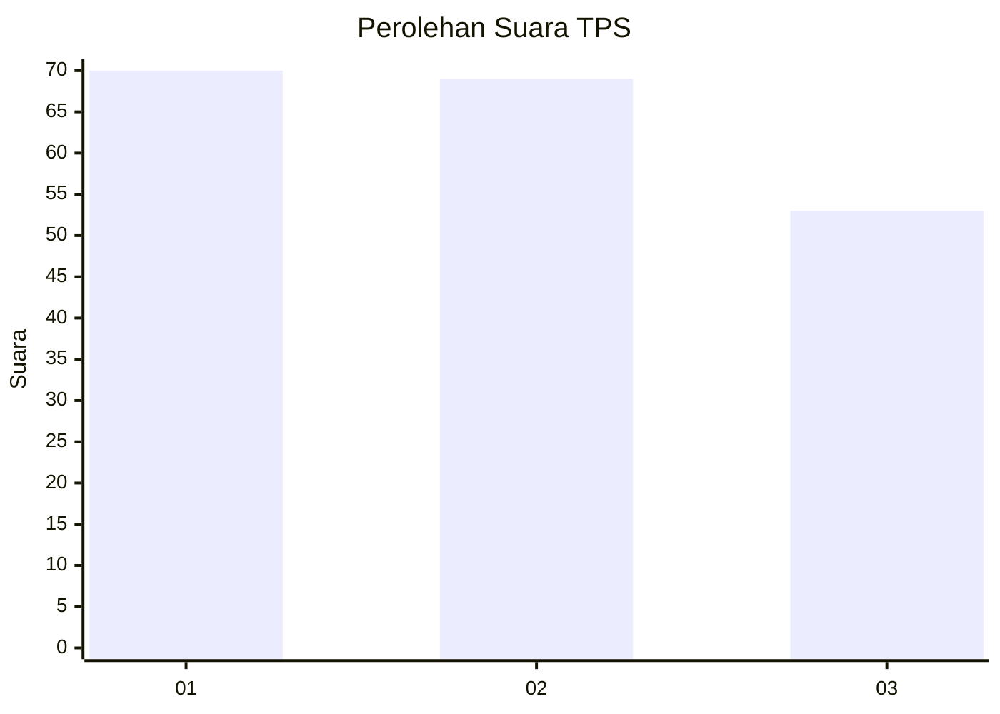
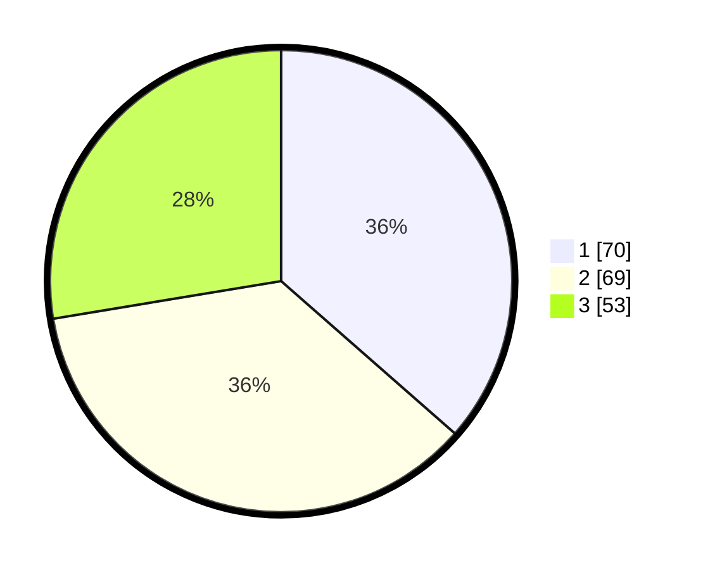

# Hasil

## Grafik

## Tabel

| No. | Nama Paslon    | Suara | Suara (raw) | Persentase |
|:--- |:-------------- | -----:| -----------:| ----------:|
| 1   | ANIES MUHAIMIN | 70    | [70][p-1]   | 36,46      |
| 2   | PRABOWO GIBRAN | 69    | [69][p-2]   | 35,94      |
| 3   | GANJAR MAHFUD  | 53    | [53][p-3]   | 27,60      |

[p-1]: https://github.com/gigit-pemilu/pemilu-2024-34-di-yogyakarta/blob/main/pilpres/hitung-suara/sub/34-di-yogyakarta/sub/02-bantul/sub/02-sanden/sub/2004-murtigading/sub/027-tps/sub/paslon-1.txt
[p-2]: https://github.com/gigit-pemilu/pemilu-2024-34-di-yogyakarta/blob/main/pilpres/hitung-suara/sub/34-di-yogyakarta/sub/02-bantul/sub/02-sanden/sub/2004-murtigading/sub/027-tps/sub/paslon-2.txt
[p-3]: https://github.com/gigit-pemilu/pemilu-2024-34-di-yogyakarta/blob/main/pilpres/hitung-suara/sub/34-di-yogyakarta/sub/02-bantul/sub/02-sanden/sub/2004-murtigading/sub/027-tps/sub/paslon-3.txt

## Foto C Plano

https://sirekap-obj-formc.kpu.go.id/92f6/pemilu/ppwp/34/02/02/20/04/3402022004027-20240214-214558--696037ff-750f-4eba-b775-812be2840f08.jpg

https://sirekap-obj-formc.kpu.go.id/92f6/pemilu/ppwp/34/02/02/20/04/3402022004027-20240214-214641--69fb6c32-5419-4362-ae5f-4057000484d8.jpg

https://sirekap-obj-formc.kpu.go.id/92f6/pemilu/ppwp/34/02/02/20/04/3402022004027-20240214-214831--019975dd-3e4b-498e-b77a-8b7453c06d3e.jpg

## Metadata

| Key        | Value               |
| ---------- | ------------------- |
| Time Stamp | 2024-02-24 22:31:28 |

