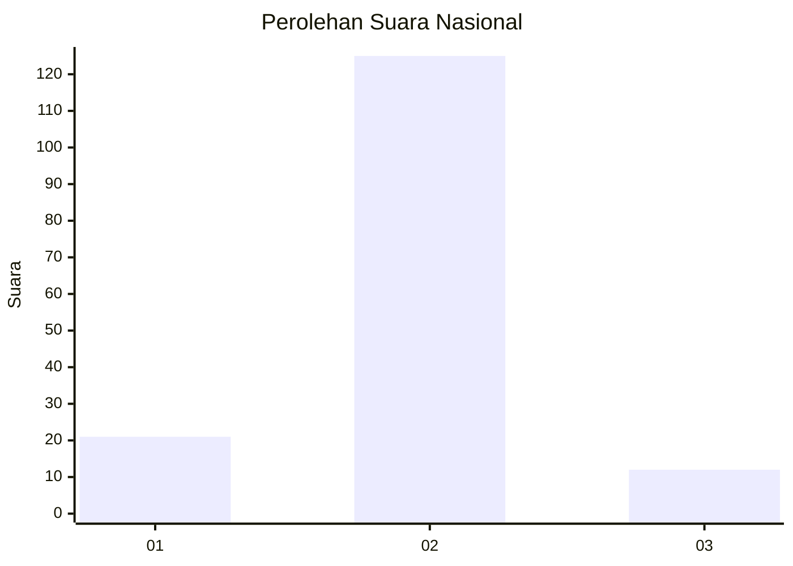
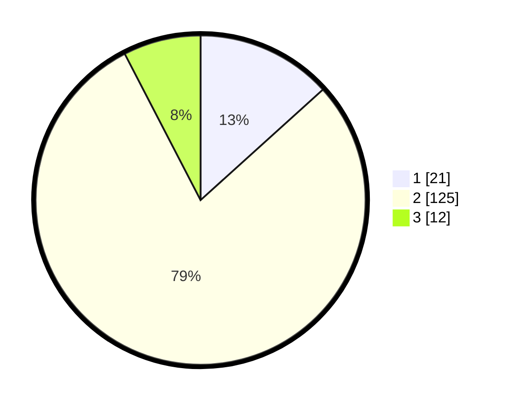

# Hasil

## Grafik

## Tabel

| No. | Nama Paslon    | Suara | Suara (raw) | Persentase |
|:--- |:-------------- | -----:| -----------:| ----------:|
| 1   | ANIES MUHAIMIN | 21    | [21][p-1]   | 13,29      |
| 2   | PRABOWO GIBRAN | 125   | [125][p-2]  | 79,11      |
| 3   | GANJAR MAHFUD  | 12    | [12][p-3]   | 7,59       |

[p-1]: https://github.com/gigit-pemilu/pemilu-2024/blob/main/pilpres/hitung-suara/sub/34-di-yogyakarta/sub/02-bantul/sub/02-sanden/sub/2004-murtigading/sub/030-tps/sub/paslon-1.txt
[p-2]: https://github.com/gigit-pemilu/pemilu-2024/blob/main/pilpres/hitung-suara/sub/34-di-yogyakarta/sub/02-bantul/sub/02-sanden/sub/2004-murtigading/sub/030-tps/sub/paslon-2.txt
[p-3]: https://github.com/gigit-pemilu/pemilu-2024/blob/main/pilpres/hitung-suara/sub/34-di-yogyakarta/sub/02-bantul/sub/02-sanden/sub/2004-murtigading/sub/030-tps/sub/paslon-3.txt

## Foto C Plano

https://sirekap-obj-formc.kpu.go.id/0ae7/pemilu/ppwp/34/02/02/20/04/3402022004030-20240217-092052--4f36f33e-395b-445a-9695-9c0fc2301426.jpg

https://sirekap-obj-formc.kpu.go.id/0ae7/pemilu/ppwp/34/02/02/20/04/3402022004030-20240214-200944--dc4f43f2-0ccd-4e9f-ac6e-74083de70903.jpg

https://sirekap-obj-formc.kpu.go.id/0ae7/pemilu/ppwp/34/02/02/20/04/3402022004030-20240214-200826--37434d01-bd49-426c-9df8-0b1a580cd9a2.jpg

## Metadata

| Key        | Value               |
| ---------- | ------------------- |
| Time Stamp | 2024-02-17 09:30:03 |

