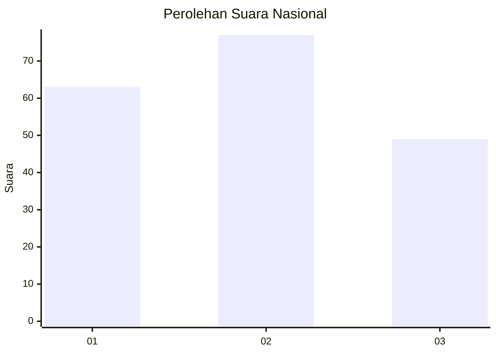
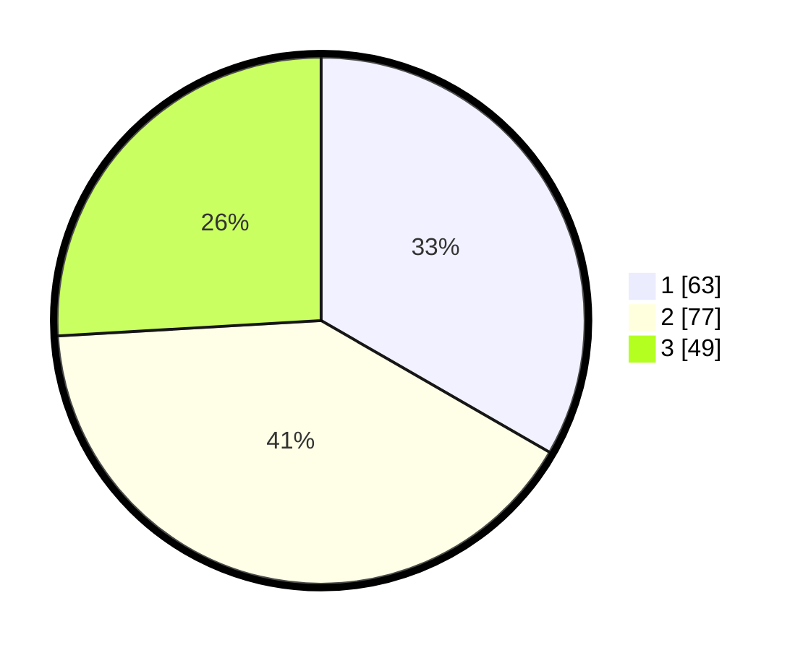

# Hasil

## Grafik

## Tabel

| No. | Nama Paslon    | Suara | Suara (raw) | Persentase |
|:--- |:-------------- | -----:| -----------:| ----------:|
| 1   | ANIES MUHAIMIN | 63    | [63][p-1]   | 33,33      |
| 2   | PRABOWO GIBRAN | 77    | [77][p-2]   | 40,74      |
| 3   | GANJAR MAHFUD  | 49    | [49][p-3]   | 25,93      |

[p-1]: https://github.com/gigit-pemilu/pemilu-2024/blob/main/pilpres/hitung-suara/sub/34-di-yogyakarta/sub/02-bantul/sub/03-kretek/sub/2001-tirtomulyo/sub/002-tps/sub/paslon-1.txt
[p-2]: https://github.com/gigit-pemilu/pemilu-2024/blob/main/pilpres/hitung-suara/sub/34-di-yogyakarta/sub/02-bantul/sub/03-kretek/sub/2001-tirtomulyo/sub/002-tps/sub/paslon-2.txt
[p-3]: https://github.com/gigit-pemilu/pemilu-2024/blob/main/pilpres/hitung-suara/sub/34-di-yogyakarta/sub/02-bantul/sub/03-kretek/sub/2001-tirtomulyo/sub/002-tps/sub/paslon-3.txt

## Foto C Plano

https://sirekap-obj-formc.kpu.go.id/e084/pemilu/ppwp/34/02/03/20/01/3402032001002-20240217-103123--0152a5c6-60a3-49a7-9416-232ff4ad97bf.jpg

https://sirekap-obj-formc.kpu.go.id/e084/pemilu/ppwp/34/02/03/20/01/3402032001002-20240217-101637--f952f0d8-da87-4d3d-9973-e3817ed04412.jpg

https://sirekap-obj-formc.kpu.go.id/e084/pemilu/ppwp/34/02/03/20/01/3402032001002-20240217-102631--cc40a024-3430-4ac2-a027-8baf694eab97.jpg

## Metadata

| Key        | Value               |
| ---------- | ------------------- |
| Time Stamp | 2024-02-17 11:00:02 |

## DATA PEMILIH TETAP

Jumlah pemilih dalam DPT: **220**.
 * L: **114**.
 * P: **106**.

## DATA PENGGUNA HAK PILIH

Jumlah pengguna hak pilih dalam DPT: **192**.
 * L: **98**.
 * P: **94**.

Jumlah pengguna hak pilih dalam DPTb: **0**.
 * L: **0**.
 * P: **0**.

Jumlah pengguna hak pilih dalam DPK: **0**.
 * L: **0**.
 * P: **0**.

Jumlah pengguna hak pilih: **192**.
 * L: **98**.
 * P: **94**.

## JUMLAH SUARA SAH DAN TIDAK SAH

JUMLAH SELURUH SUARA SAH: **189**.

JUMLAH SUARA TIDAK SAH: **3**.

JUMLAH SELURUH SUARA SAH DAN SUARA TIDAK SAH: **192**.

