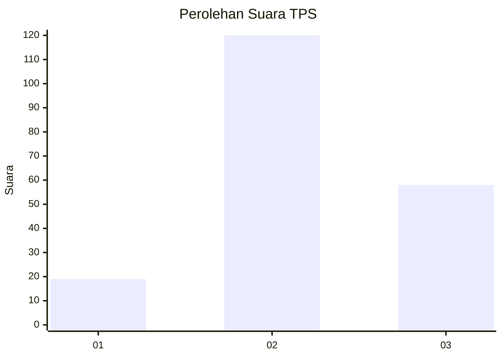
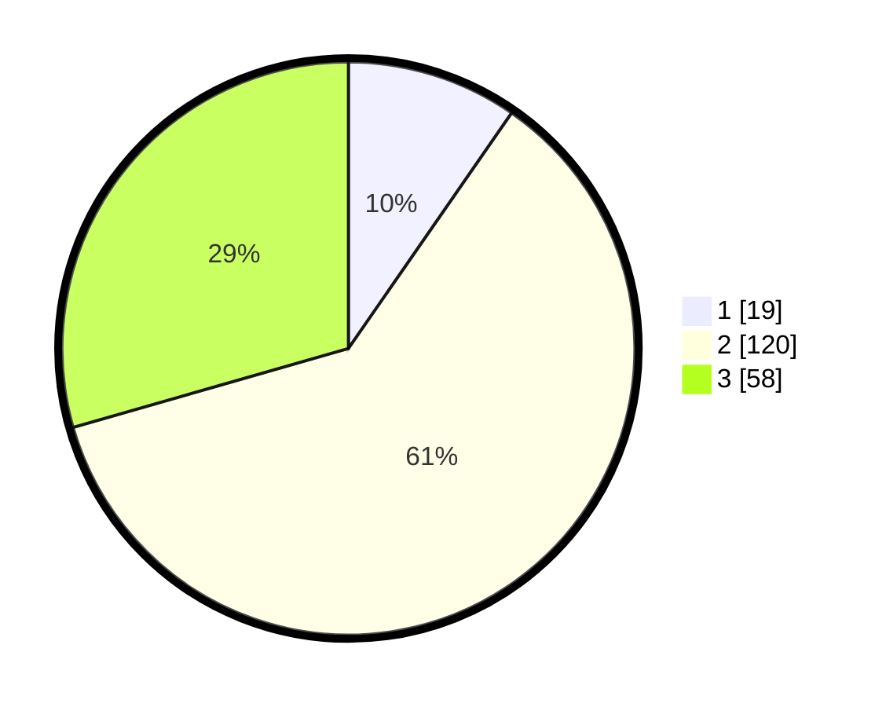

# Hasil

## Grafik

## Tabel

| No. | Nama Paslon    | Suara | Suara (raw) | Persentase |
|:--- |:-------------- | -----:| -----------:| ----------:|
| 1   | ANIES MUHAIMIN | 19    | [19][p-1]   | 9,64       |
| 2   | PRABOWO GIBRAN | 120   | [120][p-2]  | 60,91      |
| 3   | GANJAR MAHFUD  | 58    | [58][p-3]   | 29,44      |

[p-1]: https://github.com/gigit-pemilu/pemilu-2024-34-di-yogyakarta/blob/main/pilpres/hitung-suara/sub/34-di-yogyakarta/sub/02-bantul/sub/03-kretek/sub/2001-tirtomulyo/sub/003-tps/sub/paslon-1.txt
[p-2]: https://github.com/gigit-pemilu/pemilu-2024-34-di-yogyakarta/blob/main/pilpres/hitung-suara/sub/34-di-yogyakarta/sub/02-bantul/sub/03-kretek/sub/2001-tirtomulyo/sub/003-tps/sub/paslon-2.txt
[p-3]: https://github.com/gigit-pemilu/pemilu-2024-34-di-yogyakarta/blob/main/pilpres/hitung-suara/sub/34-di-yogyakarta/sub/02-bantul/sub/03-kretek/sub/2001-tirtomulyo/sub/003-tps/sub/paslon-3.txt

## Foto C Plano

https://sirekap-obj-formc.kpu.go.id/184e/pemilu/ppwp/34/02/03/20/01/3402032001003-20240214-231731--dc4c7301-de5b-41a6-bf35-9d6ece382fce.jpg

https://sirekap-obj-formc.kpu.go.id/184e/pemilu/ppwp/34/02/03/20/01/3402032001003-20240214-205155--9240eb65-8538-4fde-80d3-776f0ad2c102.jpg

https://sirekap-obj-formc.kpu.go.id/184e/pemilu/ppwp/34/02/03/20/01/3402032001003-20240214-231854--4655608e-f3ca-4383-b84b-e67908536513.jpg

## Metadata

| Key        | Value               |
| ---------- | ------------------- |
| Time Stamp | 2024-02-15 19:30:26 |

