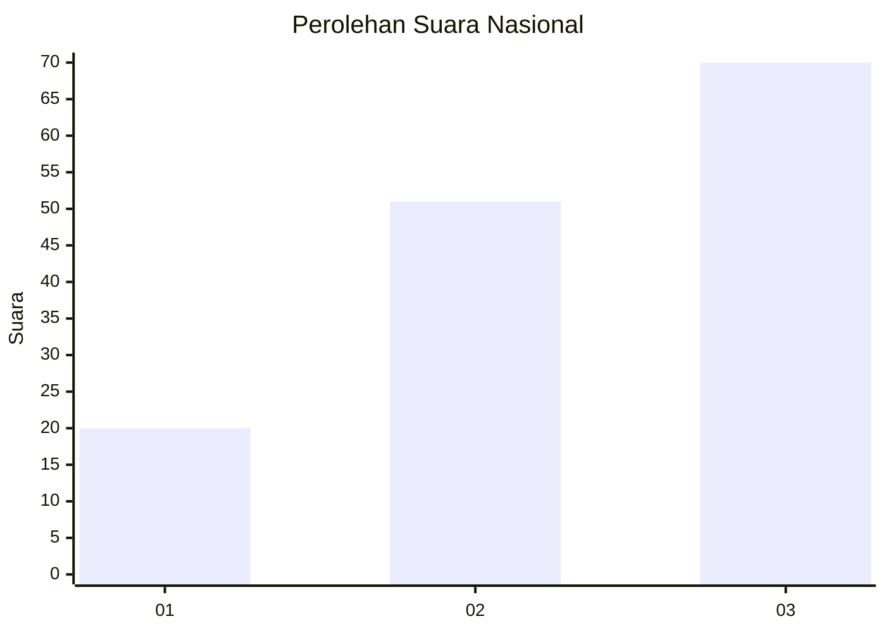
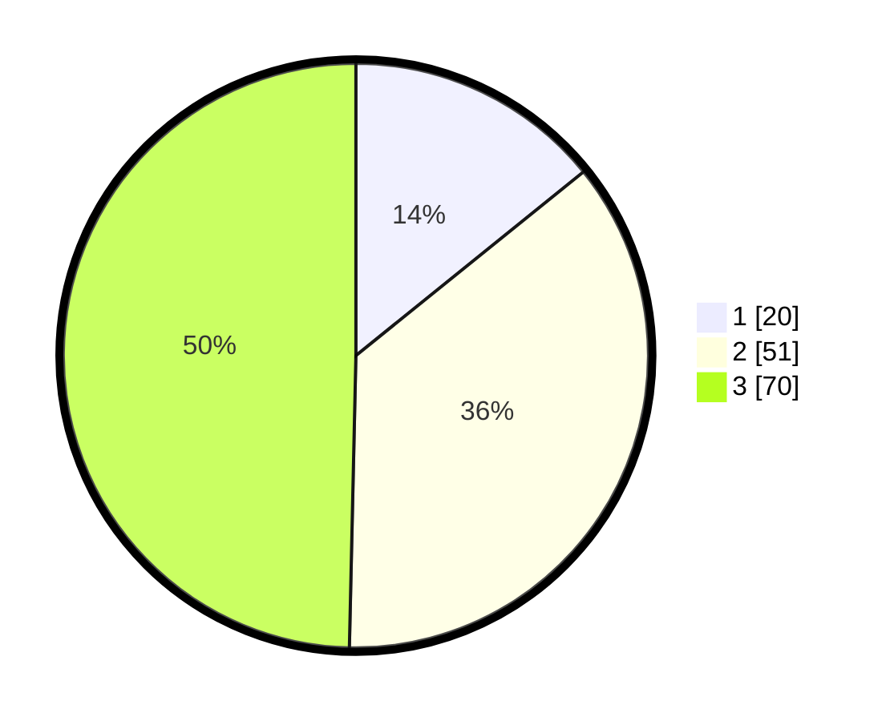

# Hasil

## Grafik

## Tabel

| No. | Nama Paslon    | Suara | Suara (raw) | Persentase |
|:--- |:-------------- | -----:| -----------:| ----------:|
| 1   | ANIES MUHAIMIN | 20    | [20][p-1]   | 14,18      |
| 2   | PRABOWO GIBRAN | 51    | [51][p-2]   | 36,17      |
| 3   | GANJAR MAHFUD  | 70    | [70][p-3]   | 49,65      |

[p-1]: https://github.com/gigit-pemilu/pemilu-2024/blob/main/pilpres/hitung-suara/sub/34-di-yogyakarta/sub/02-bantul/sub/03-kretek/sub/2001-tirtomulyo/sub/004-tps/sub/paslon-1.txt
[p-2]: https://github.com/gigit-pemilu/pemilu-2024/blob/main/pilpres/hitung-suara/sub/34-di-yogyakarta/sub/02-bantul/sub/03-kretek/sub/2001-tirtomulyo/sub/004-tps/sub/paslon-2.txt
[p-3]: https://github.com/gigit-pemilu/pemilu-2024/blob/main/pilpres/hitung-suara/sub/34-di-yogyakarta/sub/02-bantul/sub/03-kretek/sub/2001-tirtomulyo/sub/004-tps/sub/paslon-3.txt

## Foto C Plano

https://sirekap-obj-formc.kpu.go.id/0a02/pemilu/ppwp/34/02/03/20/01/3402032001004-20240217-104052--6e96fac7-6737-44e6-8ac2-b9603dea4e62.jpg

https://sirekap-obj-formc.kpu.go.id/0a02/pemilu/ppwp/34/02/03/20/01/3402032001004-20240217-105017--5117ace5-4cb2-413e-9f27-1fdb7a79121f.jpg

https://sirekap-obj-formc.kpu.go.id/0a02/pemilu/ppwp/34/02/03/20/01/3402032001004-20240217-105629--bb732d0f-bc83-41bc-9f78-71953f887659.jpg

## Metadata

| Key        | Value               |
| ---------- | ------------------- |
| Time Stamp | 2024-02-17 11:00:02 |

## DATA PEMILIH TETAP

Jumlah pemilih dalam DPT: **154**.
 * L: **78**.
 * P: **76**.

## DATA PENGGUNA HAK PILIH

Jumlah pengguna hak pilih dalam DPT: **143**.
 * L: **72**.
 * P: **71**.

Jumlah pengguna hak pilih dalam DPTb: **2**.
 * L: **0**.
 * P: **2**.

Jumlah pengguna hak pilih dalam DPK: **0**.
 * L: **0**.
 * P: **0**.

Jumlah pengguna hak pilih: **145**.
 * L: **72**.
 * P: **73**.

## JUMLAH SUARA SAH DAN TIDAK SAH

JUMLAH SELURUH SUARA SAH: **141**.

JUMLAH SUARA TIDAK SAH: **4**.

JUMLAH SELURUH SUARA SAH DAN SUARA TIDAK SAH: **145**.

