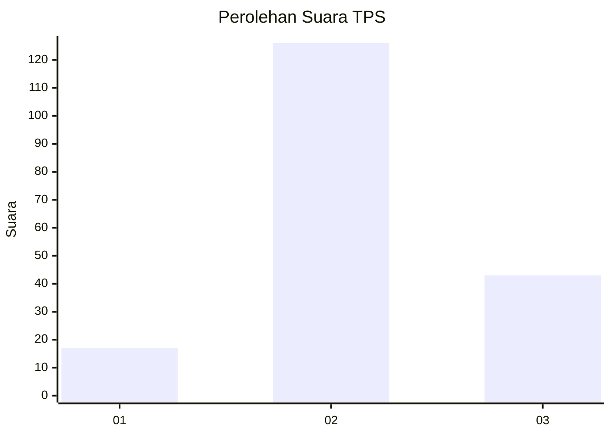
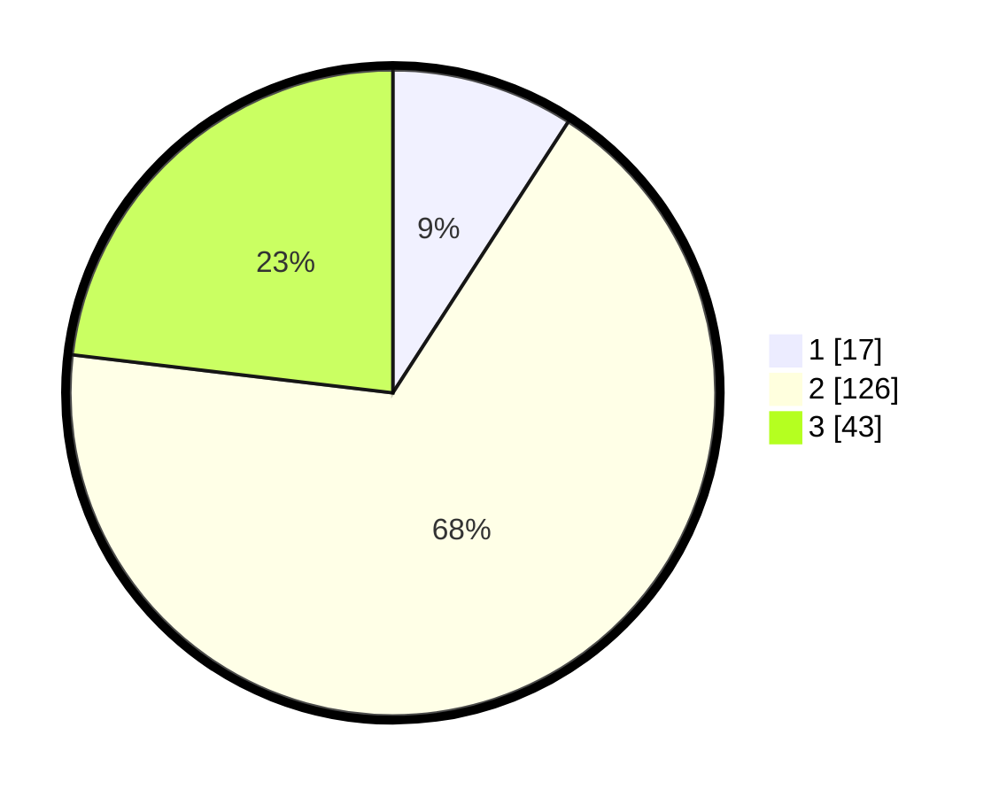

# Hasil

## Grafik

## Tabel

| No. | Nama Paslon    | Suara | Suara (raw) | Persentase |
|:--- |:-------------- | -----:| -----------:| ----------:|
| 1   | ANIES MUHAIMIN | 17    | [17][p-1]   | 9,14       |
| 2   | PRABOWO GIBRAN | 126   | [126][p-2]  | 67,74      |
| 3   | GANJAR MAHFUD  | 43    | [43][p-3]   | 23,12      |

[p-1]: https://github.com/gigit-pemilu/pemilu-2024-34-di-yogyakarta/blob/main/pilpres/hitung-suara/sub/34-di-yogyakarta/sub/02-bantul/sub/03-kretek/sub/2001-tirtomulyo/sub/005-tps/sub/paslon-1.txt
[p-2]: https://github.com/gigit-pemilu/pemilu-2024-34-di-yogyakarta/blob/main/pilpres/hitung-suara/sub/34-di-yogyakarta/sub/02-bantul/sub/03-kretek/sub/2001-tirtomulyo/sub/005-tps/sub/paslon-2.txt
[p-3]: https://github.com/gigit-pemilu/pemilu-2024-34-di-yogyakarta/blob/main/pilpres/hitung-suara/sub/34-di-yogyakarta/sub/02-bantul/sub/03-kretek/sub/2001-tirtomulyo/sub/005-tps/sub/paslon-3.txt

## Foto C Plano

https://sirekap-obj-formc.kpu.go.id/bbc8/pemilu/ppwp/34/02/03/20/01/3402032001005-20240217-110108--29d2041f-8a49-4bd7-bf34-17e4ce5937ca.jpg

https://sirekap-obj-formc.kpu.go.id/bbc8/pemilu/ppwp/34/02/03/20/01/3402032001005-20240217-111612--e4fab3c2-d91f-47c1-9c51-19f561692a36.jpg

https://sirekap-obj-formc.kpu.go.id/bbc8/pemilu/ppwp/34/02/03/20/01/3402032001005-20240217-112355--0cd61e2b-b725-4b5e-b831-a7ba987cb720.jpg

## Metadata

| Key        | Value               |
| ---------- | ------------------- |
| Time Stamp | 2024-02-17 11:30:03 |

## DATA PEMILIH TETAP

Jumlah pemilih dalam DPT: **198**.
 * L: **97**.
 * P: **101**.

## DATA PENGGUNA HAK PILIH

Jumlah pengguna hak pilih dalam DPT: **184**.
 * L: **89**.
 * P: **95**.

Jumlah pengguna hak pilih dalam DPTb: **1**.
 * L: **0**.
 * P: **1**.

Jumlah pengguna hak pilih dalam DPK: **1**.
 * L: **0**.
 * P: **1**.

Jumlah pengguna hak pilih: **186**.
 * L: **89**.
 * P: **97**.

## JUMLAH SUARA SAH DAN TIDAK SAH

JUMLAH SELURUH SUARA SAH: **186**.

JUMLAH SUARA TIDAK SAH: **0**.

JUMLAH SELURUH SUARA SAH DAN SUARA TIDAK SAH: **186**.

