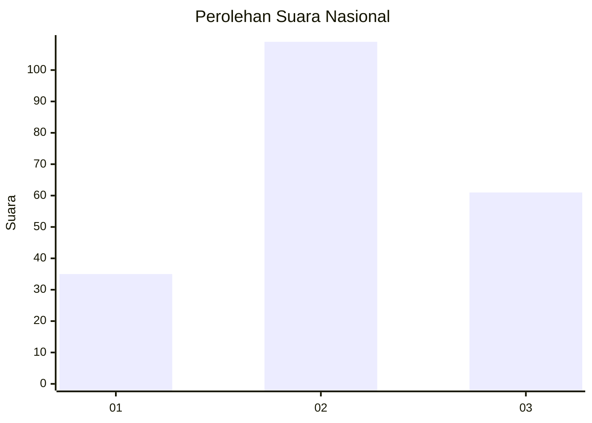
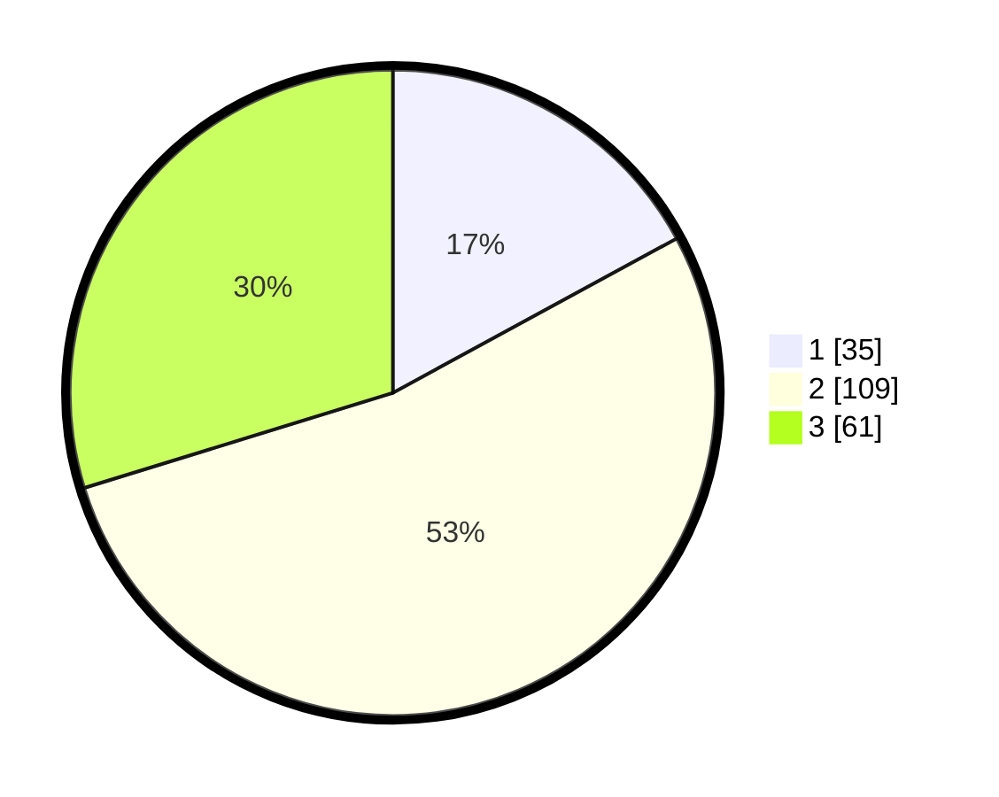

# Hasil

## Grafik

## Tabel

| No. | Nama Paslon    | Suara | Suara (raw) | Persentase |
|:--- |:-------------- | -----:| -----------:| ----------:|
| 1   | ANIES MUHAIMIN | 35    | [35][p-1]   | 17,07      |
| 2   | PRABOWO GIBRAN | 109   | [109][p-2]  | 53,17      |
| 3   | GANJAR MAHFUD  | 61    | [61][p-3]   | 29,76      |

[p-1]: https://github.com/gigit-pemilu/pemilu-2024/blob/main/pilpres/hitung-suara/sub/34-di-yogyakarta/sub/02-bantul/sub/03-kretek/sub/2001-tirtomulyo/sub/006-tps/sub/paslon-1.txt
[p-2]: https://github.com/gigit-pemilu/pemilu-2024/blob/main/pilpres/hitung-suara/sub/34-di-yogyakarta/sub/02-bantul/sub/03-kretek/sub/2001-tirtomulyo/sub/006-tps/sub/paslon-2.txt
[p-3]: https://github.com/gigit-pemilu/pemilu-2024/blob/main/pilpres/hitung-suara/sub/34-di-yogyakarta/sub/02-bantul/sub/03-kretek/sub/2001-tirtomulyo/sub/006-tps/sub/paslon-3.txt

## Foto C Plano

https://sirekap-obj-formc.kpu.go.id/4d18/pemilu/ppwp/34/02/03/20/01/3402032001006-20240215-003337--dbf11ab8-c4ca-47fd-ae10-07b1bce510d1.jpg

https://sirekap-obj-formc.kpu.go.id/4d18/pemilu/ppwp/34/02/03/20/01/3402032001006-20240215-003417--4b5a57e8-194f-46bf-9626-1b9f88d17c83.jpg

https://sirekap-obj-formc.kpu.go.id/4d18/pemilu/ppwp/34/02/03/20/01/3402032001006-20240215-003450--9b30c4a1-6099-4fed-ad6f-7d72c11ae97a.jpg

## Metadata

| Key        | Value               |
| ---------- | ------------------- |
| Time Stamp | 2024-02-15 07:00:44 |

