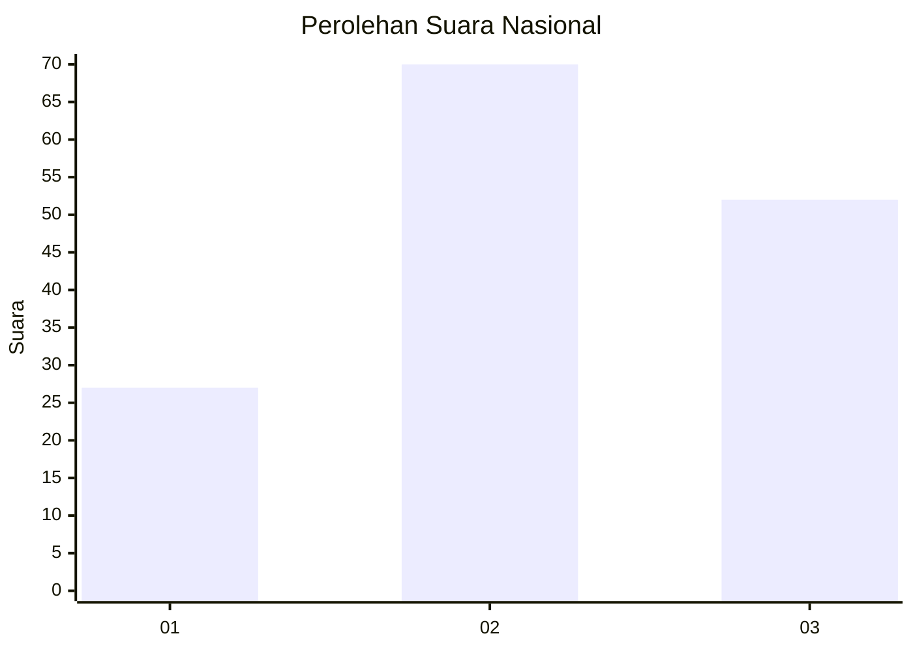
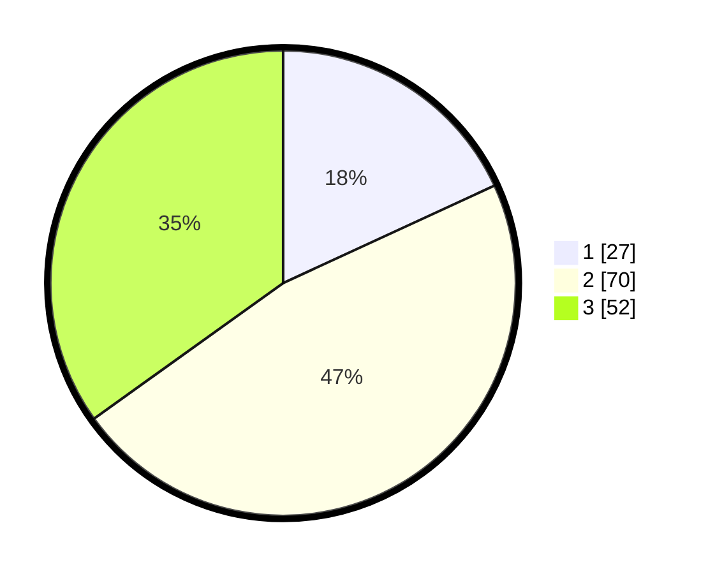

# Hasil

## Grafik

## Tabel

| No. | Nama Paslon    | Suara | Suara (raw) | Persentase |
|:--- |:-------------- | -----:| -----------:| ----------:|
| 1   | ANIES MUHAIMIN | 27    | [27][p-1]   | 18,12      |
| 2   | PRABOWO GIBRAN | 70    | [70][p-2]   | 46,98      |
| 3   | GANJAR MAHFUD  | 52    | [52][p-3]   | 34,90      |

[p-1]: https://github.com/gigit-pemilu/pemilu-2024/blob/main/pilpres/hitung-suara/sub/34-di-yogyakarta/sub/02-bantul/sub/03-kretek/sub/2001-tirtomulyo/sub/007-tps/sub/paslon-1.txt
[p-2]: https://github.com/gigit-pemilu/pemilu-2024/blob/main/pilpres/hitung-suara/sub/34-di-yogyakarta/sub/02-bantul/sub/03-kretek/sub/2001-tirtomulyo/sub/007-tps/sub/paslon-2.txt
[p-3]: https://github.com/gigit-pemilu/pemilu-2024/blob/main/pilpres/hitung-suara/sub/34-di-yogyakarta/sub/02-bantul/sub/03-kretek/sub/2001-tirtomulyo/sub/007-tps/sub/paslon-3.txt

## Foto C Plano

https://sirekap-obj-formc.kpu.go.id/ec13/pemilu/ppwp/34/02/03/20/01/3402032001007-20240217-112316--bf7d50f8-be69-47a3-bdff-f5deef55a18a.jpg

https://sirekap-obj-formc.kpu.go.id/ec13/pemilu/ppwp/34/02/03/20/01/3402032001007-20240217-112647--5adbfb5b-28cd-4213-8425-0a8174eb147f.jpg

https://sirekap-obj-formc.kpu.go.id/ec13/pemilu/ppwp/34/02/03/20/01/3402032001007-20240217-112932--3f542e4d-591e-4d1d-8f5d-b98147518f31.jpg

## Metadata

| Key        | Value               |
| ---------- | ------------------- |
| Time Stamp | 2024-02-17 11:30:03 |

## DATA PEMILIH TETAP

Jumlah pemilih dalam DPT: **177**.
 * L: **80**.
 * P: **97**.

## DATA PENGGUNA HAK PILIH

Jumlah pengguna hak pilih dalam DPT: **150**.
 * L: **66**.
 * P: **84**.

Jumlah pengguna hak pilih dalam DPTb: **2**.
 * L: **1**.
 * P: **1**.

Jumlah pengguna hak pilih dalam DPK: **1**.
 * L: **1**.
 * P: **0**.

Jumlah pengguna hak pilih: **153**.
 * L: **58**.
 * P: **75**.

## JUMLAH SUARA SAH DAN TIDAK SAH

JUMLAH SELURUH SUARA SAH: **149**.

JUMLAH SUARA TIDAK SAH: **4**.

JUMLAH SELURUH SUARA SAH DAN SUARA TIDAK SAH: **153**.

