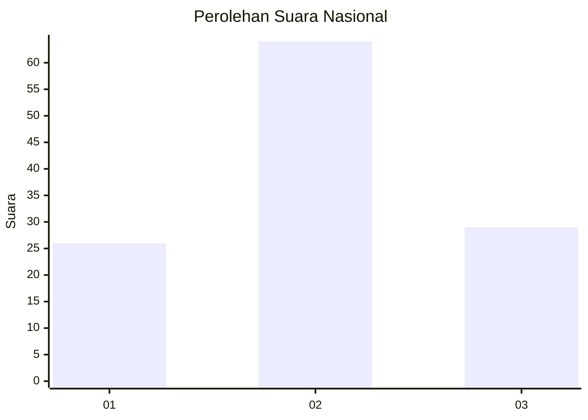
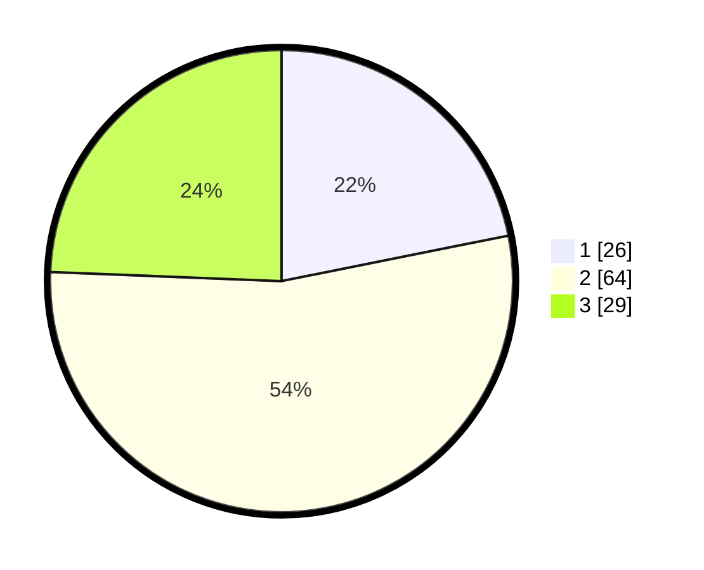

# Hasil

## Grafik

## Tabel

| No. | Nama Paslon    | Suara | Suara (raw) | Persentase |
|:--- |:-------------- | -----:| -----------:| ----------:|
| 1   | ANIES MUHAIMIN | 26    | [26][p-1]   | 21,85      |
| 2   | PRABOWO GIBRAN | 64    | [64][p-2]   | 53,78      |
| 3   | GANJAR MAHFUD  | 29    | [29][p-3]   | 24,37      |

[p-1]: https://github.com/gigit-pemilu/pemilu-2024/blob/main/pilpres/hitung-suara/sub/34-di-yogyakarta/sub/02-bantul/sub/03-kretek/sub/2001-tirtomulyo/sub/010-tps/sub/paslon-1.txt
[p-2]: https://github.com/gigit-pemilu/pemilu-2024/blob/main/pilpres/hitung-suara/sub/34-di-yogyakarta/sub/02-bantul/sub/03-kretek/sub/2001-tirtomulyo/sub/010-tps/sub/paslon-2.txt
[p-3]: https://github.com/gigit-pemilu/pemilu-2024/blob/main/pilpres/hitung-suara/sub/34-di-yogyakarta/sub/02-bantul/sub/03-kretek/sub/2001-tirtomulyo/sub/010-tps/sub/paslon-3.txt

## Foto C Plano

https://sirekap-obj-formc.kpu.go.id/449f/pemilu/ppwp/34/02/03/20/01/3402032001010-20240215-004352--3bd8ced2-836e-422d-bca1-e573f299fbbb.jpg

https://sirekap-obj-formc.kpu.go.id/449f/pemilu/ppwp/34/02/03/20/01/3402032001010-20240215-004748--cbe5dfa5-eef9-4f14-9e9c-cd550c655a32.jpg

https://sirekap-obj-formc.kpu.go.id/449f/pemilu/ppwp/34/02/03/20/01/3402032001010-20240215-004800--f0edba92-8133-4af2-9015-a751e3e46f82.jpg

## Metadata

| Key        | Value               |
| ---------- | ------------------- |
| Time Stamp | 2024-02-24 22:31:28 |

