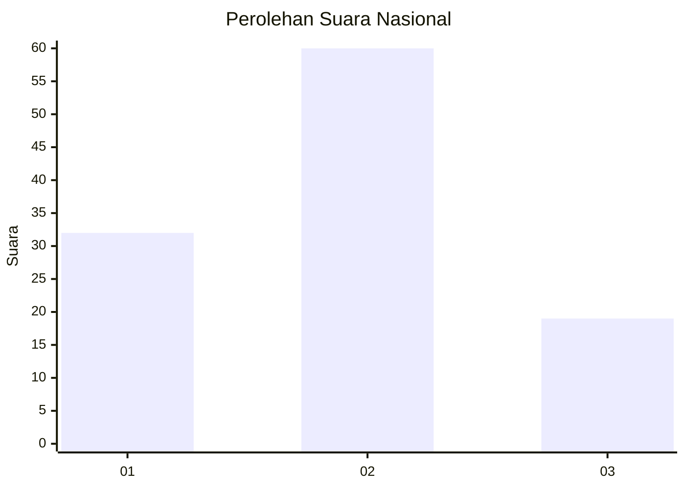
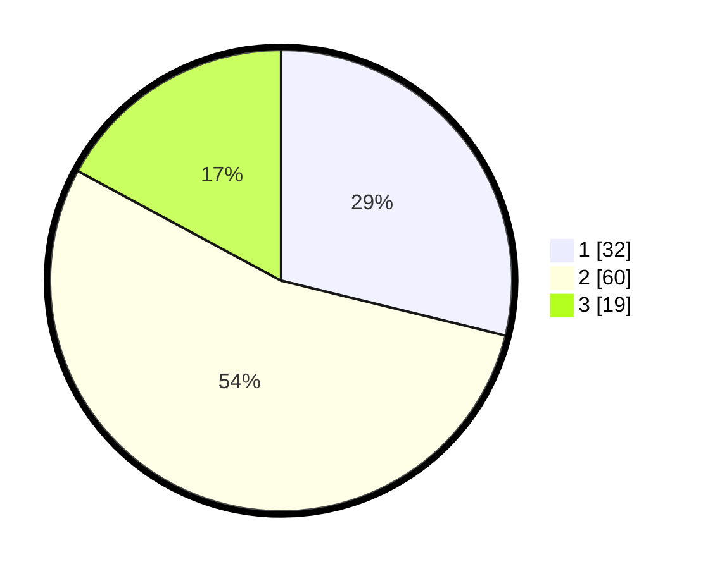

# Hasil

## Grafik

## Tabel

| No. | Nama Paslon    | Suara | Suara (raw) | Persentase |
|:--- |:-------------- | -----:| -----------:| ----------:|
| 1   | ANIES MUHAIMIN | 32    | [32][p-1]   | 28,83      |
| 2   | PRABOWO GIBRAN | 60    | [60][p-2]   | 54,05      |
| 3   | GANJAR MAHFUD  | 19    | [19][p-3]   | 17,12      |

[p-1]: https://github.com/gigit-pemilu/pemilu-2024/blob/main/pilpres/hitung-suara/sub/34-di-yogyakarta/sub/02-bantul/sub/03-kretek/sub/2001-tirtomulyo/sub/011-tps/sub/paslon-1.txt
[p-2]: https://github.com/gigit-pemilu/pemilu-2024/blob/main/pilpres/hitung-suara/sub/34-di-yogyakarta/sub/02-bantul/sub/03-kretek/sub/2001-tirtomulyo/sub/011-tps/sub/paslon-2.txt
[p-3]: https://github.com/gigit-pemilu/pemilu-2024/blob/main/pilpres/hitung-suara/sub/34-di-yogyakarta/sub/02-bantul/sub/03-kretek/sub/2001-tirtomulyo/sub/011-tps/sub/paslon-3.txt

## Foto C Plano

https://sirekap-obj-formc.kpu.go.id/4ae3/pemilu/ppwp/34/02/03/20/01/3402032001011-20240214-202112--fb334570-815a-4927-a17b-eea0bd6a9def.jpg

https://sirekap-obj-formc.kpu.go.id/4ae3/pemilu/ppwp/34/02/03/20/01/3402032001011-20240214-202135--68ef81e6-b003-42eb-b940-4c7bbf516f43.jpg

https://sirekap-obj-formc.kpu.go.id/4ae3/pemilu/ppwp/34/02/03/20/01/3402032001011-20240214-202145--f30f0049-8b17-4b47-a4f2-a3db86a2373e.jpg

## Metadata

| Key        | Value               |
| ---------- | ------------------- |
| Time Stamp | 2024-02-24 22:31:28 |

