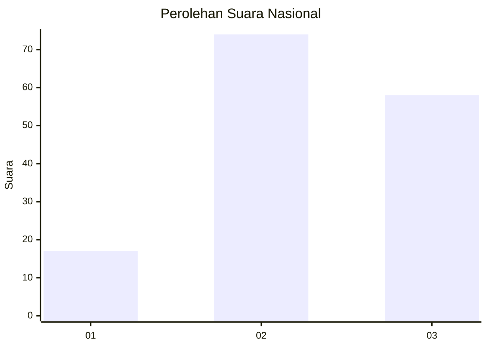
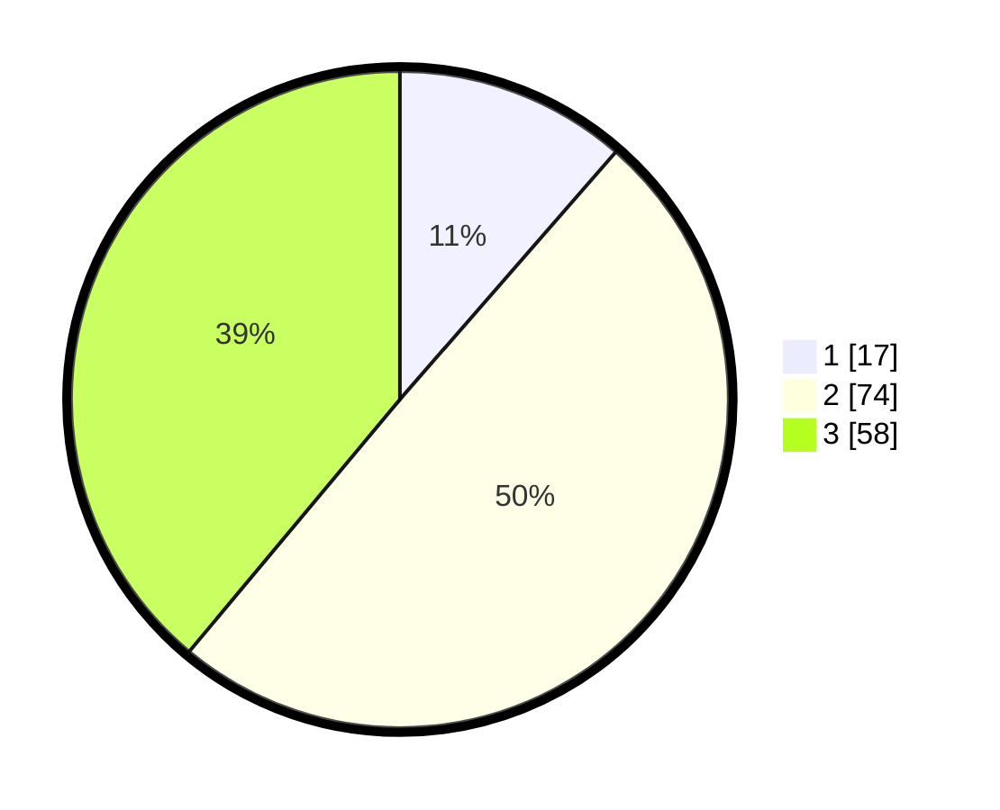

# Hasil

## Grafik

## Tabel

| No. | Nama Paslon    | Suara | Suara (raw) | Persentase |
|:--- |:-------------- | -----:| -----------:| ----------:|
| 1   | ANIES MUHAIMIN | 17    | [17][p-1]   | 11,41      |
| 2   | PRABOWO GIBRAN | 74    | [74][p-2]   | 49,66      |
| 3   | GANJAR MAHFUD  | 58    | [58][p-3]   | 38,93      |

[p-1]: https://github.com/gigit-pemilu/pemilu-2024/blob/main/pilpres/hitung-suara/sub/34-di-yogyakarta/sub/02-bantul/sub/03-kretek/sub/2001-tirtomulyo/sub/012-tps/sub/paslon-1.txt
[p-2]: https://github.com/gigit-pemilu/pemilu-2024/blob/main/pilpres/hitung-suara/sub/34-di-yogyakarta/sub/02-bantul/sub/03-kretek/sub/2001-tirtomulyo/sub/012-tps/sub/paslon-2.txt
[p-3]: https://github.com/gigit-pemilu/pemilu-2024/blob/main/pilpres/hitung-suara/sub/34-di-yogyakarta/sub/02-bantul/sub/03-kretek/sub/2001-tirtomulyo/sub/012-tps/sub/paslon-3.txt

## Foto C Plano

https://sirekap-obj-formc.kpu.go.id/0191/pemilu/ppwp/34/02/03/20/01/3402032001012-20240215-113518--562b8044-b8fb-4c74-9bd1-c54d49b0a034.jpg

https://sirekap-obj-formc.kpu.go.id/0191/pemilu/ppwp/34/02/03/20/01/3402032001012-20240215-113549--b09c6302-e51c-4f37-be0e-1e96a512637e.jpg

https://sirekap-obj-formc.kpu.go.id/0191/pemilu/ppwp/34/02/03/20/01/3402032001012-20240215-113559--2f0e1ab8-5944-47c2-8344-d9917e42086f.jpg

## Metadata

| Key        | Value               |
| ---------- | ------------------- |
| Time Stamp | 2024-02-24 22:31:28 |

