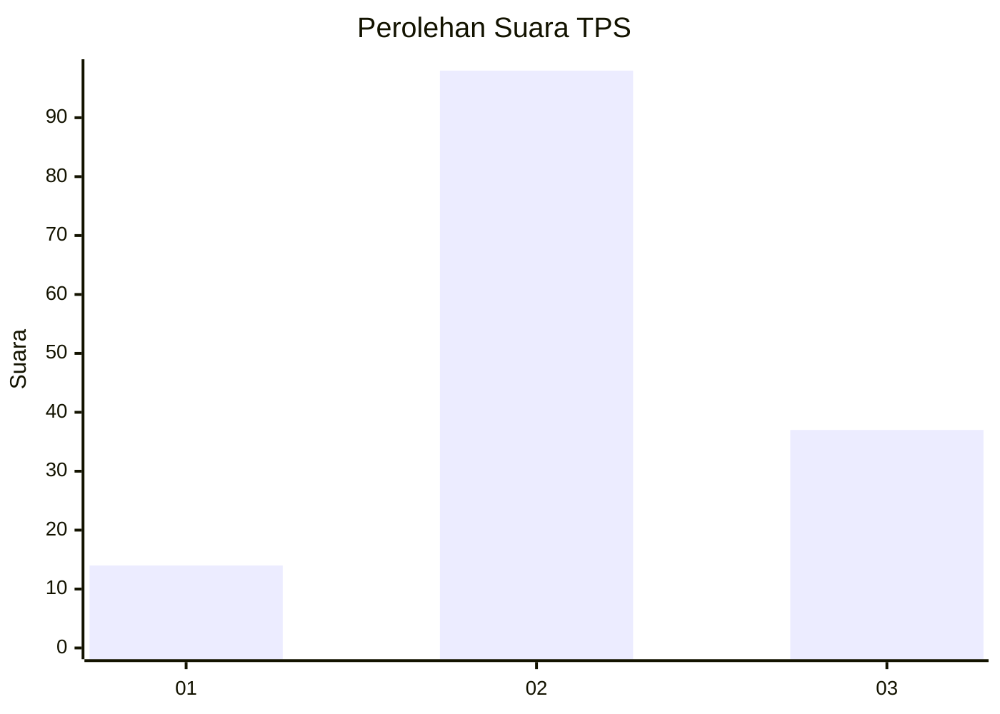
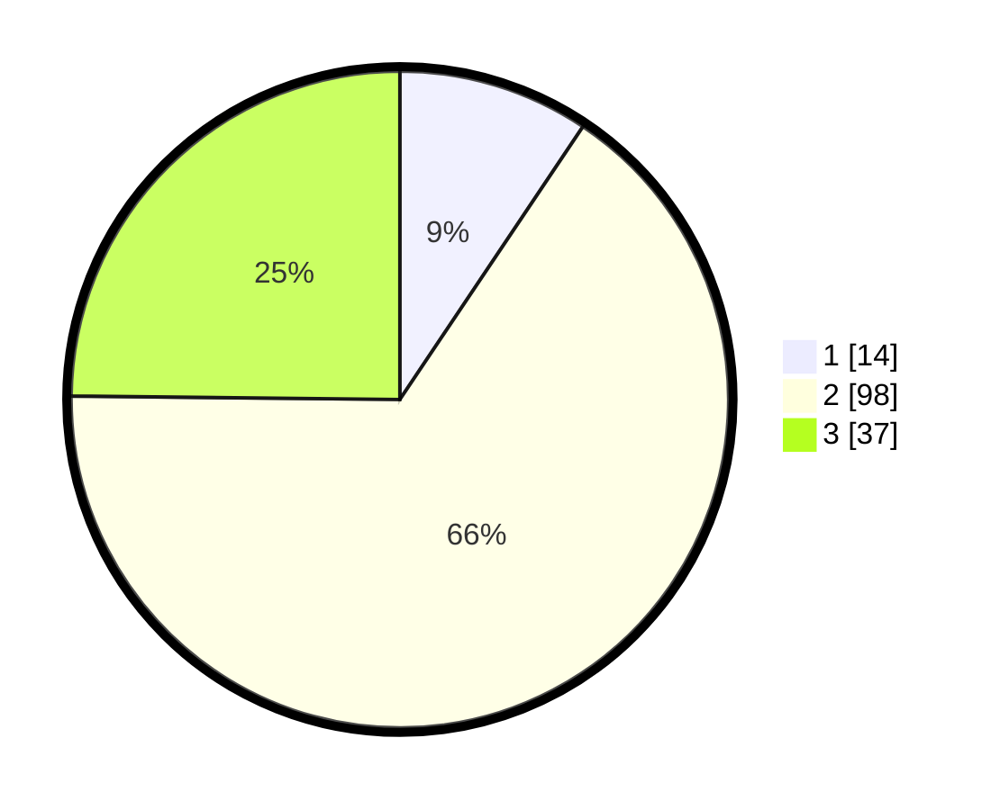

# Hasil

## Grafik

## Tabel

| No. | Nama Paslon    | Suara | Suara (raw) | Persentase |
|:--- |:-------------- | -----:| -----------:| ----------:|
| 1   | ANIES MUHAIMIN | 14    | [14][p-1]   | 9,40       |
| 2   | PRABOWO GIBRAN | 98    | [98][p-2]   | 65,77      |
| 3   | GANJAR MAHFUD  | 37    | [37][p-3]   | 24,83      |

[p-1]: https://github.com/gigit-pemilu/pemilu-2024-34-di-yogyakarta/blob/main/pilpres/hitung-suara/sub/34-di-yogyakarta/sub/02-bantul/sub/03-kretek/sub/2001-tirtomulyo/sub/019-tps/sub/paslon-1.txt
[p-2]: https://github.com/gigit-pemilu/pemilu-2024-34-di-yogyakarta/blob/main/pilpres/hitung-suara/sub/34-di-yogyakarta/sub/02-bantul/sub/03-kretek/sub/2001-tirtomulyo/sub/019-tps/sub/paslon-2.txt
[p-3]: https://github.com/gigit-pemilu/pemilu-2024-34-di-yogyakarta/blob/main/pilpres/hitung-suara/sub/34-di-yogyakarta/sub/02-bantul/sub/03-kretek/sub/2001-tirtomulyo/sub/019-tps/sub/paslon-3.txt

## Foto C Plano

https://sirekap-obj-formc.kpu.go.id/f3a3/pemilu/ppwp/34/02/03/20/01/3402032001019-20240214-214546--f19131cc-3c3b-45ba-829d-000276758306.jpg

https://sirekap-obj-formc.kpu.go.id/f3a3/pemilu/ppwp/34/02/03/20/01/3402032001019-20240214-214325--5a948976-cf7a-4b71-b3a8-2131300d028b.jpg

https://sirekap-obj-formc.kpu.go.id/f3a3/pemilu/ppwp/34/02/03/20/01/3402032001019-20240214-214500--b5a3651d-f78c-4467-a2a9-2f82bed91132.jpg

## Metadata

| Key        | Value               |
| ---------- | ------------------- |
| Time Stamp | 2024-02-25 14:00:00 |

