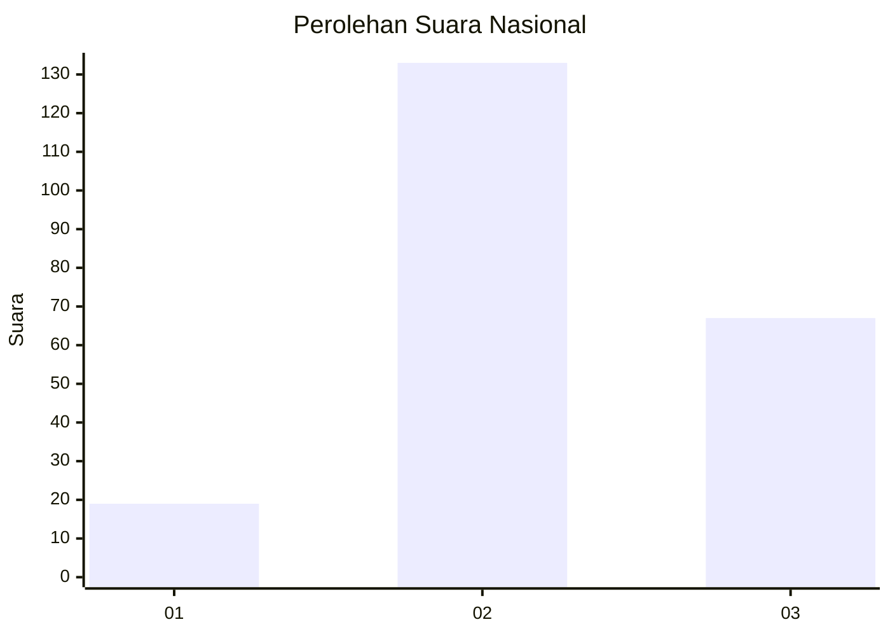
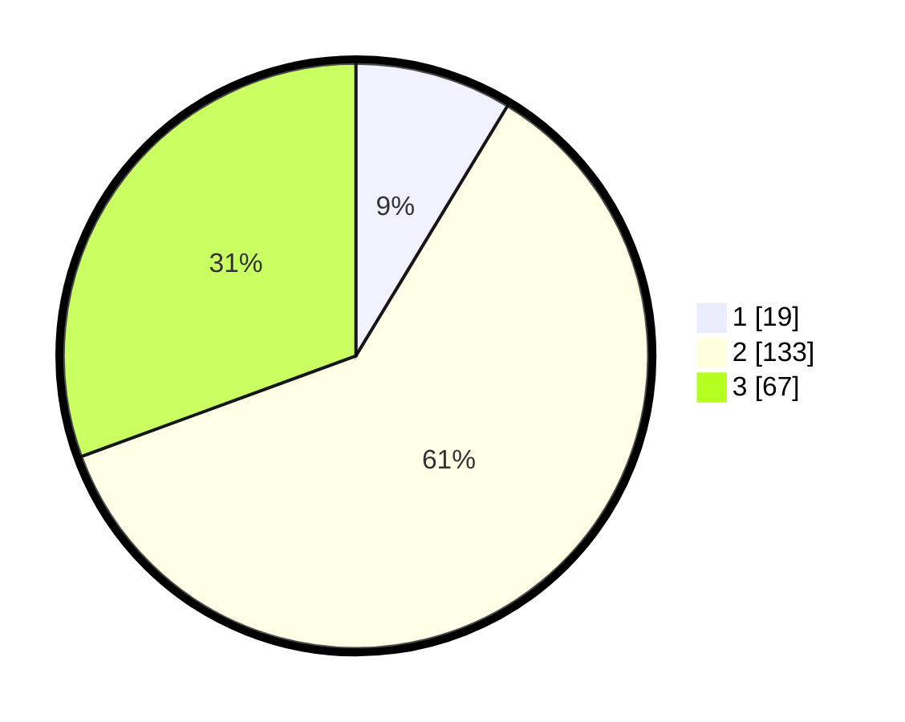

# Hasil

## Grafik

## Tabel

| No. | Nama Paslon    | Suara | Suara (raw) | Persentase |
|:--- |:-------------- | -----:| -----------:| ----------:|
| 1   | ANIES MUHAIMIN | 19    | [19][p-1]   | 8,68       |
| 2   | PRABOWO GIBRAN | 133   | [133][p-2]  | 60,73      |
| 3   | GANJAR MAHFUD  | 67    | [67][p-3]   | 30,59      |

[p-1]: https://github.com/gigit-pemilu/pemilu-2024/blob/main/pilpres/hitung-suara/sub/34-di-yogyakarta/sub/02-bantul/sub/03-kretek/sub/2001-tirtomulyo/sub/020-tps/sub/paslon-1.txt
[p-2]: https://github.com/gigit-pemilu/pemilu-2024/blob/main/pilpres/hitung-suara/sub/34-di-yogyakarta/sub/02-bantul/sub/03-kretek/sub/2001-tirtomulyo/sub/020-tps/sub/paslon-2.txt
[p-3]: https://github.com/gigit-pemilu/pemilu-2024/blob/main/pilpres/hitung-suara/sub/34-di-yogyakarta/sub/02-bantul/sub/03-kretek/sub/2001-tirtomulyo/sub/020-tps/sub/paslon-3.txt

## Foto C Plano

https://sirekap-obj-formc.kpu.go.id/1077/pemilu/ppwp/34/02/03/20/01/3402032001020-20240214-232053--851539e1-7941-4a55-a7f1-d0450e4efe83.jpg

https://sirekap-obj-formc.kpu.go.id/1077/pemilu/ppwp/34/02/03/20/01/3402032001020-20240214-232225--e3ef89d1-a8b9-48fe-a601-0fa57dbd8350.jpg

https://sirekap-obj-formc.kpu.go.id/1077/pemilu/ppwp/34/02/03/20/01/3402032001020-20240214-232354--ab700a7e-69ba-46e0-95ba-dccb9a1a7264.jpg

## Metadata

| Key        | Value               |
| ---------- | ------------------- |
| Time Stamp | 2024-02-15 22:00:27 |

